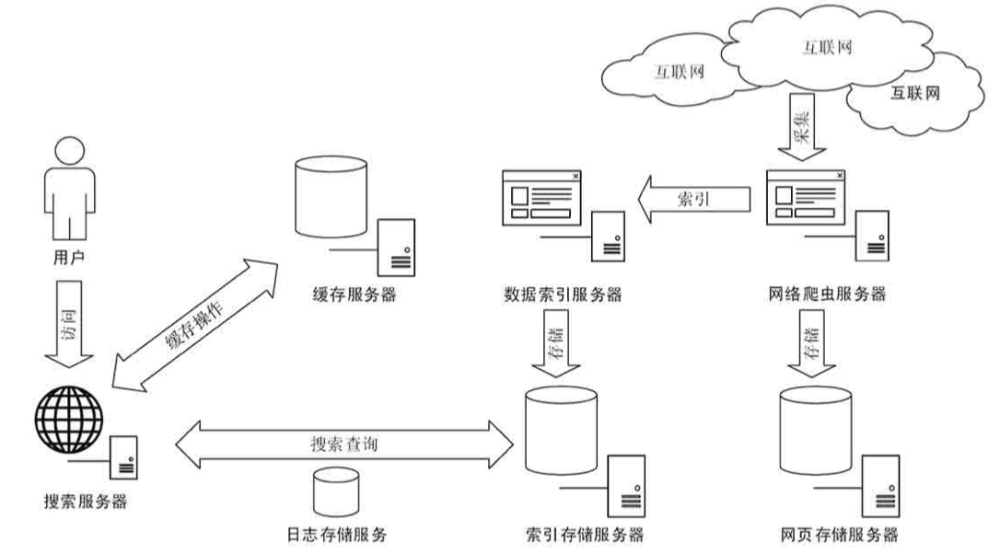

## Ch02: 搜索引擎原理与技术

1. 搜索引擎工作原理

   

2. 基本模块结构

   - 爬虫服务
   - 索引服务
   - 缓存服务
   - 搜索服务
   - 日志服务

3. 关键技术

   

4. 开源技术

   

## Ch03: 自然语言处理框架

## Ch04: 构建大数据存储引擎

## Ch05: 构建分布式实时计算

## Ch06: 分布式可扩展爬虫

## Ch07:大数据构建知识图谱

## Ch08: 索引构建机制

## Ch09: 搜索服务构建

## Ch10: 基于用户日志的反馈学习

