### lecture08：NMT

1. 传统的机器翻译

   - 基于规则

     > 使用一个双语词典

   - 基于统计

     > 从数据中学习一个概率模型。
     >
     > 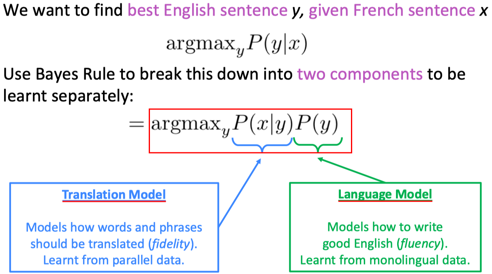
     >
     > 关键是学习translate model，即词-词、短语-短语之间的对齐（alignment）
     >
     > 如何找到agrmax？Use a heuristic search algorithm to search for the best translation, discarding hypotheses that are too low probability。
     >

2. neural mechine translate

   - seq2seq

     > The sequence-to-sequence model is an example of a Conditional Language Model.
     >
     > 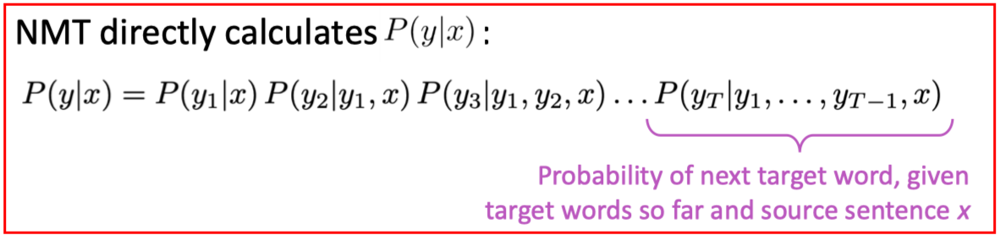
     >
     > decoding：
     >
     > - 贪婪解码：每一步只取最可能的词。
     >
     > - 穷举解码：每一步都保留所有的可能分支。
     >
     > - beam search：每一步只保留最可能的K个分支。（具体方法：对K个分支中的每个分支，先扩展并保留top-K最可能分支，然后再K^K次方个分支中保留top-K分支，并进行下一步解码）
     >
     >   For NMT, increasing k too much decreases BLEU score.This is primarily because large-k beam search produces tooshort translations.
     >
     >   In open-ended tasks like chit-chat dialogue, large k can make output more generic.
     >
     > - Sampling-based decoding：good for open-ended / creative generation (poetry, stories).
     >
     >   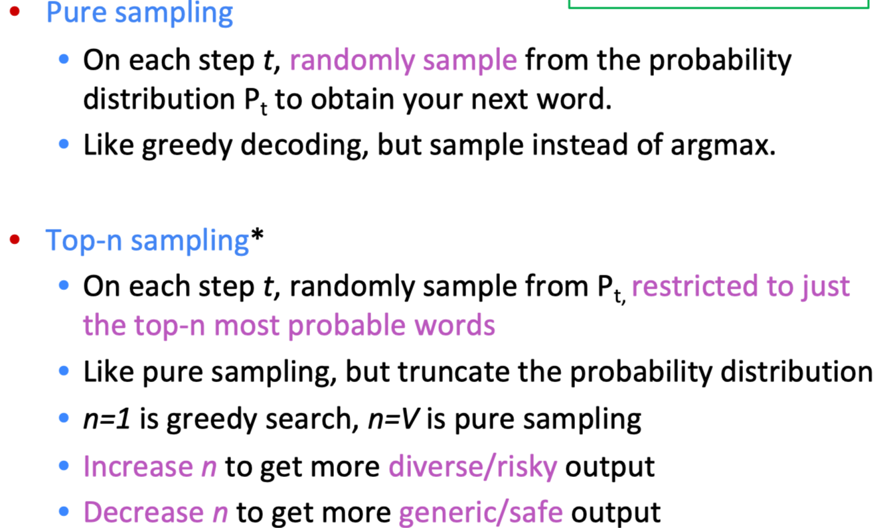
     >
     > ​    (一个额外的技术：Softmax temperature ------- is another way to control diversity)
     >
     > 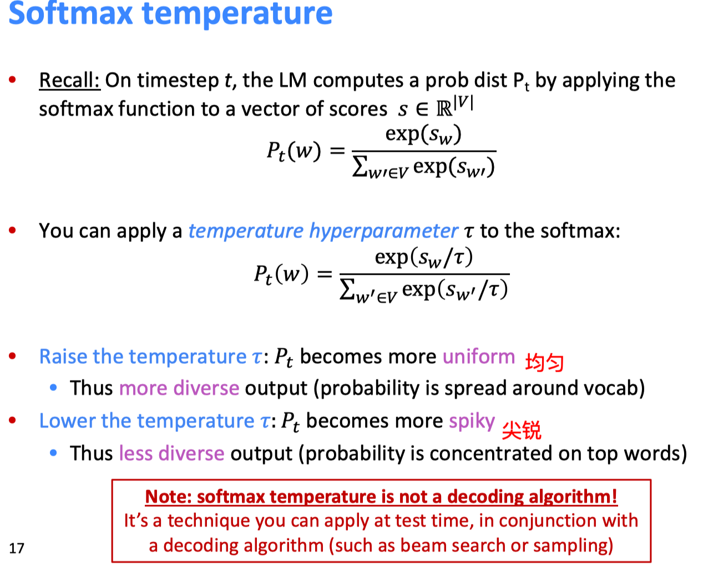
     >
     > 停止解码的条件：
     >
     > 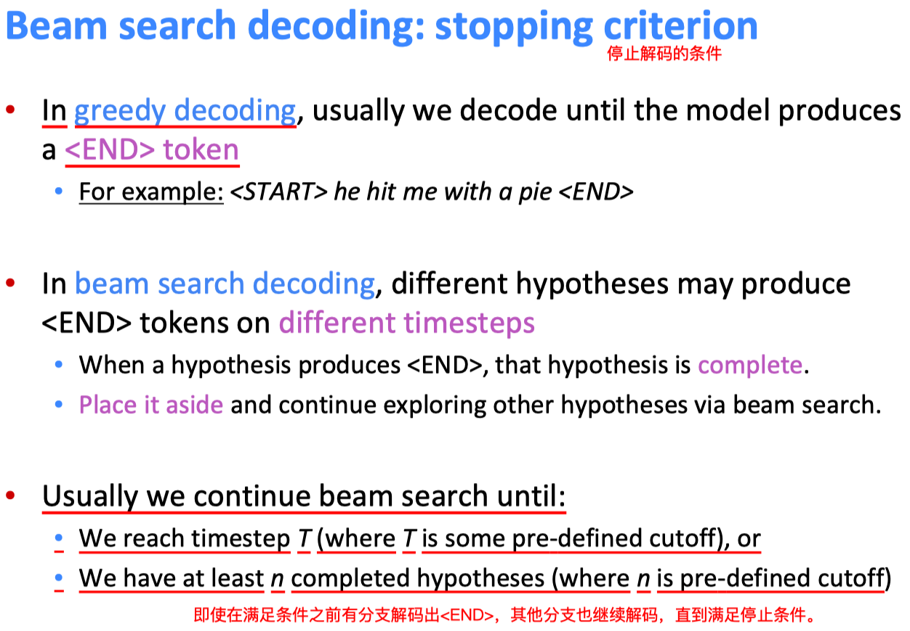
     >
     > 对短序列进行惩罚：
     >
     > 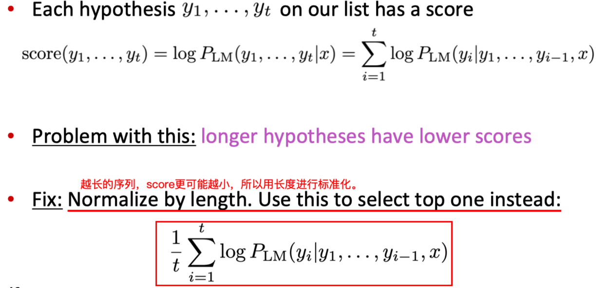

   - 一些未被解决的问题

     > 1. OOV的词
     > 2. Domain mismatch between train and test data
     > 3. Maintaining context over longer text
     > 4. Low-resource language pairs
     > 5. using common sense is still hard
     > 6. pick up biases in training data
     > 7. 不可解释

3. Attention 机制

   > 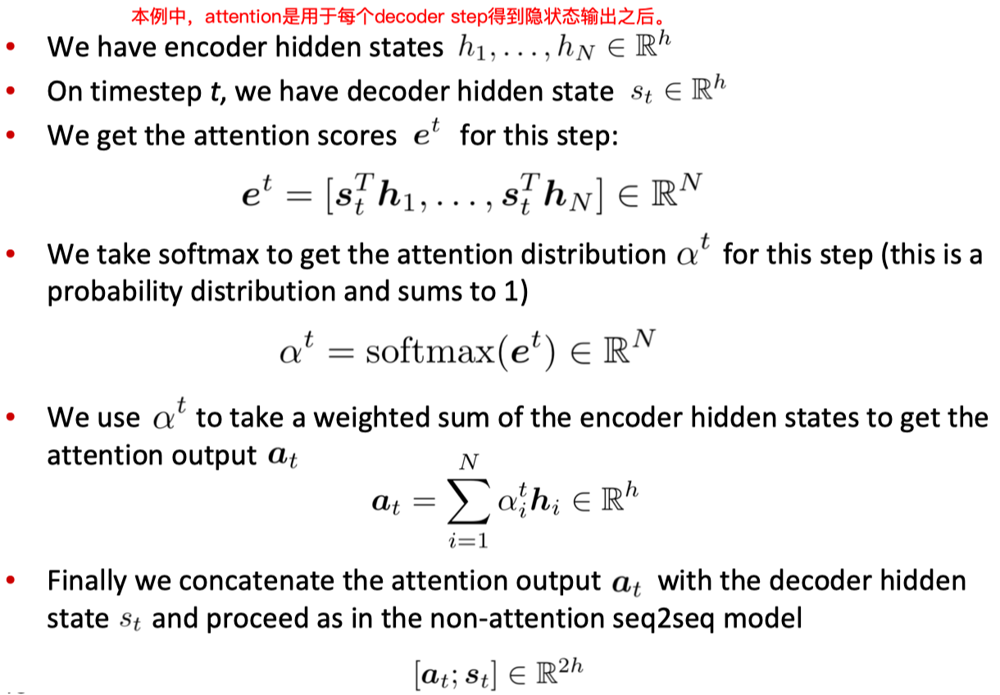

   > 一些常用的计算attention score的方法：
   >
   > 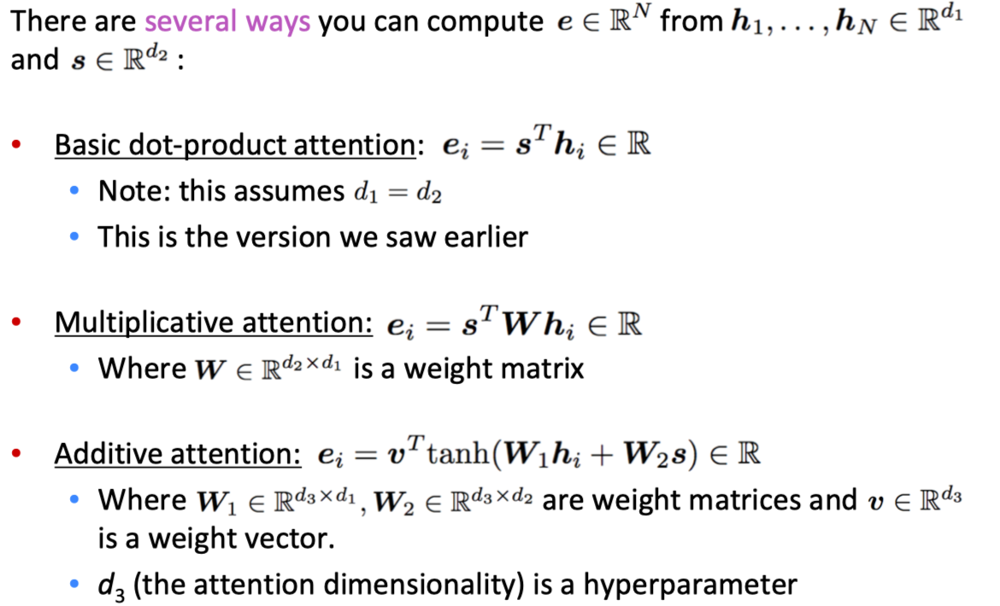

### lecture12：subwords

1. Byte Pair Encoding（BPE算法）

   > 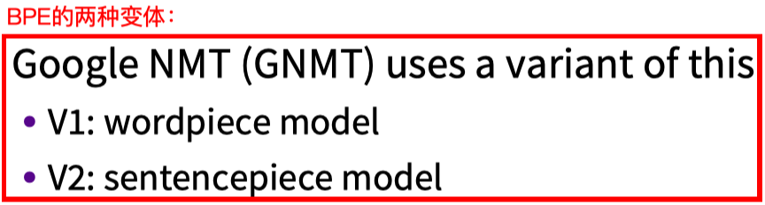

   > 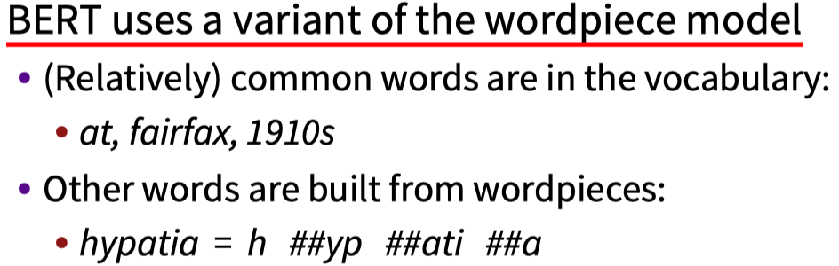

2. Sub-word models 的两个发展趋势：
   - Same architecture as for word-level model
   - Hybrid architectures（Main model has words; something else for characters）

### Lecture13：contextual representation

1. TagLM （'Pre-EMLo'）：Semi-supervised sequence tagging with bidirectional language models
2. EMLo：以语言模型为任务，学习上下文向量
3. CoVe：以机器学习任务，学习上下文的词向量

> 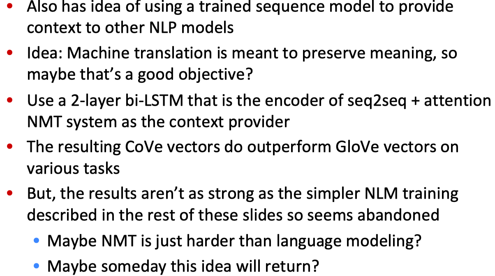

4. ULMFit
5. BERT

### Lecture14：transformer

1. 用self-attention到图片生成时：（参考文献：Image Transformer. Parmar*, Vaswani*, Uszkoreit, Kaiser, Shazeer, Ku, and Tran. ICML 2018）

   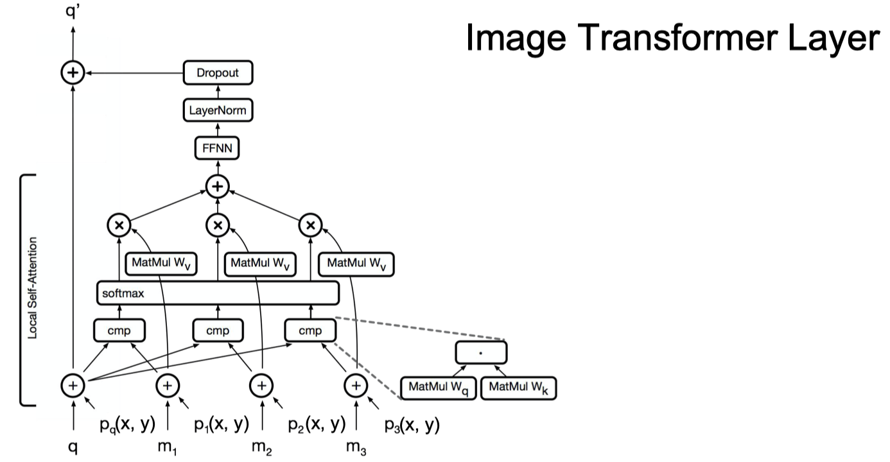

   Combining Locality with Self-Attention.

   Restrict the attention windows to be local neighborhoods.

   Good assumption for images because of spatial localit.

2. 用transformer到音乐生成：（参考文献：Music Transformer. ICLR 2019）

   Music generation using relative self-attention.

   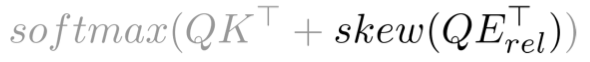

### Lecture15：nature language generation

1. copy 机制

   copy机制的问题：copy too much

   解决方案：（参考文献：Bottom-Up Abstractive Summarization）

   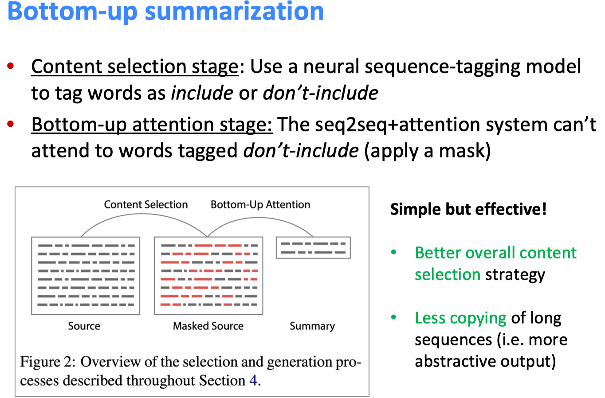

### Lecture19：bias

1. Prototype Theory

   One purpose of categorization is to reduce the infinite differences among stimuli to behaviourally and cognitively usable proportions

2. bias

   - 数据中存在bias：

     - Selection Bias: Selection does not reflect a random sample
     - Out-group homogeneity bias: Tendency to see outgroup members as more alike than ingroup members
     - Biased Data Representation
     - Biased Labels

   - 解释中的bias

     - Confirmation bias: The tendency to search for, interpret, favor, recall information in a way that confirms preexisting beliefs

     - Overgeneralization（过拟合）
     - Correlation fallacy: Confusing correlation with causation（混淆因果关系和相关性）
     - Automation bias: Propensity for humans to favor suggestions from automated decision-making systems over contradictory information without automation

### Lecture20：future

1. 使用无标记数据

   参考NMT，self-supervised、back-supervised

2. huge model，但不是可以解决任何问题

3. 多任务学习

4. Low-Resource Settings

   比如Low-resource languages、Low-data settings (元学习)

5. 模型的可解释性

   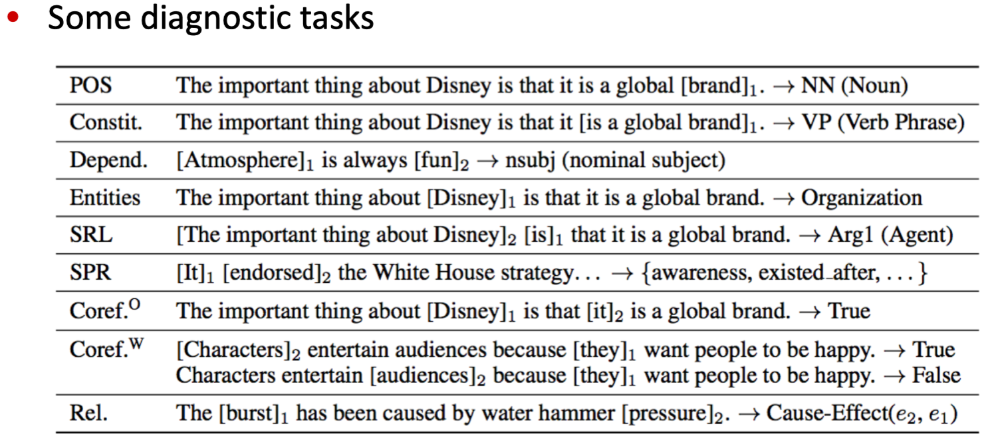

6. 

