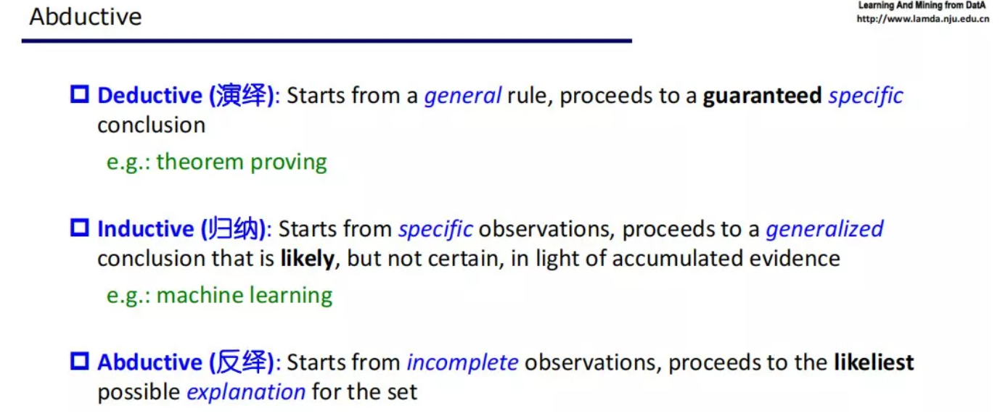
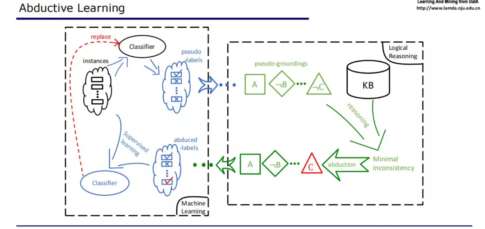

https://mp.weixin.qq.com/s/pkCIr092Oet3PJJ9jcDvJg

周志华教授先简要介绍了

- 机器学习中利用无标签数据的重要性，
- 以及过去利用无标签数据主要依赖的「**纯学习**」解决方案，
- 然后重点介绍了他最近提出的**「反绎学习」**。这是一种全新的「学习 + 推理」方案，与以往的「学习 + 推理」方案重点依赖学习、获得的结果牺牲了推理能力，或重点依赖推理、获得的结果牺牲了学习能力不同，**反绎学习提供了一种以平衡和互利方式利用机器学习和逻辑推理的「学习 + 推理」解决方案**。通过逻辑推理对领域知识进行利用，从而可以显著缓解对有标签数据的需求；而通过机器学习可以利用数据对领域知识进行精化和改善，甚至可能发现新知识。

---------

### **自训练方法（Self-training）**

### **主动学习（Active learning）**

### **半监督学习**

### **机器学习和逻辑推理**

### **反绎学习（abductive learning）**

- 反绎学习，是一种将机器学习和逻辑推理联系起来的新框架。

- 

- 反绎学习的设置不太一样，反绎学习中假设有一个知识库，以及一个初始分类器。

  在这个学习中，我们先把所有的数据提供给这个初始分类器，初始分类器猜测一个结果，得到结果之后就会把它转化成一个知识推理系统能够接受的符号表示。

  那么接下来这一步，我们就要根据知识库里面的知识来发现有没有什么东西是不一致的？如果有不一致，我们能不能找到某一个东西，一旦修改之后它就能变成一致？或者修改之后使得不一致程度大幅度降低？这就需要我们去找最小的不一致。如下图所示：假设我们现在找到，只要把这个非 C 改成 C，那么你得到的事实就和知识都一致了。我们就把它改过来，这就是红色的这个部分，这就是一个反绎的结果。而反绎出来的这个 C，我们现在会回到原来的标签中，把标签改掉，接下来我们就用修改过的标签和原来的数据一起来训练一个新分类器。这个分类器可以代替掉旧的分类器。这个过程可以不断地迭代下去。这个过程一直到分类器不发生变化，或者我们得到的伪事实和知识库完全一致，这时候就停止了。

- 

- 从上图可以看到，左半部在进行机器学习，而右半部在进行逻辑推理。机器学习和逻辑推理这两者互相依赖，循环处理往复，直到分类器与知识库一致（此时相当于分类器已经 「学到」了知识库中的内容）或者分类器连续数轮不再提升；如果允许对知识库进行修改，还可以使得知识库中的内容可以被精化或更新（这是利用数据经验来改善知识的过程）。

  反绎学习不依赖于真实标签，但如果存在有标签数据，它也可以充分利用，例如可以生成更可靠的伪标签等，从这个意义上说，反绎学习可以被视为一种更具一般性的弱监督学习，其监督信息不仅限于标签，还可以是领域知识。

- 初始分类器可以是预训练好的深度模型或者迁移学习模型，甚至可以很简单，例如基于聚类或最近邻分类的预处理；其基本作用是让整个过程 「启动」 起来。在领域知识丰富可靠时，通过知识的利用可以使得整个过程并不依赖于初始分类器的强度。

  知识库目前仍需要人工总结人类经验并写成一阶逻辑规则。今后可能通过学习来对知识库进行改善和提炼。对数据事实与符号知识的联合优化不再能依靠常规的梯度方法，使用了周教授团队自己开发的不依赖梯度计算的零阶优化方法。