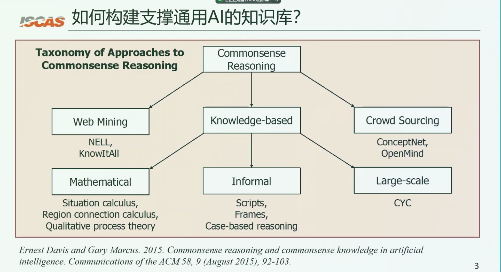

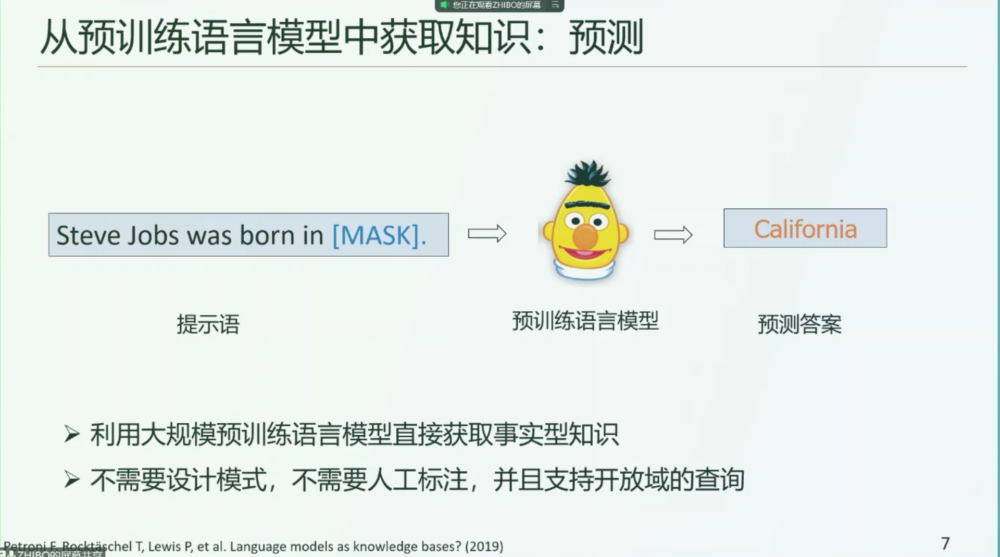

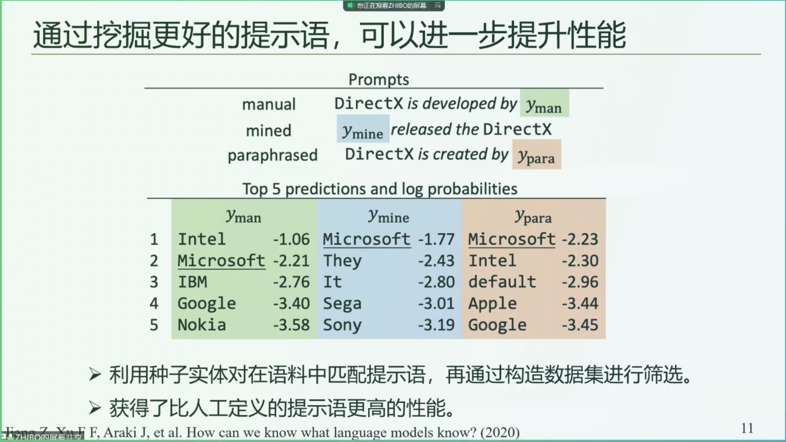

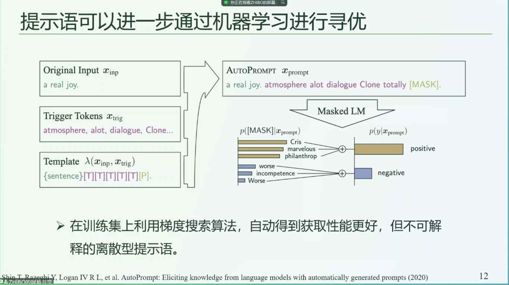

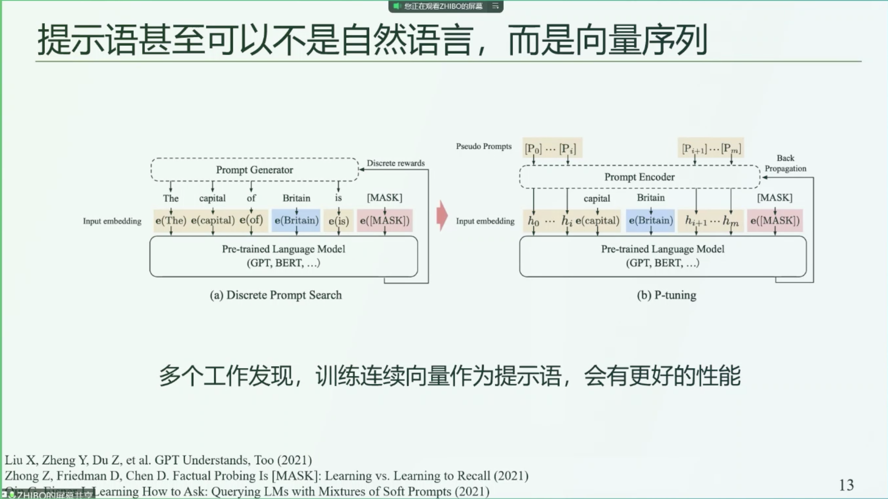

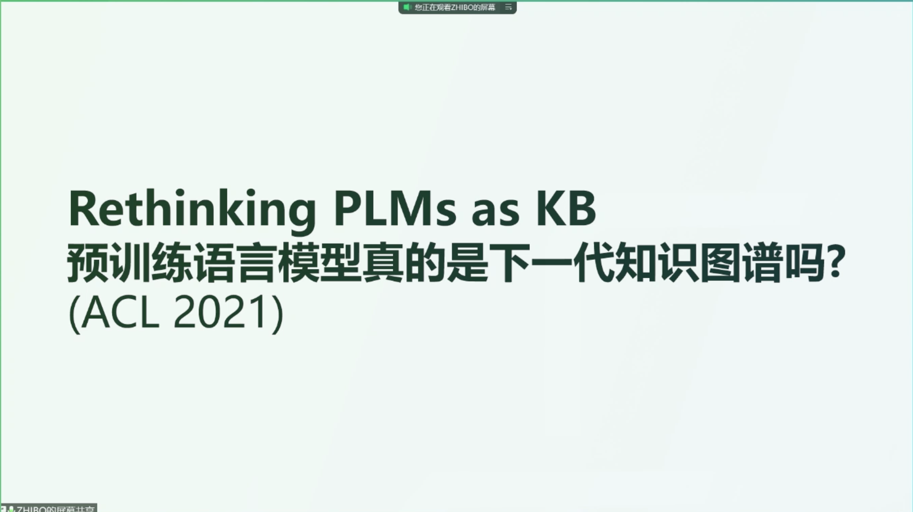

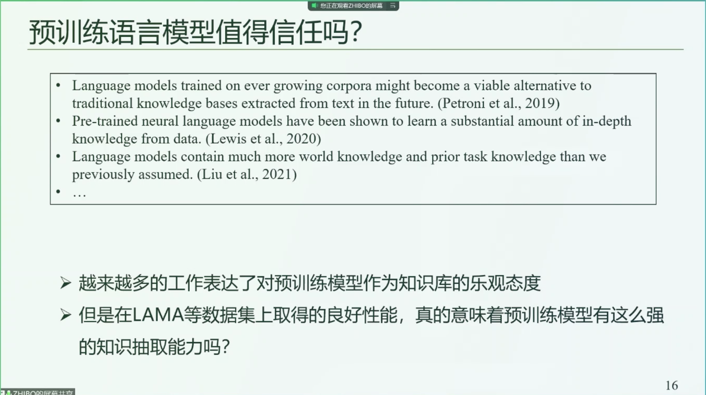

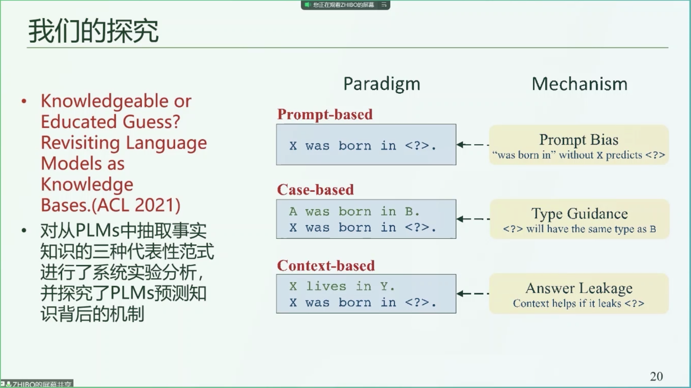

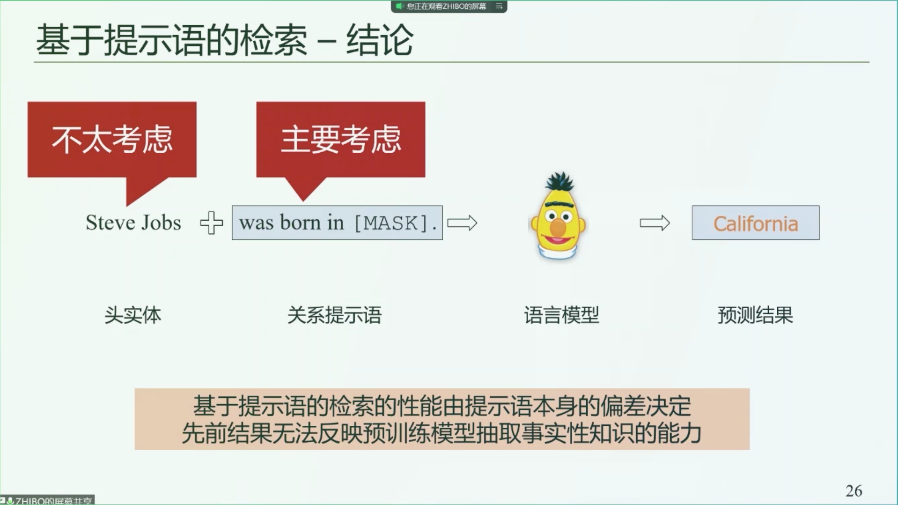

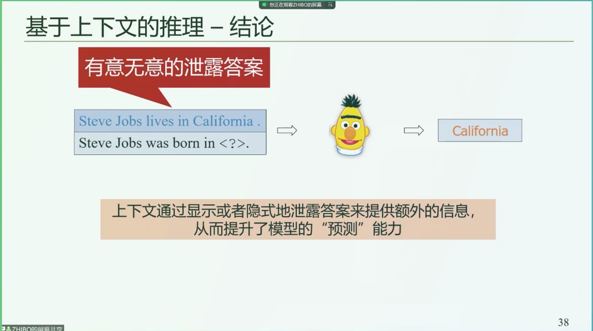

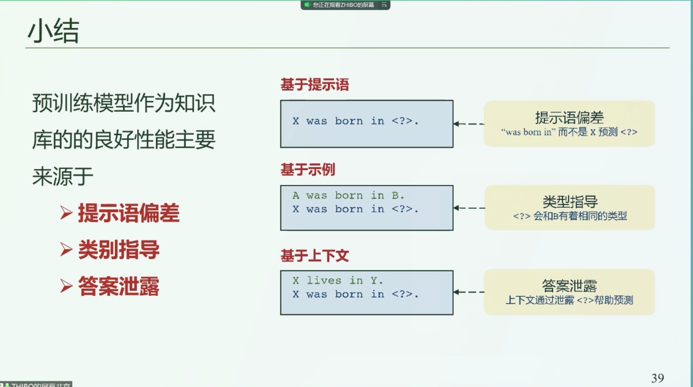

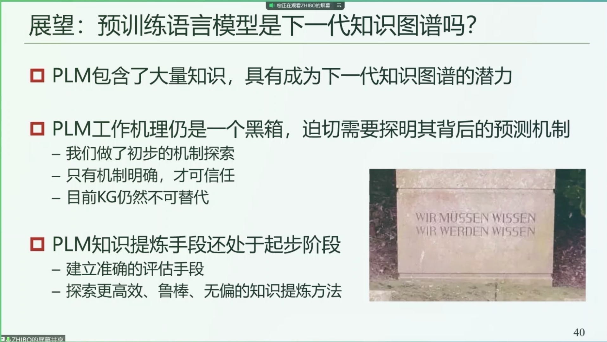

相关文献：

1. Language models as knowledge bases? （2019）
2. How can we know what language models know? （通过提示语探究）
3. AutoPrompt:  （通过基于可学习的提示语）
4. GPT understands, Too （2021，基于向量而不是自然语言的提示语）
5. Konwledgeable or educated guess? Revisiting Language models as knowledge bases. （2021，韩先培）

