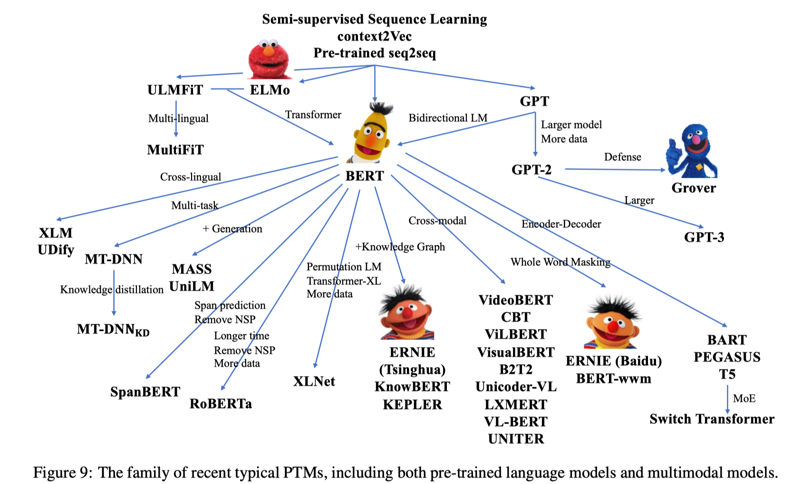

# Pre-Trained Models: Past, Present and Future

### 1. Introduction

- history（2-3章）
- Present, four important directions（4-7章）
  - designing effective architectures, 
  - utilizing rich contexts, 
  - improving computational efficiency, 
  - conducting interpretation and theoretical analysis.
- future（8章）

### 2. Background

##### 2.1 Transfer Learning and Supervised Pre-Training（有监督的预训练）

- two pre-training approaches in transfer learning: **feature transfer** and **parameter transfer**

##### 2.2 Self-Supervised Learning and Self-Supervised Pre-Training（自监督的预训练）

- CV：supervised pre-training（ImageNet）
- NLP：self-supervised pre-training（word2vec，ELMo，BERT）

### 3. Transformer and Representative PTMs

##### 3.1 Transformer

##### 3.2 autoregressive：GPT

##### 3.3 autoencoding：BERT

##### 3.4 After GPT and BERT

- model architectures
- explores novel pretraining tasks：XLNet、UniLM、MASS、SpanBERT、ELECTRA
- incorporating rich data sources：
- model scale：GPT-3、Switch Transformer

### 4. Designing Effective Architectures

##### 4.1 **Unified Sequence Modeling**（统一不同类型的NLP任务到同一模型）

- Combining Autoregressive and Autoencoding Modeling：XLNet、MPNet、UniLM、GLM
- Applying Generalized Encoder-Decoder：MASS、T5、BART

##### 4.2 Cognitive-Inspired Architectures

- Maintainable Working Memory：Transformer-XL、CogQA、CogLTX
- Sustainable Long-Term Memory：REALM、RAG

##### 4.3 More Variants of Existing PTMs

- improving the masking strategy：SpanBERT、ERNIE（a whole entity is masked）
- change the masked-prediction objective：ELECTRA

### 5. Utilizing Multi-Source Data

##### 5.1 Multilingual Pre-Training

##### 5.2 Multimodal Pre-Training

##### 5.3 Knowledge-Enhanced Pre-Training

- 结构化知识
- 无结构化知识

### 6. Improving Computational Efficiency

##### 6.1 System-Level Optimization

- Single-Device Optimization：FP16
- Multi-Device Optimization：Data parallelism

##### 6.2 Efficient Pre-Training

- Efficient Training Methods：ELECTRA（预训练任务），不同层使用不同的学习率（训练方法）
- Efficient Model Architectures：MoE-based models

##### 6.3 Model Compression

- Parameter Sharing：ALBERT
- Model Pruning：CompressingBERT
- Knowledge Distillation：DistillBERT, TinyBERT, BERTPKD, MiniLM
- Model Quantization：Q-BERT, TernaryBERT

### 7.Interpretation and Theoretical Analysis

##### 7.1 Knowledge of PTMs

- Linguistic Knowledge
- World Knowledge

##### 7.2 Robustness of PTMs

##### 7.3 Structural Sparsity of PTMs

##### 7.4 Theoretical Analysis of PTMs

### 8. Future Directions

##### 8.1 Architectures and Pre-Training Methods

- New Architectures：neural architecture search
- New Pre-Training Tasks：ELECTRA
- Beyond Fine-Tuning：Prompt
- Reliability：adversarial attacks、Adversarial defenses

##### 8.2 Multilingual and Multimodal Pre-Training

- More Modalities：探索除image外的其他模态
- More Insightful Interpretation：用可视化工具帮助多模态预训练的可解释
- More Downstream Applications：
- Transfer Learning：适应到未见过的语言

##### 8.3 Computational Efficiency

- Data Movement：数据在不同设备间的通信代价
- Parallelism Strategies：data parallelism, model parallelism, pipeline parallelism
- Large-Scale Training：
- Wrappers and Plugins：

##### 8.4 Theoretical Foundation

- Uncertainty：OOD问题
- Generalization and Robustness

##### 8.5 Modeledge Learning（can refer to the knowledge stored in PTMs as “modeledge”, which is distinguished from the discrete symbolic knowledge formalized by human beings.）

- Knowledge-Aware Tasks：把预训练模型视为知识库或知识图谱
- Modeledge Storage and Management：store and manage various continuous modeledge in PTMs（e.g., MoE）

##### 8.6 Cognitive and Knowledgeable Learning

- knowledgeable PTMs：1）Knowledge Augmentation；2）Knowledge Support；3）Knowledge Supervision
- cognitive PTMs：1）Cognitive Architecture；2）Explicit and Controllable Reasoning；3）Interactions of Knowledge

##### 8.7 Applications

- Natural Language Generation
- Dialog Systems
- Domain-Specific PTMs：BioBERT、SciBERT
- Domain Adaptation and Task Adaptation