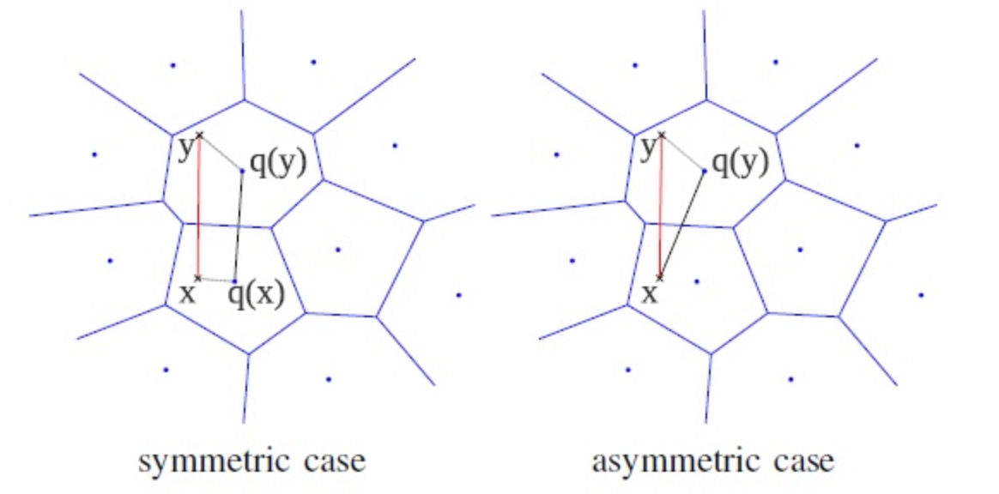
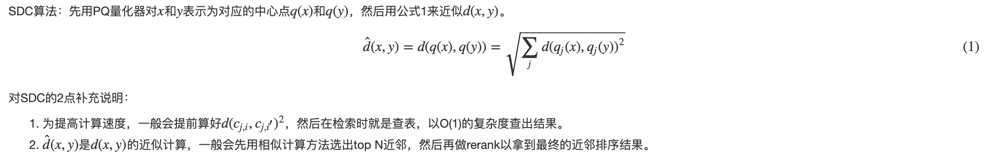
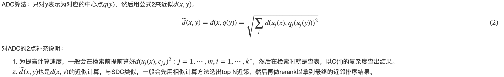

### Product Quantization算法的核心

Vector quantization定义了一个量化器quantizer，即一个映射函数q，它将一个D维向量x转换码本cookbook中的一个向量，这个码本的大小用k表示。

如果希望量化器达到最优，那么需要量化器满足Lloyd最优化条件。而这个最优量化器，恰巧就能对应到机器学习领域最常用的kmeans聚类算法。需要注意的是kmeans算法的损失函数不是凸函数，受初始点设置的影响，算法可能会收敛到不同的聚类中心点（局部最优解），当然有kmeans++等方法来解决这个问题，对这个问题，这篇文章就不多做描述。一般来说，码本的大小k一般会是2的幂次方，那么就可以用log2k bit对应的向量来表示码本的每个值。

其实PQ算法可以理解为是对vector quantization做了一次分治，首先把原始的向量空间分解为m个低维向量空间的笛卡尔积，并对分解得到的低维向量空间分别做量化，那如何对低维向量空间做量化呢？恰巧又正是用kmeans算法。所以换句话描述就是，把原始D维向量（比如D=128）分成m组（比如m=4），每组就是D∗=D/m维的子向量（比如D∗=D/m=128/4=32)，各自用kmeans算法学习到一个码本，然后这些码本的笛卡尔积就是原始D维向量对应的码本。用qj表示第j组子向量，用Cj表示其对应学习到的码本，那么原始D维向量对应的码本就是C=C1×C2×…×Cm。用k∗表示子向量的聚类中心点数或者说码本大小，那么原始D维向量对应的聚类中心点数或者说码本大小就是k=(k∗)m。可以看到m=1或者m=D是PQ算法的2种极端情况，对m=1，PQ算法就回退到vector quantization，对m=D，PQ算法相当于对原始向量的每一维都用kmeans算出码本。

上面介绍了如何建立PQ的量化器，下面将介绍如何基于这些量化器做相似搜索。有2种方法做相似搜索，一种是SDC(symmetric distance computation)，另一种是ADC(asymmetric distance computation)。SDC算法和ADC算法的区别在于是否要对查询向量x做量化，参见公式1和公式2。如图3所示，x是查询向量(query vector)，y是数据集中的某个向量，目标是要在数据集中找到x的相似向量。

### Product Quantization算法的改进

当n>k∗D∗时，计算瓶颈存在于公式1和公式2的计算上，它们的复杂度都是O(n×m)。实际中n可能是千万量级甚至更大，虽然相比暴力搜索算法，PQ算法已经减少了计算量，但计算量依旧很大，并不实用。所以作者提出了**IVFADC算法**，一种基于倒排索引的ADC算法。简而言之，该算法包含2层量化，第1层被称为coarse quantizer，粗粒度量化器，在原始的向量空间中，基于kmeans聚类出k′个簇（文献[8]建议k′=n‾√）。第2层是上文讲的PQ量化器，不过这个PQ量化器不是直接在原始数据上做，而是经过第1层量化后，计算出每个数据与其量化中心的残差后，对这个残差数据集进行PQ量化。用PQ处理残差，而不是原始数据的原因是残差的方差或者能量比原始数据的方差或者能量要小。

对IVFADC的3点补充说明：

1. 考虑到在coarse quantization中，x和它的近邻不一定落在同一个簇中，所以在查询coarse quantization时，会同时取出w个倒排链。
2. 对取出的每个倒排链，还是用第3节介绍的PQ算法把近邻给找出。
3. 考虑当n>k∗D∗时，朴素的ADC算法的复杂度是O(n×m)，而IVFADC算法的复杂度会降低为O((n×w/k′)×m)。

