> > ACL2017，生成式QA

# 背景

本文提出了一个QA框架，能够适应长文本输入或多文本输入。

- 先用一个粗糙的、快速的模型选择一些相关的句子。（句子选择相当于一个隐变量）
- 组成文档摘要
- 再用RNN根据文档摘要生成答案

# 模型

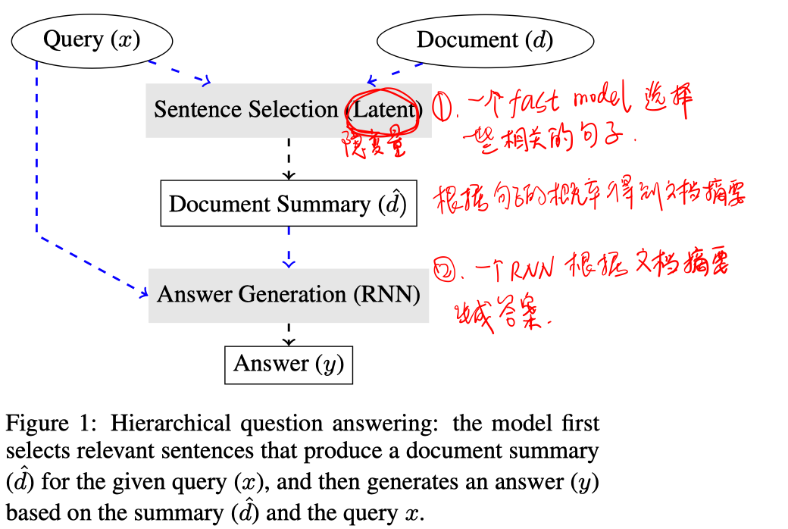

##### Sentence Selector

有三种模型：

- BoW Model

  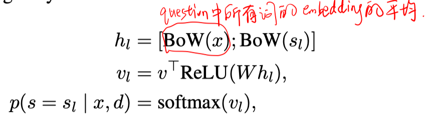

- Chunked BoW Model

  先将每个句子切分成固定长度的chunk，根据每个chunk与question的BoW向量表示，和BoW model一样计算每个chunk的score，再对所有句子的所有chunk进行softmax，最后把同一个句子内的chunk的得分相加作为句子的得分。

  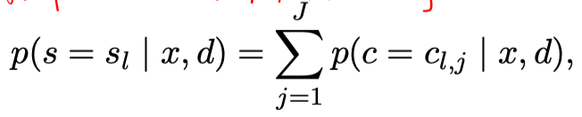

- CNN model

  将每个sentence和question的word embedding作为1维CNN的输入，再用max-pooling得到向量表示，再像BoW model一样通过一层全连接计算每个句子的得分。

##### Document Summary

有两种模型：

- hard sttention

  训练时根据句子的得分采样出K个句子，拼接起来作为文档摘要。

- soft attention

  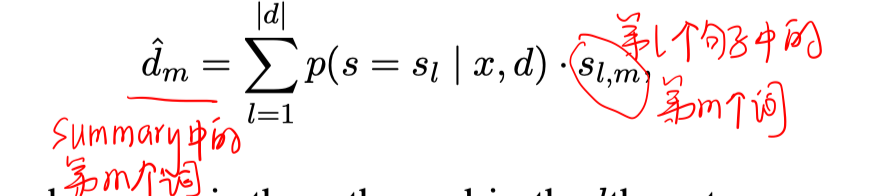

##### Answer Generation

利用一个现有的模型，并进行稍微的改动。

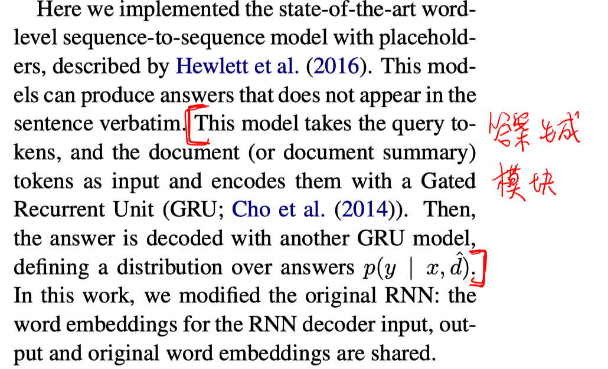

##### 训练

- pipeline

  分别训练sentence selector和answer generator。

  sentence selector的训练使用远监督的方式，正例是第一个含有answer string的句子，如果没有这样的句子，则文档的第一个句子是正例。

  answer generator训练时输入时ground truth的句子。推断时是选择sentence selector得分最高的句子。

  两个模块的训练都使用最大似然。

  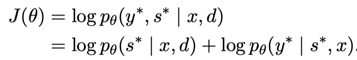

- hard attention生成文档摘要 + 强化学习

  

  使用课程学习，先用远监督进行训练，逐渐转到强化学习训练。

  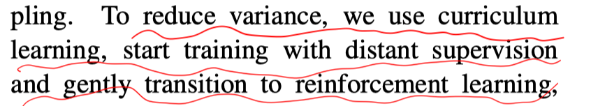

- soft attention生成文档摘要 + 端到端学习

  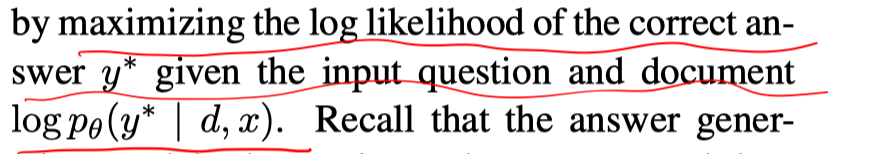

# 实验

##### **数据集**

WikiReading、WikiReadingLong、WikiSuggest

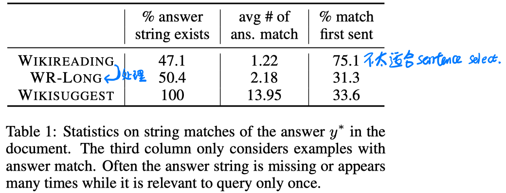

本文仅使用document的前35个句子作为模型的输入。

##### **实验结果**

- answer预测

  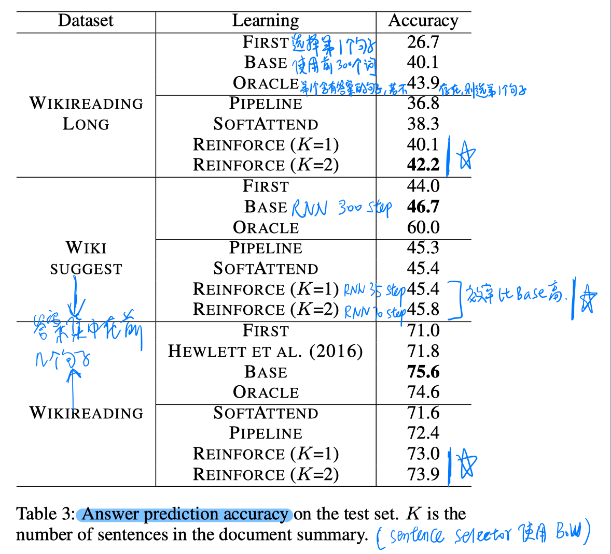

  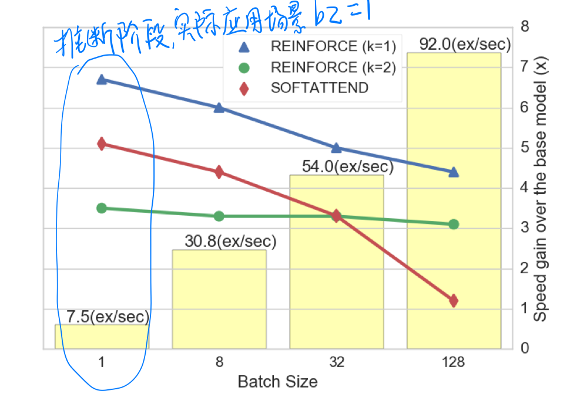

- sentence选择

  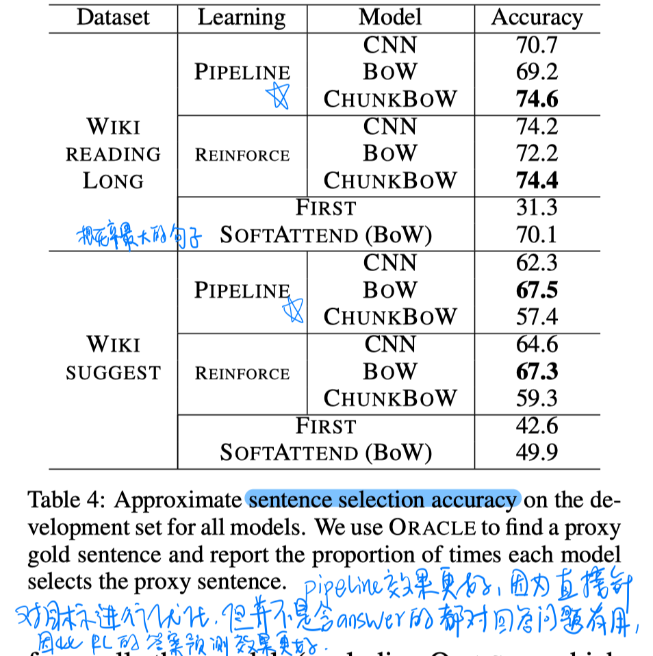

# 结论

- 依靠以人进行阅读理解的过程，先浏览所有相关文档，识别有用的部分，仔细阅读这些部分来生成答案。
- 主要是提出了一个sentence selector模块。但是同样是独立建模每个句子，没有考虑sentence的上下文信息和句子间的序列关系。