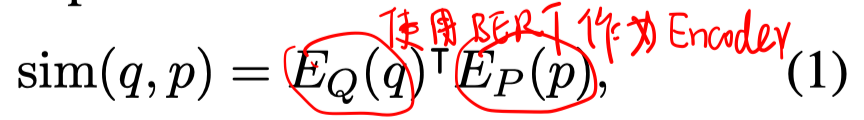
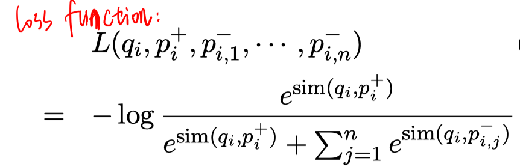
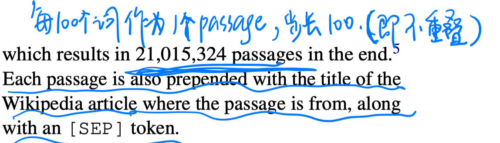
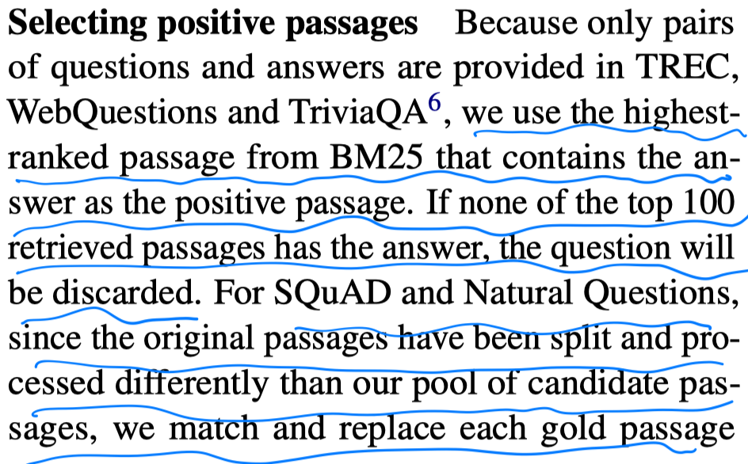
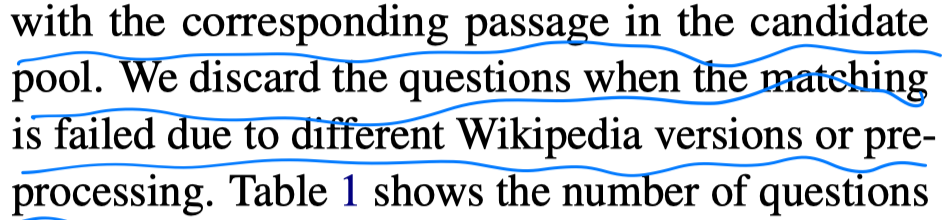
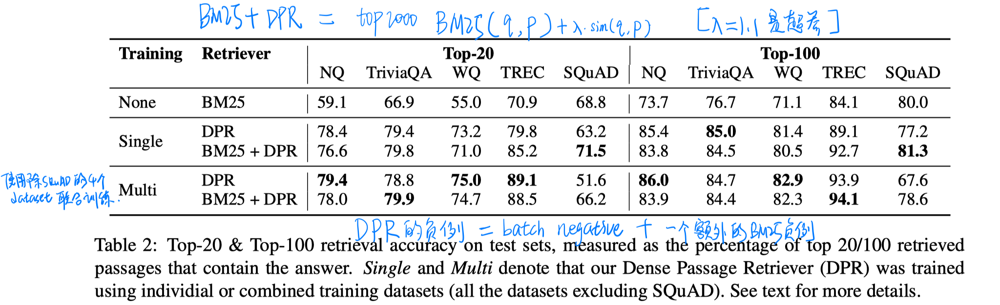
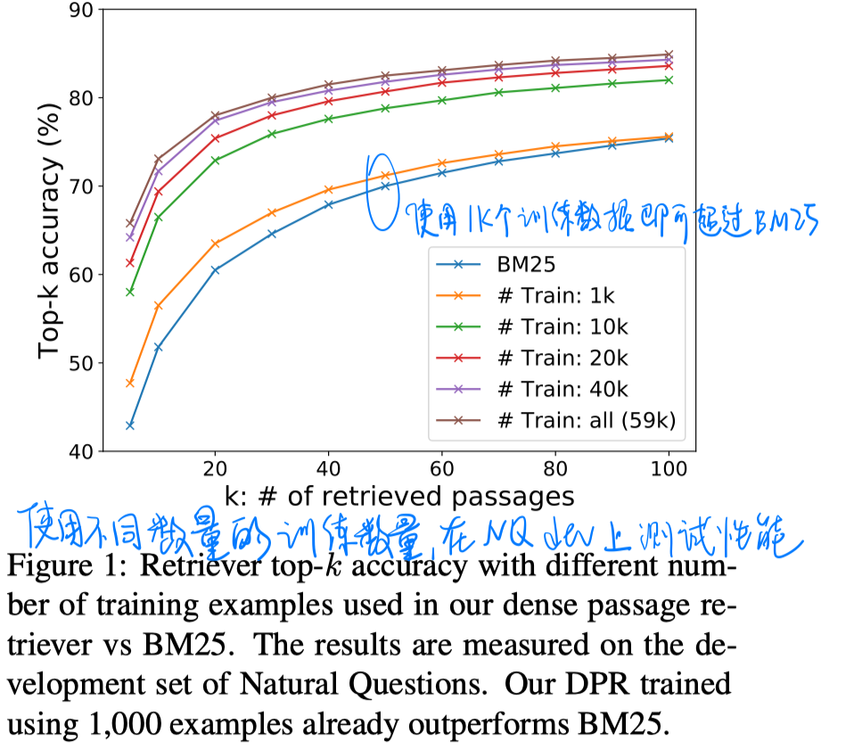
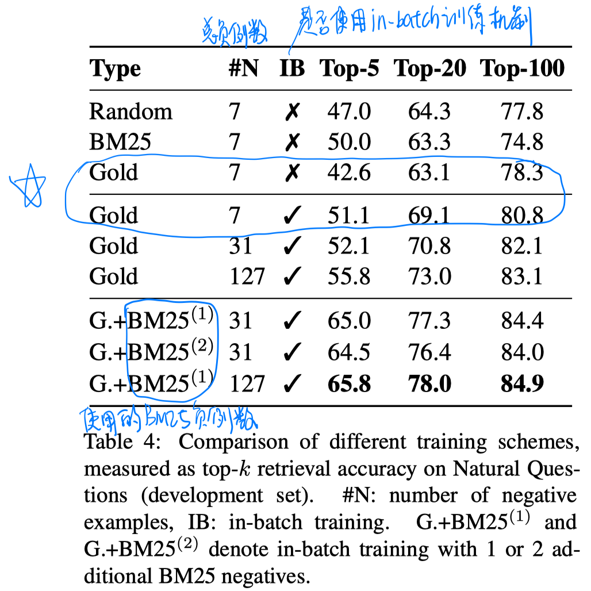
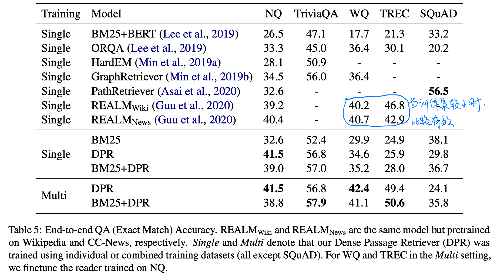

# 背景

openQA中检索部分通常使用BM25等基于term的方法，无法捕捉语义相似的passage。

# 模型

##### 训练目标

##### 负例采样策略

- random：any random passage from the corpus
- BM25：top passages returned by BM25 which don’t contain the answer but match question tokens heavily。
- gold：positive passages paired with other questions which appear in the training set

In-batch 策略：不仅可以提高效率，也可能使性能有所提高。

（本文实验结果表明使用同一batch的gold passage再加上一个BM25策略得到的一个passage效果最好）

# 实验

##### 数据集

- Natural Question、TriviaQA、WebQuestions、CuratedTREC、SQuAD1.1

- wikipedia的处理：

  把document划分成不重叠的100个词的passage。

- 正例passage处理：

##### 实验结果

- passage retrieval

  

  

  - 使用少量数据微调即可超过BM25的性能。
  - dense表示对BM25可以起到补充作用，结合两者可以使性能进一步提高。

- 负例采样策略的影响

  

- end-to-end QA

  

# 结论