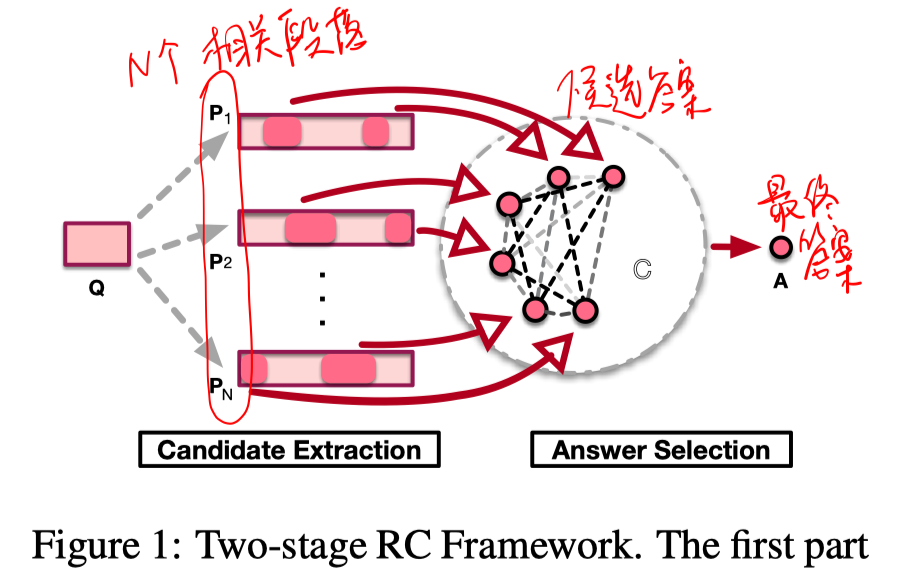
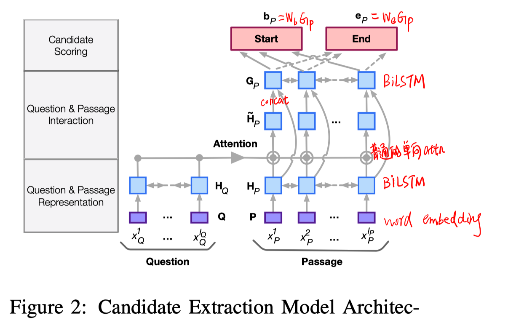
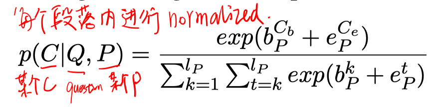
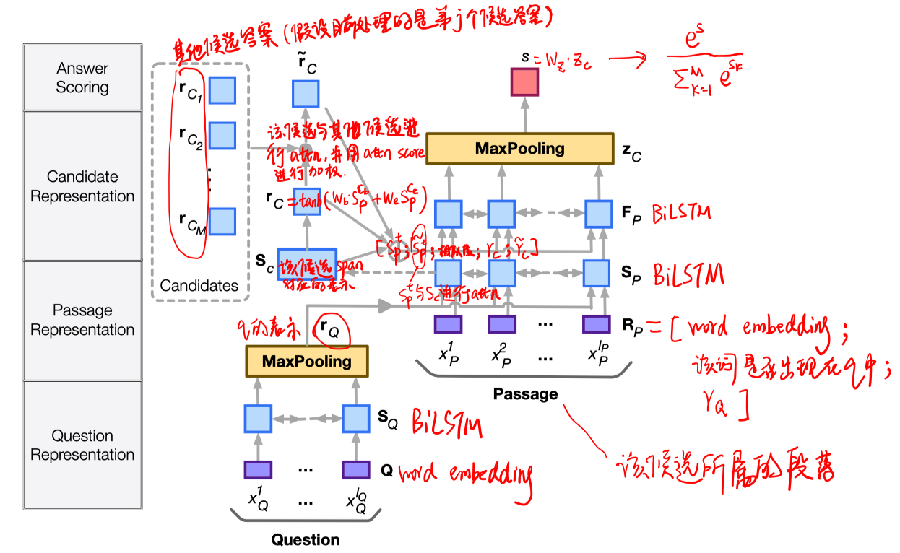
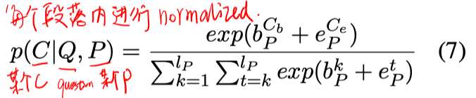
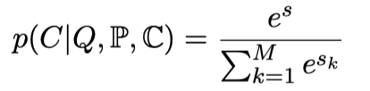
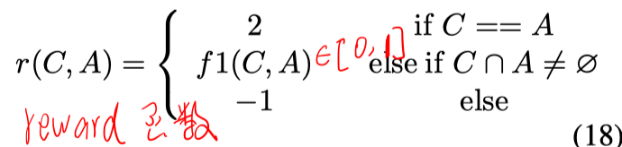
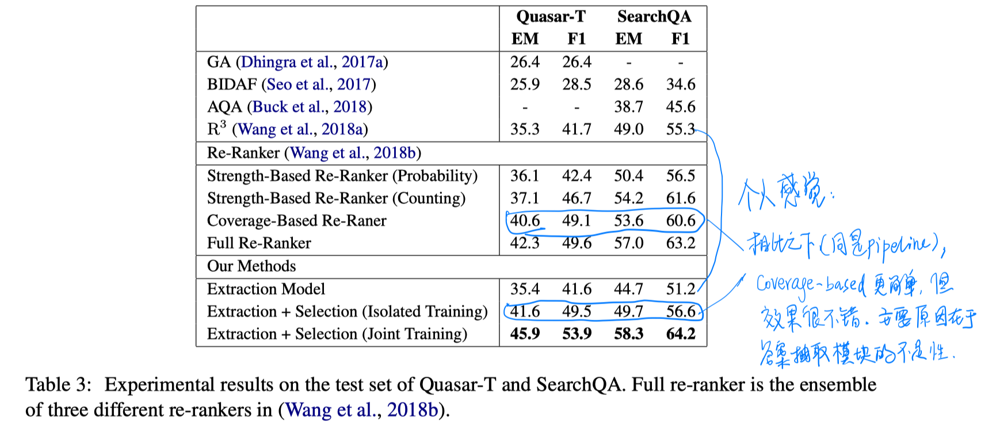
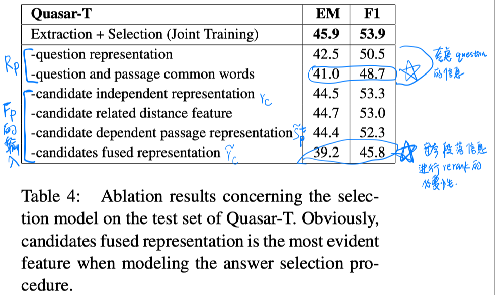
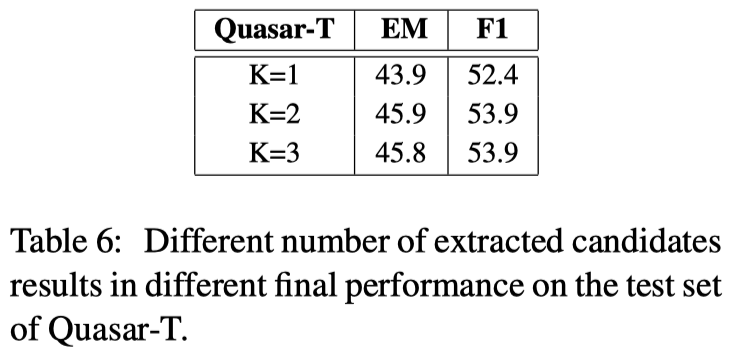

> > ACL2018，抽取式QA

# 背景

对于阅读理解任务，目前的大部分方法都是以一种独立的方式建模answer，忽视了和其他候选答案之间的关系。尤其在开放域的QA中，来自多个段落的候选答案应该被结合在一起回答单个问题。

本文中，把阅读理解视为一个【抽取-选择】的两段式处理过程：首先从各个段落中独立地提取规定个数的候选答案，然后结合所有候选答案的信息来选择最终的答案。（把候选答案提取视为一个隐变量，然后使用强化学习联合地训练这两个步骤）

# 模型

##### candidate extraction

从每个段落中抽取top-k个候选答案。

##### answer selection

结合每个候选答案所在的段落信息得到每个候选答案的表示；每个候选答案都与其他所有候选答案进行交互，融合其他所有候选答案（即其他所有段落）的信息，进一步对每个候选答案进行评分。

##### 训练

先分别用最大似然估计预训练这两个模块，再用RL微调。

答案抽取的预训练：只使用含有正确答案的passage进行训练，目标函数如下，

答案选择的预训练：用预训练好答案抽取模块对每个passage生成2个候选答案，作为答案选择模块的训练数据，目标函数如下，

强化学习：

# 实验

数据集：Quasar-T、SearchQA

实验结果：

- 主结果

- 答案选择模块的消融实验

- 不同K值的影响

  

# 结论

- 本文的重点是提出了一个结合多个候选答案/段落的信息来进行answer rerank。

