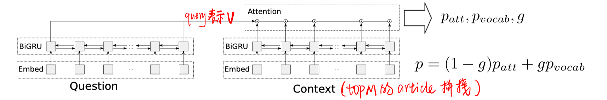
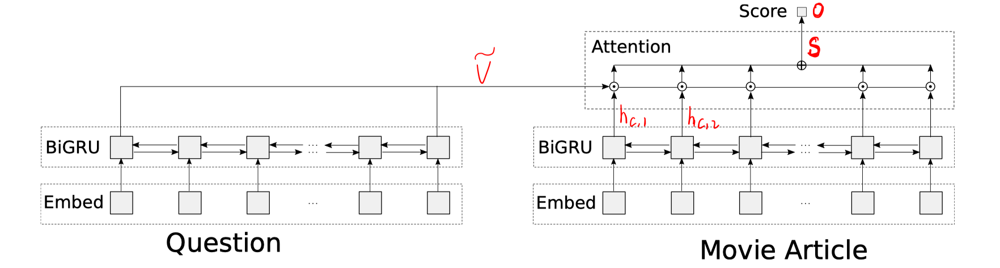

> > 2017，抽取式

# 思路

使用retrieval和reader的pipeline模式，提出了ranker模块。

retrieval（ranker）模块提出了三种方法。

reader模块使用pointer和vocabulary的混合模型。（主要是因为WikiMovie数据集的answer都是实体，而且该数据集提供了一个实体列表，答案都在该列表内）

# 模型

##### reader模块：

使用M个文档的拼接，拼接前先进行shuffle，以提高泛化性。

##### retrieval模块：

方法1：筛选出含有question中实体的文档（N个），随机选择M个输入到reader中。

方法2：筛选出含有question中实体的文档（N个），使用针对该数据集的启发式方法对这N个文档排序，选择topM。

方法3：筛选出含有question中实体的文档（N个），使用word level attention的机器学习方法对这N个文档排序，选择topM。（使用远程监督的方法打标签。该模块使用cross entropy loss进行优化）

# 实验

数据集：WikiMovie