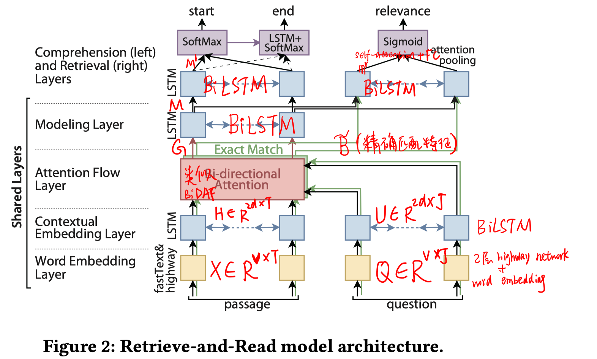
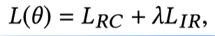
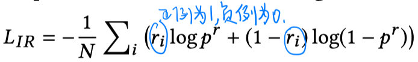
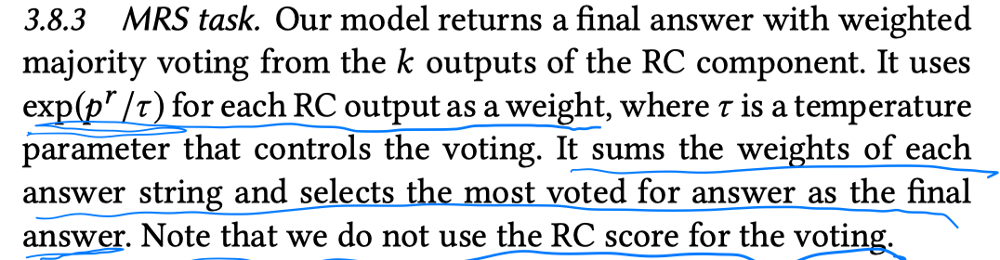
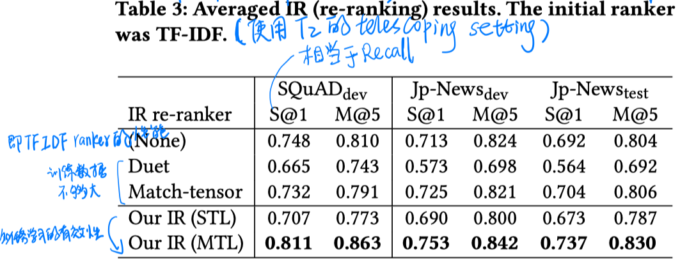
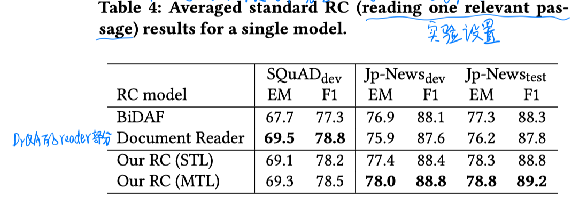
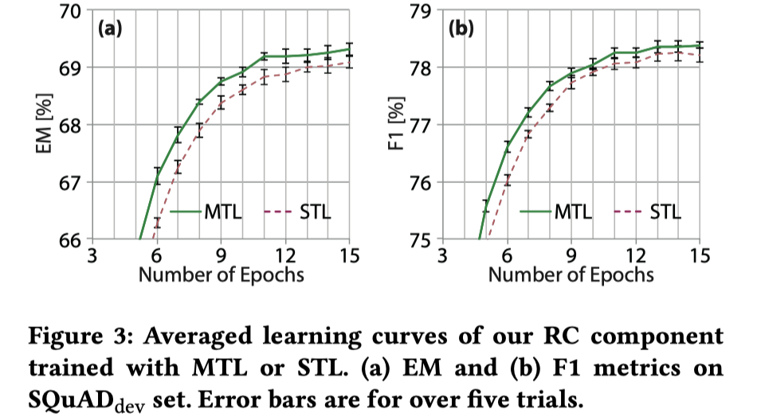
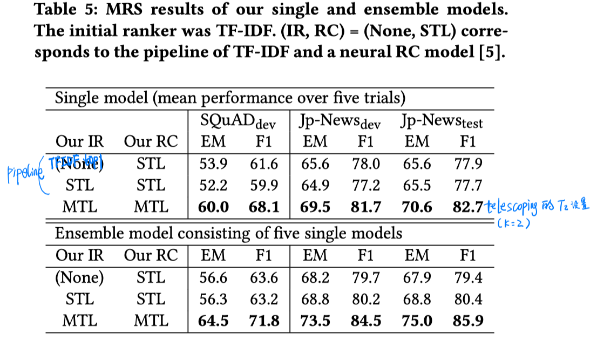
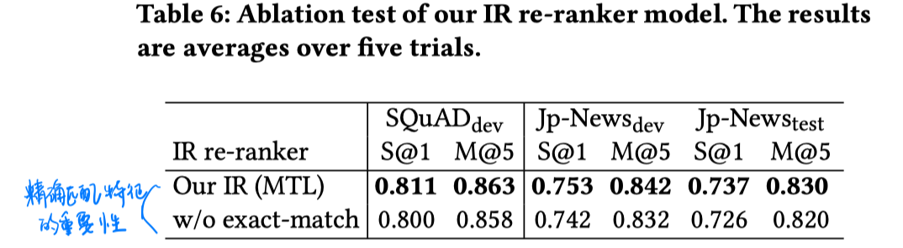
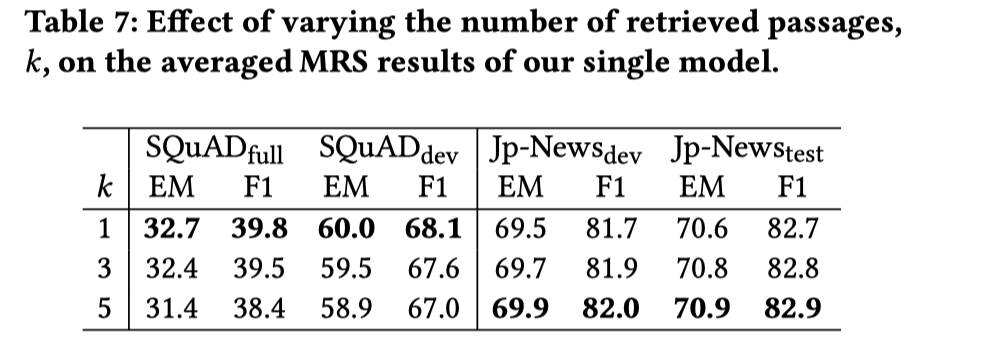

> > CIKM2018，抽取式QA

# 背景

一般的OpenQA都有IR和RC两个模块。但一般在检索相关段落的训练时都没有考虑answer span，比如DrQA是基于精确匹配检索检索的段落，但这些段落不一定是与question相关的。

如果一个RC模型既可以识别一个段落中是否包含answer span，也可以抽取answer span，则可以解决该问题。比如R^3模型，联合训练了这两个任务，但reranker部分采用间接的远监督reward，不是很好。

本文提出一个简单有效的模型，使用有监督的多任务学习联合学习IR和RC，从而使得IR模块能够在训练时考虑answer span。

# 模型

##### 训练（多任务学习）

##### 推断

对retrieval结果的topK个段落，每个段落计算一个相关度 $p^r$和一个候选答案。使用$p^r$对每个候选答案进行打分，选择最终的一个答案。

# 实验

##### 数据集（非开放域）

SQuAD、JP-News

正例是数据集中提供的每个问答对对应的相关passage。

负例是自己根据正例生成的，对每个问答对，对其正例passage根据TFIDF向量检索top15相似的段落，从其中进行采样得到负例。

##### 实验设置

telescoping setting T1：使用DrQA的2-gram TFIDF方法，先检索top5的article，在检索top200的passage，再使用本文的IR模块检索top1段落，输入到本文的RC模块得到答案。（好像是个完全pipeline的模式）

telescoping setting T1：使用TFIDF检索top200段落，使用本文的IR模块检索topk段落，用3.8.3的方法得到最终答案。

##### 实验结果

- 在开放域场景下的性能（用SQuAD的训练集进行训练，在SQuAD-open评估）

  

- 本文的检索部分（reranker）的性能以及多任务学习的影响

  

- 本文的reader部分的性能以及多任务学习的影响

  

  

- 多任务学习对比pipeline的优势

  

- 精确匹配特征对检索模块（reranker）的影响

  

  

- T2设置下K值的影响

  

# 结论

- 联合学习text reranker和reader，使得确定段落的相关性时不仅考虑与question的关系，更直接关注answer span。
- reranker模块本身表现并不好，但结合多任务学习的训练下，可以超过TFIDF的ranker性能。