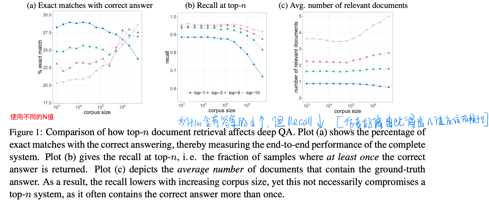
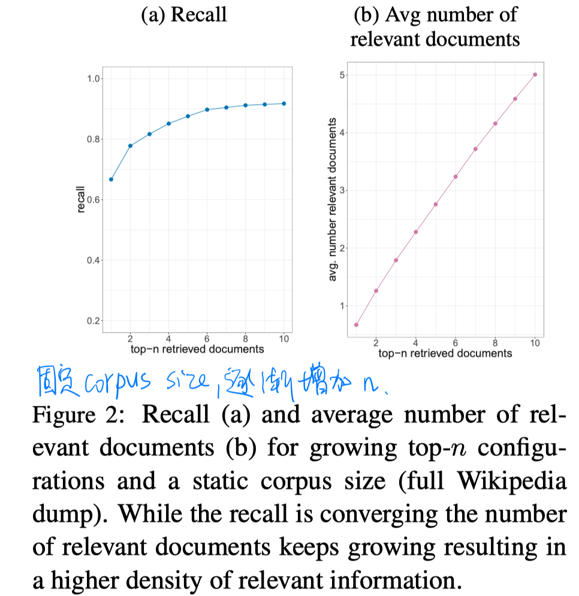
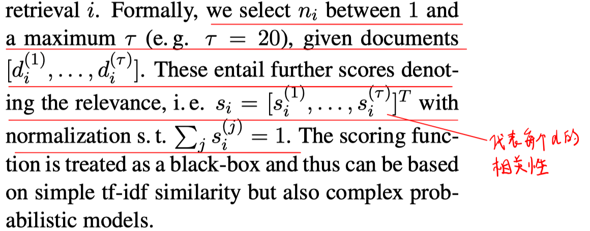
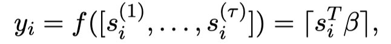
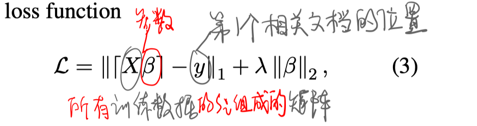
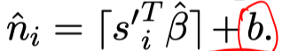
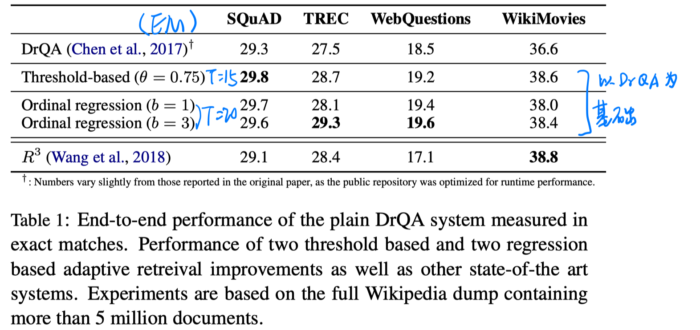
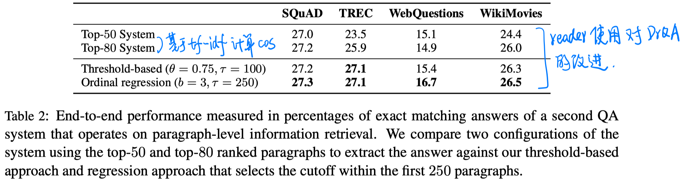
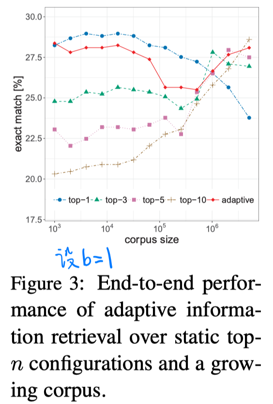

> > EMNLP2018，Adaptive Retrieval

源码：https://github.com/bernhard2202/adaptive-ir-for-qa

# 背景

目前对Retrieval和Reader模块之间的关系还不是很清楚，尤其是应该检索多少个文档用于RC阶段。

目前的模型都采用一个静态的topN值，n值的确定其实是noise-information的trade-off。

本文提出一个Adaptive Retrieval模块，针对每个question预测需要检索出多少个top document用于RC。

# 飞行试验

本文探究了静态topN的性能表现（在TRECQA数据集上，采用DrQA模型）

# 模型

- 拿到Retrieval得到的$top-\Tau$文档及每个文档对应的score。对这些文档的score进行规范化。

  

- 本文提出的一个启发式的 Threshold-Based Adaptive Retrieval 方法

  

- 文本提出的一个机器学习的 Adaptive Retrieval 方法（Ordinal Regression）

  

  

  预测时，加上一个偏置项b（相当于一个超参数），以保证第一个相关文档能被包含进去。

  

# 实验

数据集：SQuAD_open、CuratedTREC、WikiMovie、WebQuestions

实验结果：

探究Adaptive Retrieval对不同corpus的鲁棒性：

# 结论

是一个好的思路，但方法过于简单，提升不是很明显。