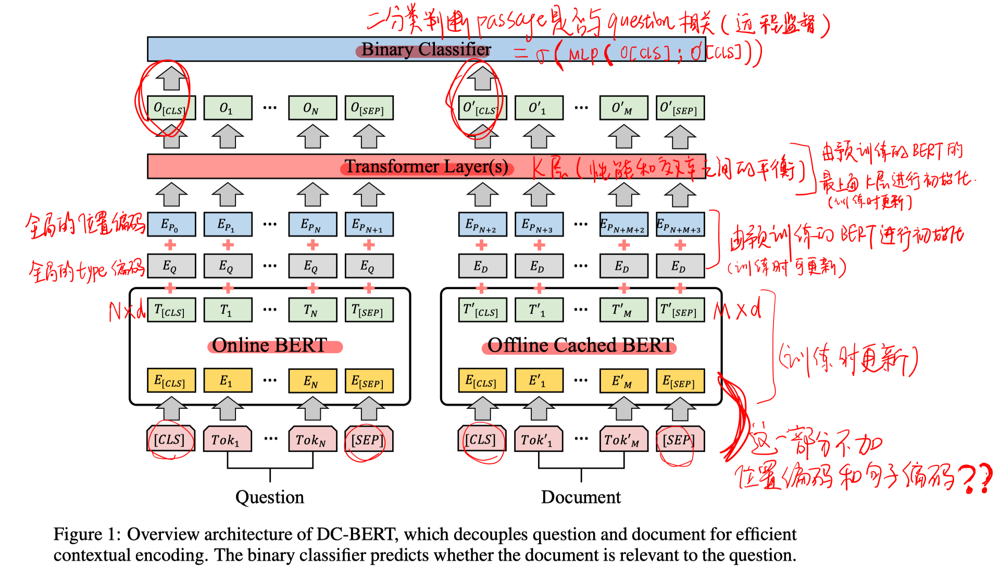
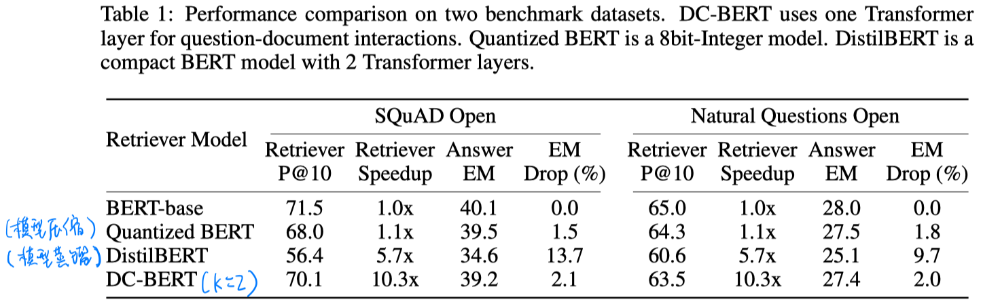
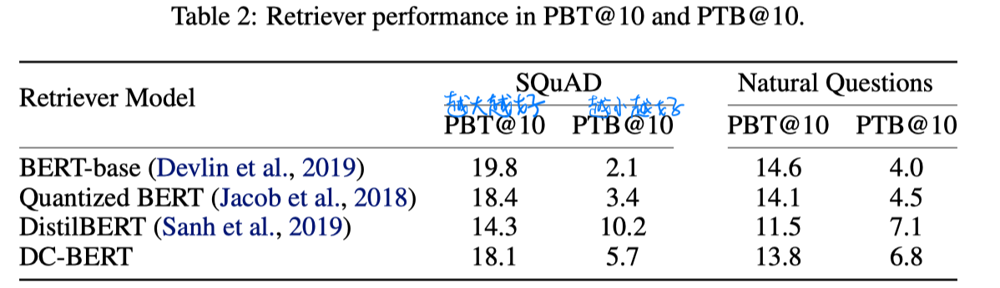
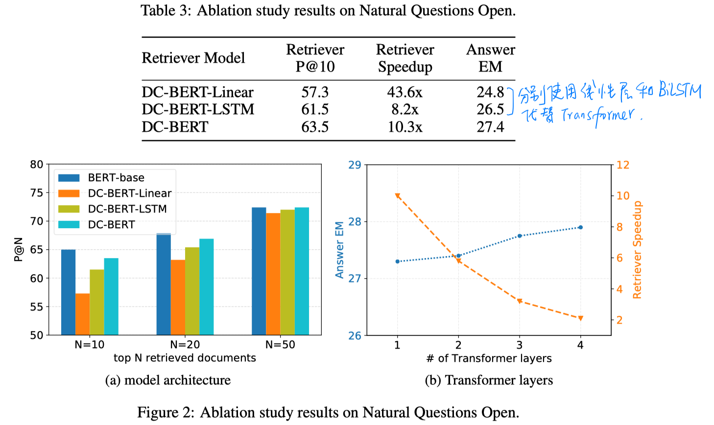

> > 2019

# 背景

一般的开放域QA使用retriever-reranker-reader的方式。以往的reranker一般把question和document拼接起来进行相关度计算，但由于retriever返回的文档一般较多，所以这样处理的效率很低。

# 模型

# 实验

##### 数据集：

SQuAD-open、Natural Question Open

##### 指标：

P@N：answer span出现在topN个文档内的概率

PBT@N：answer span出现在语义检索的topN个文档，但未出现在BM25topN个文档的概率

PTB@N：answer span出现在BM25topN个文档，单位出现在语义检索的topN个文档的概率

EM

##### 实验结果

# 结论

- 比较简单的模型，但在效率上可以提升不少。