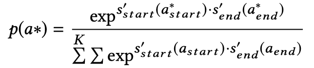
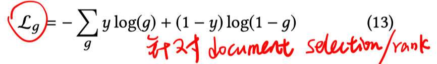
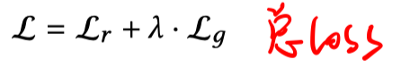
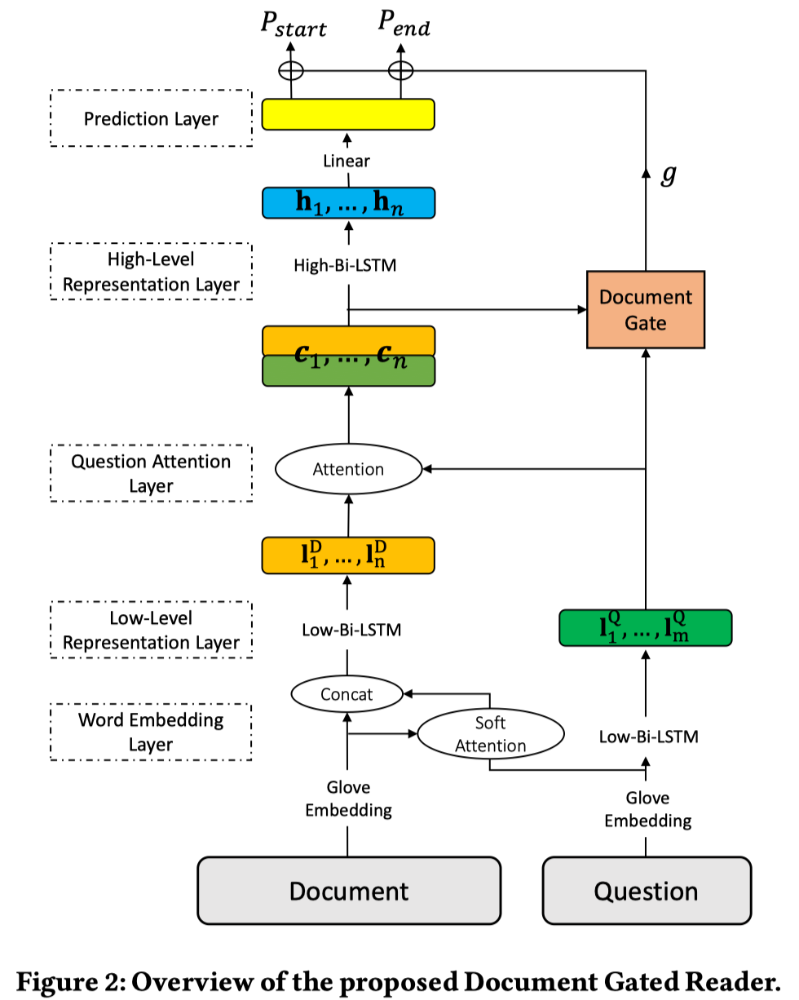
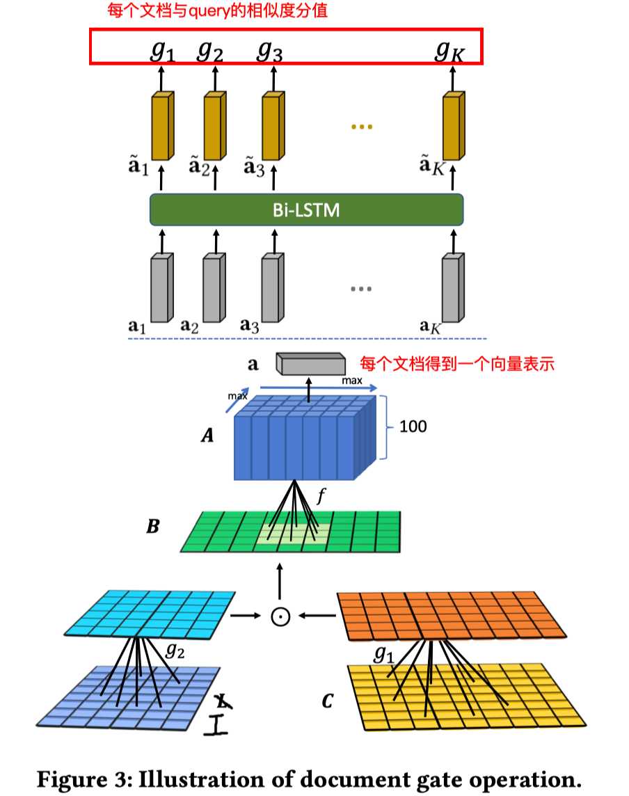

> > SIGIR2019，抽取式QA，DGR

# Motivation

- DrQA的方法使用pipeline模式，retrieval和reader模块是相互独立的，没有关联。因此一些联合训练两个模块的方法被提出了。
- 目前的方法通常选择retrieval的topk文档进行答案生成，但由于检索模块的性能问题，这些topk文档可能不包含答案。因此一些方法提出增加ranker模块。
- 但是目前的方法中，答案生成过程是un-normalized，使得正确答案的预测概率较低。
- 目前的方法一般都针对一个文档生成一个答案，当处理一个文档时没有考虑其他文档的信息。
- 目前的方法都是通过远程监督的方法构造训练数据，但远程监督会带来假正例的噪声问题。

# 思路

在模型层面：

1）多文档的设置，提出Document Gated Reader来决定文档和问题的相关度：将每个文档得到的start/end概率与文档相关度相乘。相当于**联合优化ranker和reader模块**。

2）生成每个文档对应的答案时，也考虑其他文档的信息：**决定每个文档和问题的相关度时，考虑其他文档**。

3）模型对answer span**以global-normalized方式**进行优化。

​      再加上针对document selection的目标函数：

在数据层面：

1）**使用bootstrapping机制得到高质量的远程监督数据**：如果数据集中给出了正例document，则用这些正例作为seed，否则用IR工具检索出top ranked document作为seed。负例是用IR工具检索出的文档中去掉含有answer的文档。然后训练模型，用训练出的模型去预测未标注的文档，选择top ranked 的且含有answer的文档加入正例集合，继续训练模型。迭代该过程，直到没有可以选择的正例或者模型性能不再提高。

# 模型

# 实验

数据集：SQuAD、SearchQA、WebQuestions、WikiMovies

# 启发/备注