> > ACL2018

源码：https: //github.com/thunlp/OpenQA

# 背景

已有的 DS-QA 模型通常的做法是：用信息检索技术从大规模语料中检索相关的段落，然后用这些相关的段落阅读理解技术提取出答案。但这些相关段落中包含噪声（即不含有answer），因此有人提出了rerank模块来解决这个问题，即将reranker后最相关的段落输入到reader中。

但这样的方法存在的问题是：忽略的其他段落中包含的丰富信息；有些问题的回答需要融合多个段落的信息。

本文提出了一个新的 DS-QA 模型，先应用 paragraph selector 过滤掉噪声段落，然后应用 paragraph reader 从去噪的段落中提取正确答案。  

# 思路

本文提出的 DS-QA 模型的基本思路：

1）使用信息检索技术从大规模语料中根据问题检索出m个相关文档；

2）paragraph selector：计算每个相关文档包含答案的概率，对所有文档的得分求softmax，从而降低噪声段落的权重；

3）paragraph reader：从每一个被选段落中提取答案； 

4）集成从各段落中提取到的答案，得到最终答案。

# 模型

##### paragraph selector

对段落：word embedding + 一层BiLSTM或MLP

对问题：word embedding + 一层BiLSTM或MLP + self attention = question的向量表示

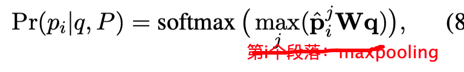

##### paragraph reader

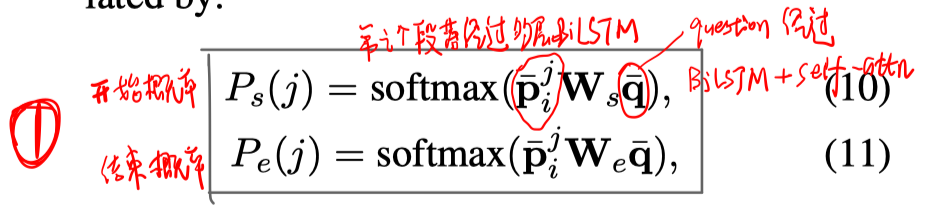

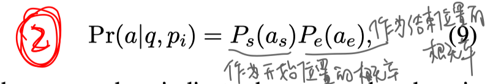

由于一个段落中可能存在多个answer span，有两种策略：

- max

  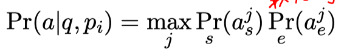

- sum

  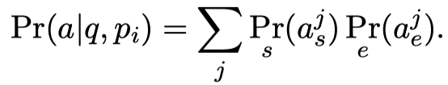

##### 训练与推断

- 训练的目标函数

  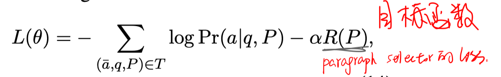

  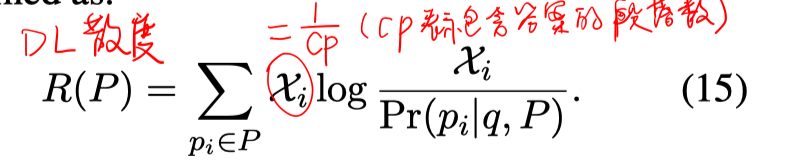

- 预测

  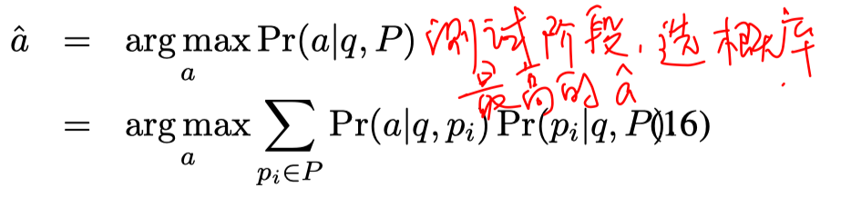

  

# 实验

数据集：Quasar-T、Search-QA、TriviaQA、CuratedTREC、WebQuestions

实验结果（AVG是指没有reranker，给所有的paragraph相同的权重）

- paragraph selector

  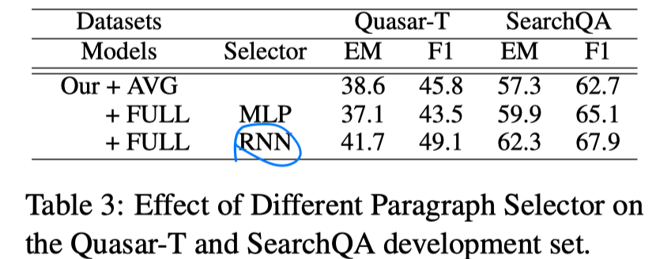

- paragraph reader

  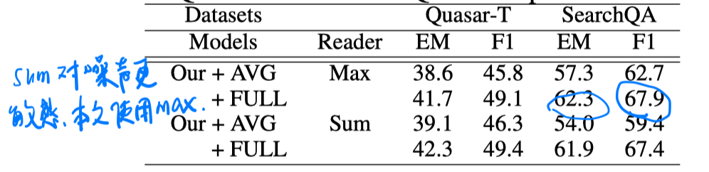

- main result

  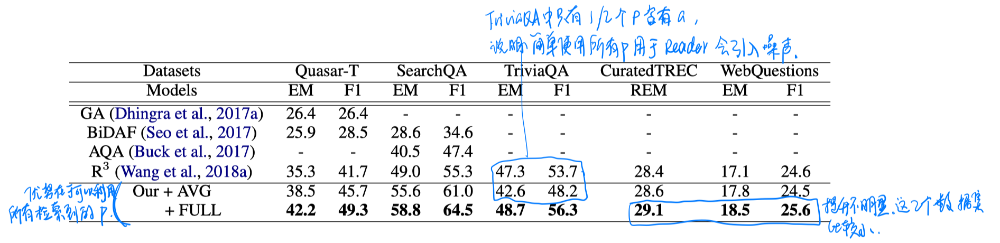

- reranker（paragraph selector）的性能分析

  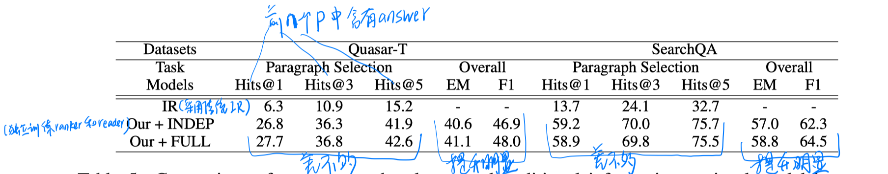

- 选择不同的paragraph数

  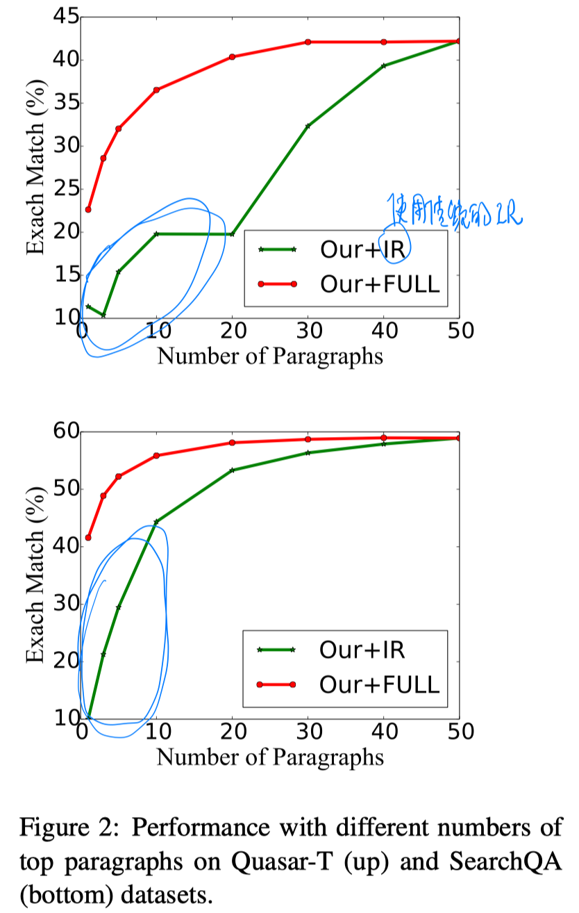

  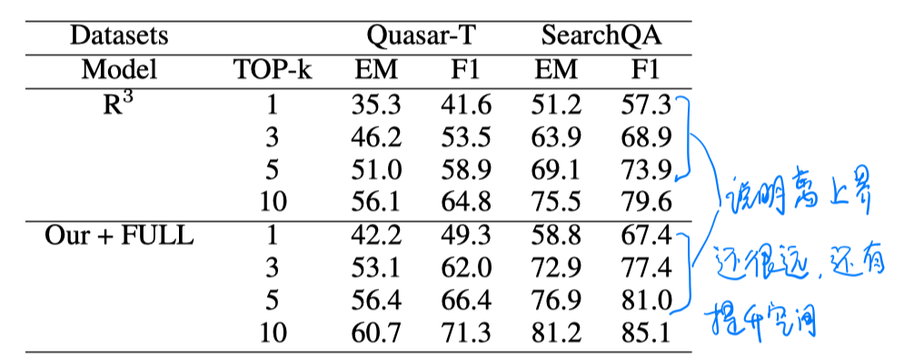

# 结论

本文采用非global normalize的方法，可能有点问题。