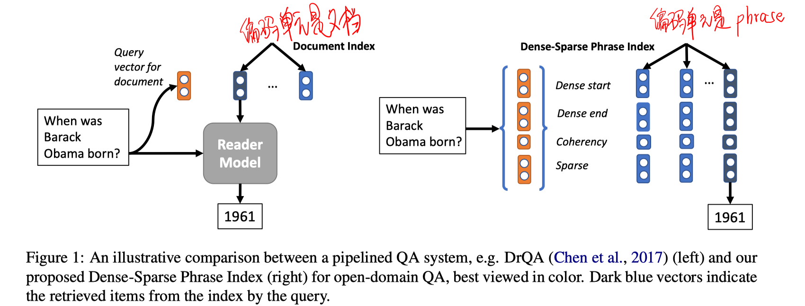
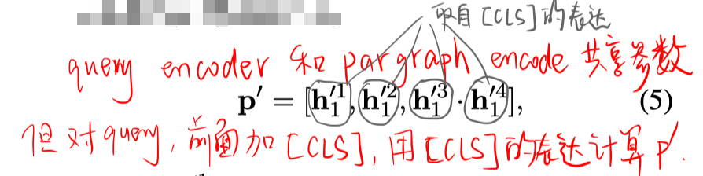
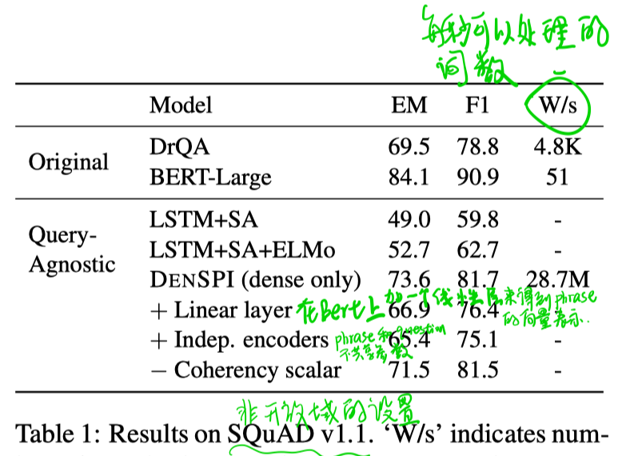
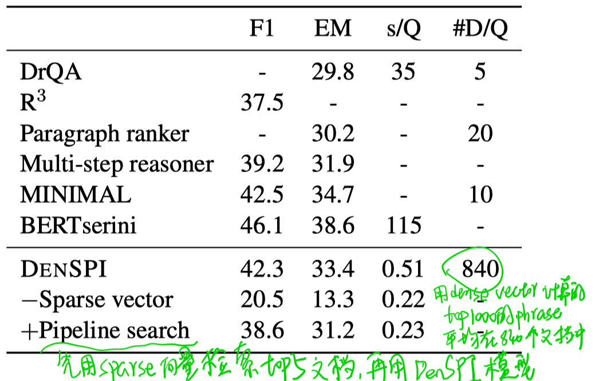
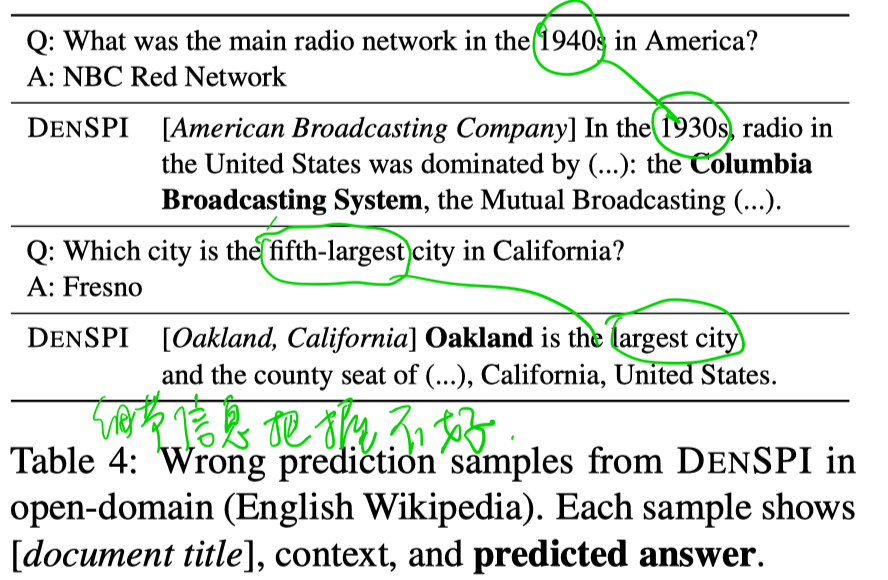

> >ACL2019，DenSPI

代码：https://github.com/uwnlp/piqa

# Motivation

传统的QA系统的劣势：

- pipeline结构，先要经过搜索，然后再经过RC抽取出答案。性能会受到搜索结果的上界影响，其次就是会阻断一些有用但排序较后的文档输入到reader阶段。
- 阅读理解部分的模型对每个新的question都要重新对document进行编码，即document表示是依赖于question的，导致效率不够高。

本文提出了 Dense-Sparse Phrase Index，一个indexable query-agnostic phrase representation model 。

该模型不使用pipeline模式（retrieval+read的范式），而且不是对每个document建立索引，而是以phrase为单位建立索引（可以直接通过与question表示计算内积得到答案span）。dense-sparse phrase index包含了dense vector和sparse vector。dense vector编码了phrase的语法和语义特征，而sparse vector则编码了整个文档的term frequencies信息（相当于phrase的上下文，可以起到精确匹配的效果）。

下图左为传统的open-domain QA方法，右为phrase-index的方法。

# Problem Definition

# 模型

#### Dense Vector

- 对于phrase

bert输入是wikipedia文章，输出的每个词对应的向量h_i为512维，h1和h2是480维，h3和h4是32维。

对每个长度不超过20个词的phrase表示成d(i;j)。

（论文中说整个wikipedia中大约有600亿个phrase，对dense vector建索引时，作者采用了一些trick减小存储空间）

- 对于question

  

#### Sparse Vector

这里用了phrase所在document和paragraph的2-gram的tf-idf向量之和，大概是16M的维度。

#### 搜索

这里要做最近邻搜索，通过[Faiss](https://github.com/facebookresearch/faiss)这个开源工具实现的。

对开放域问答的场景，是先用dense vector通过最近邻搜索得到top1000个phrase（可以从语义角度发现潜在相关的候选span），再用sparse vector进行rerank。用dense vector计算时采用一些trick提高效率，先搜索开始位置start vector a_i , 对于每个开始，找到一个最好的结束位置。

# 实验

##### SQuAD v1.1数据集

这个数据集不是开放域的设置，作者只是想在这个数据集上面验证效果。由于每个question都有一个对应的段落，该段落中所有phrase的sparse vector是相同的，所以直接只用dense vector部分计算最近邻就可以得到答案。
这里可以看到作者的方法比DrQA要好，比BERT差一些，但是速度分别是两种方法的6000倍和50万倍。

##### SQuAD-Open

下面是正常的open-domain QA的数据集，对于其他方法，通过2-gram tf-idf抽取出结果，然后再做RC。这里可以看到作者的速度是其他方法的几十倍，而且效果也还行。同时DenseSPI和+pipeline search的对比也可以看出提高reader模块输入文本的多样性的好处。

##### 定性分析

从表现不好的一些case可以看出，在精确匹配方面还不够完美。

# 结论

- 还是不能解决精确匹配场景，所以相比基于交互（word level attention）的方法，性能还是有些欠缺。