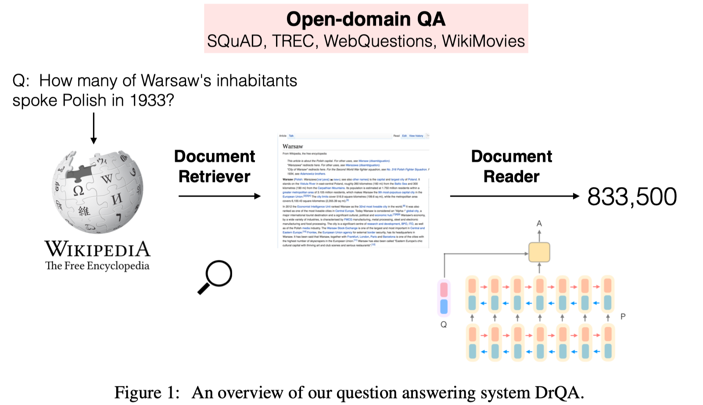
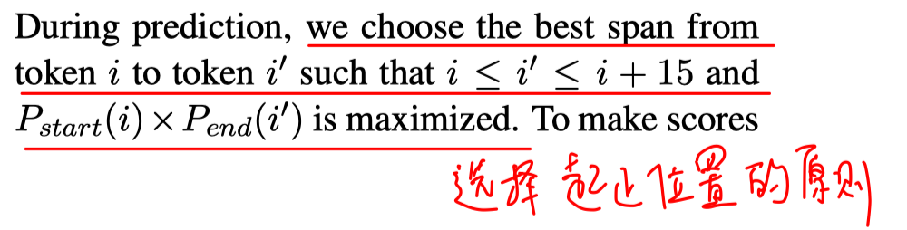
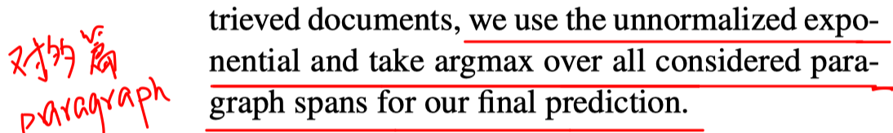
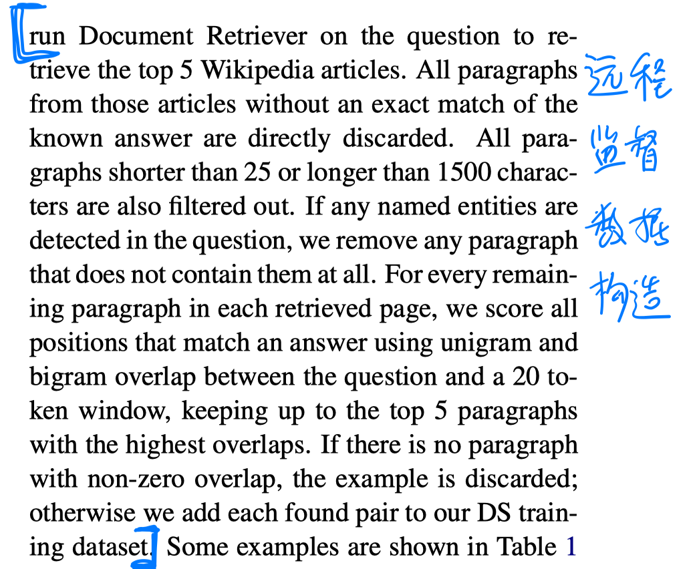
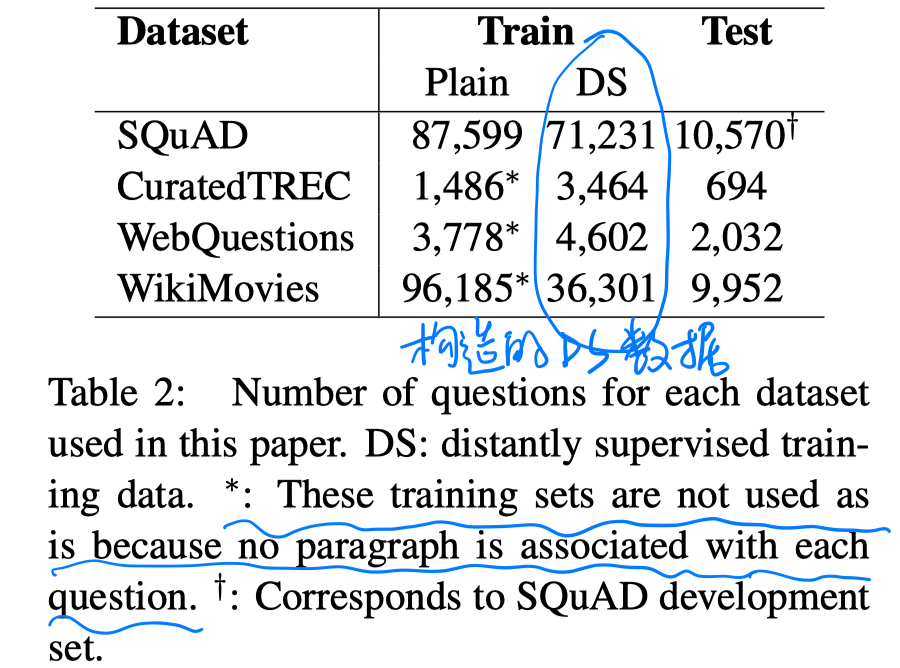
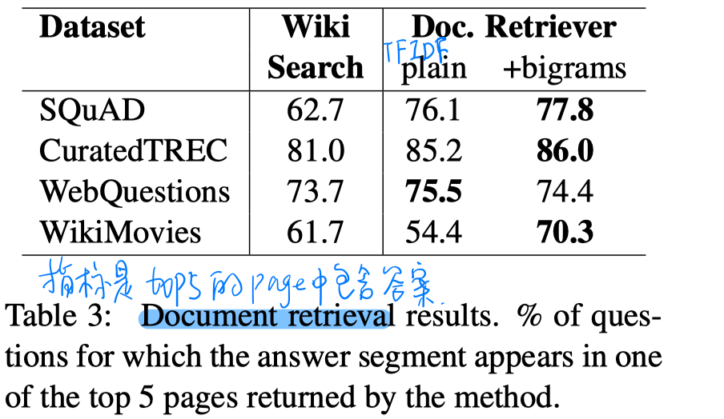
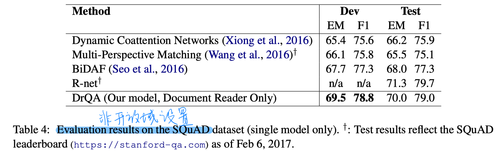
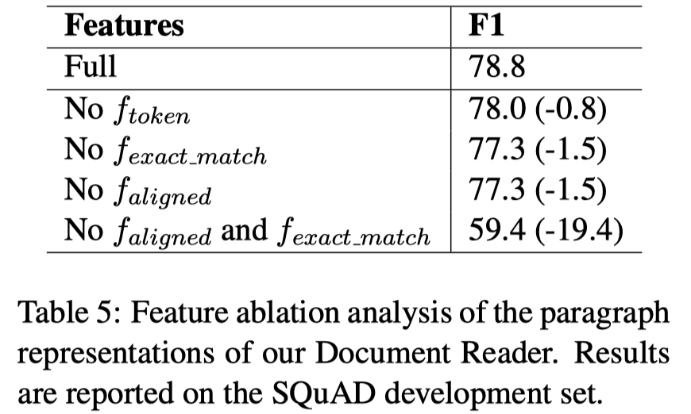

> > 2017，抽取式QA

# 背景

两个模块：

（1）document retriever：检索出与question最相关的topK个Wikipedia article

（2）document reader：从检索回的article的每个段落中预测 answer-span

# 模型

##### Document Retriever（返回前5个document）

TFIDF词向量 + 2-gram + hashing

##### Document reader（对每个段落抽取答案）

Question  Encoding：glove embedding + 多层BiLSTM + self-attention 得到question的向量表示

Paragraph Encoding

输入：gloving embedding（只有question中前1000个最频繁的词向量在训练中微调，其他冻结）

​           与question的 精确匹配特征（包括原始匹配、小写匹配、lemma匹配）

​           paragraph的token 特征（词性、实体、词频）

​           与question的aligned question embedding（相当于一个attention） 

处理：多层双向LSTM   

输出：所有BiLSTM层输出的拼接

##### 预测

# 实验

##### 数据集

SQuAD（训练时使用gold paragraph，在dev上评估时使用open domain）、CuratedTREC、WebQuestions、WikiMovies

##### 构造远程监督数据

##### **实验结果**

- retriever的性能

- reader的性能（train和dev都是非开放域设置）

- DrQA在开放域设置下的性能

  

# 结论