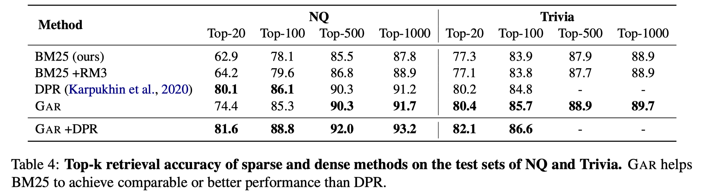
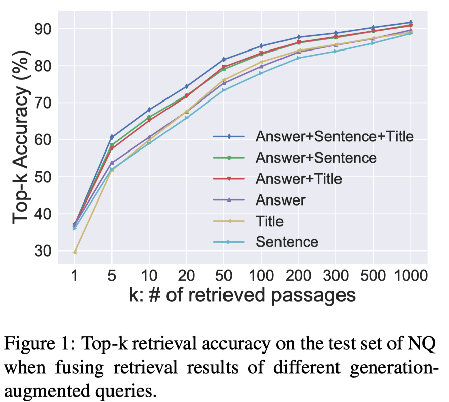
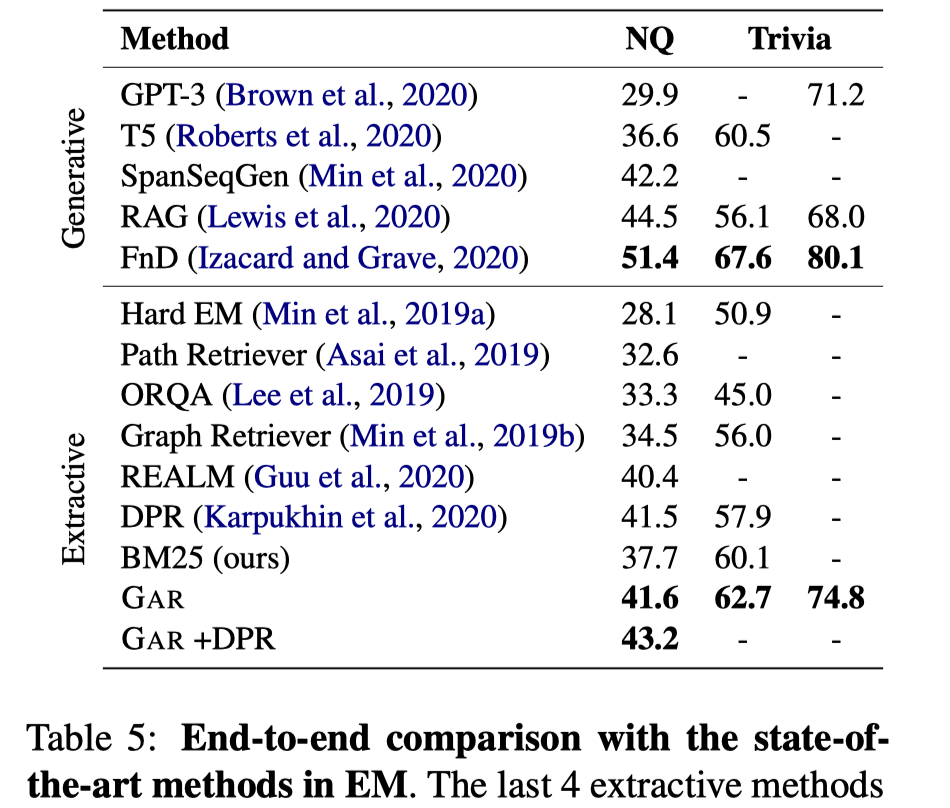

## 解决思路

1）GAR augments the semantics of a query with relevant contexts (expansion terms) through text generation of a pre-trained language model (LM).

Instead of using questions as queries directly, G AR uses a pre-trained LM to generate contexts relevant to a question and expands the query by adding generated contexts.

Specifically, we conduct sequence-to-sequence (Seq2Seq) learning with **the question as input and various generation targets as output** such as the answer, the sentence where the answer belongs to, and the title of a passage that contains the answer. We then append the generated contexts to the question as the generationaugmented query for retrieval.

2）然后使用扩充的query，根据BM25等方法检索passage。

## 实验

