> >ACL2019，抽取式QA、多跳推理

# 背景

对于multi-hop的开放域问答任务，需要同时具备【高效检索】和【文本推理】能力。

对于开放域的QA任务，目标是找到一个函数，可以输入知识源和问题，输出该问题对应的答案（知识源中某个段落中的一个span）。

Single-hop Retrieval：对每个问题，只检索出一个supporting paragraph。

Multi-hop Retrieval： 有些问题的回答需要multi-hop reasoning（动机是evidence不仅可能分布在多个段落中，关键是可能需要先读取部分段落，才能从其他段落中发现有用的信息）。Multi-hop retrieval中，supporting paragraph需要用迭代的方式进行检索。

类似DrQA的TFIDF方法，在开放域中对单跳问题有用，在多跳问题上性能很差。

 

本文提出了MUPPERT（multi-hop paragraph retrieval）模型，从大量知识源中检索出多个supporting paragraphs，用作必要的evidence来回答给定的问题。

1）使用encoder 得到question 和 paragraph的表达；（paragraph的表达不依赖于问题，可以提前算好进行存储，不浪费在线时间！！！）

2）最大内积搜索找到topk相关段落；

3）根据前一轮搜索得到的topk相关段落，分别形成k个新的question向量表示，用于下一轮的最大内积搜索得到topk相关段落。

3）把各轮迭代得到的topk段落输入到reader中，reader读取每个相关段落，分别抽取答案。

# 模型

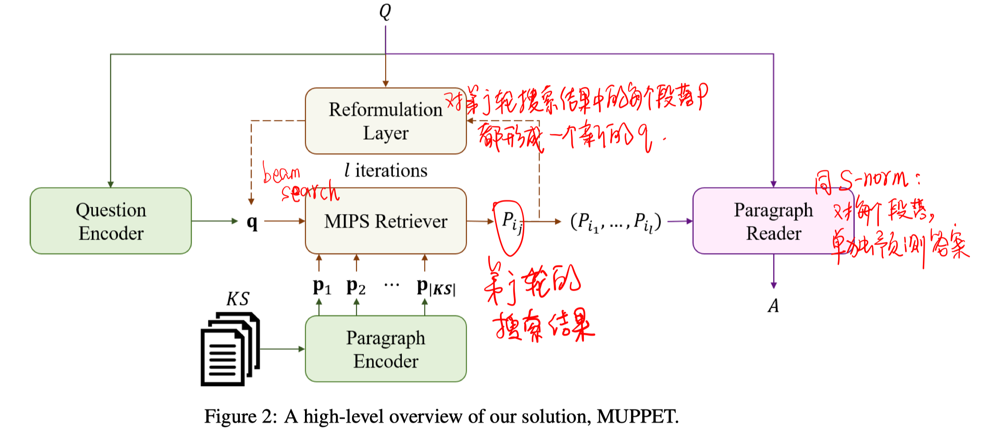

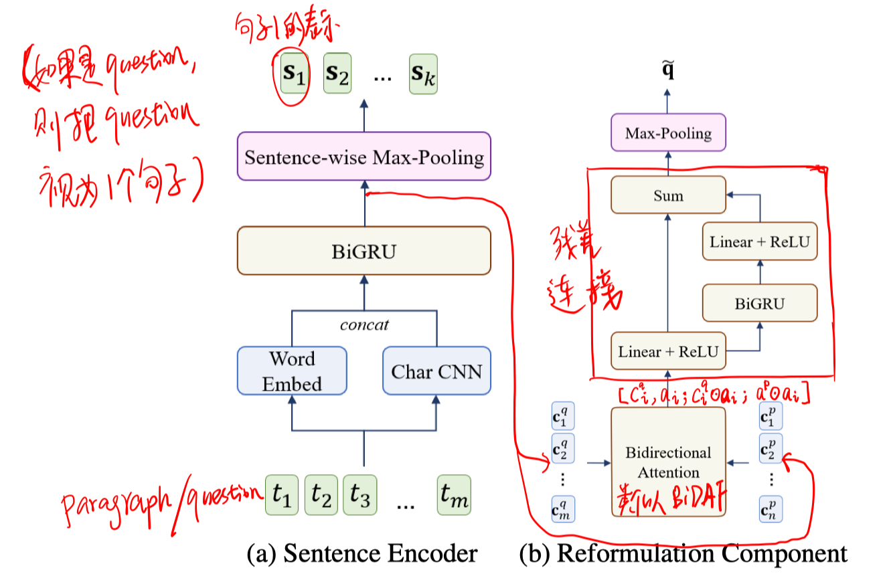

##### Paragraph Encoder & Question Encoder

Embedding + BiGRU + maxpooling.

注意paragraph是在每个句子范围内进行maxpooling，最后存储的是每个段落中所有句子的向量表示。

##### MIPS Retriever

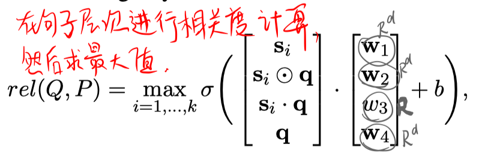

上式转换为：

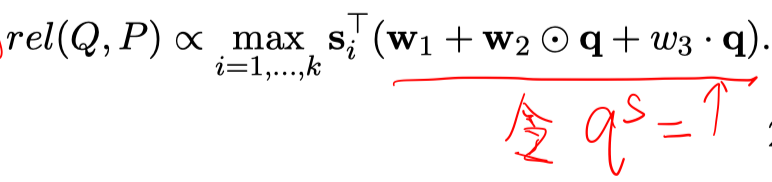

##### Reformulation Layer

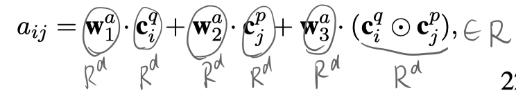

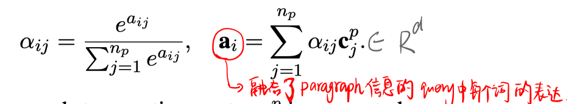

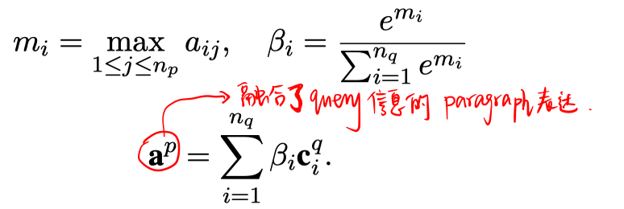

##### Reader

采用和S-norm一样的模型。

##### 训练

- retriever部分

  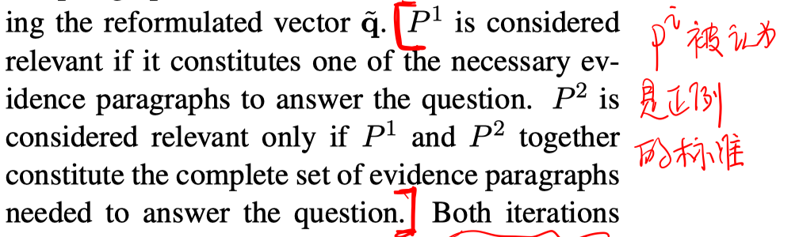

  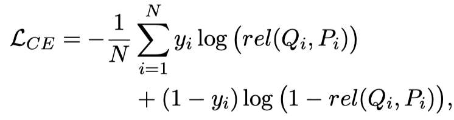

  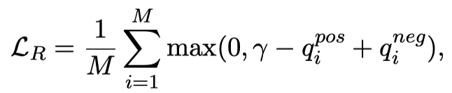

  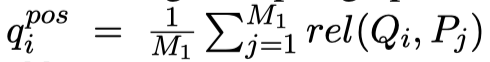

  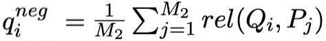

  

- reader部分

  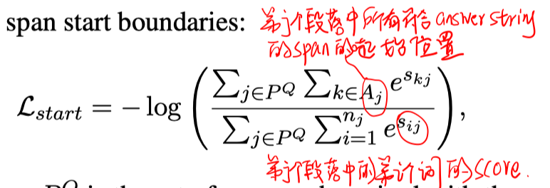

  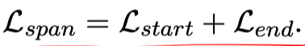

# 实验

##### 数据集

HotpotQA用于多跳检索（只使用Wikipedia的第一段）、SQuAD-open用于单跳检索（使用Wikipedia全文）

注：也使用了2-gram的TFIDF缩小MIPS的搜索空间，每一轮的搜索空间是个超参数。

##### 实验结果

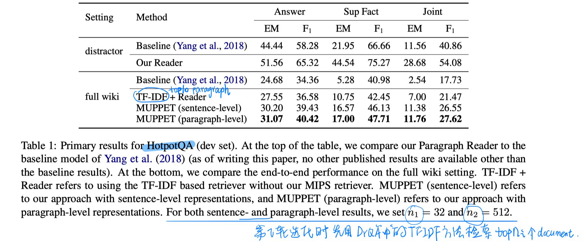

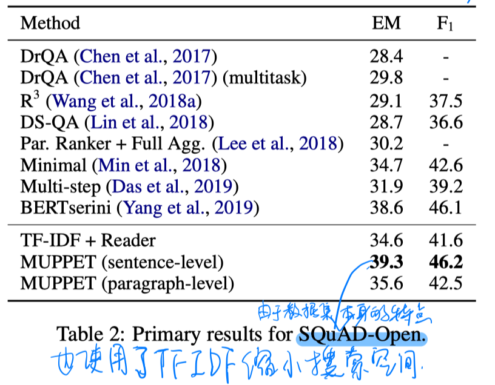

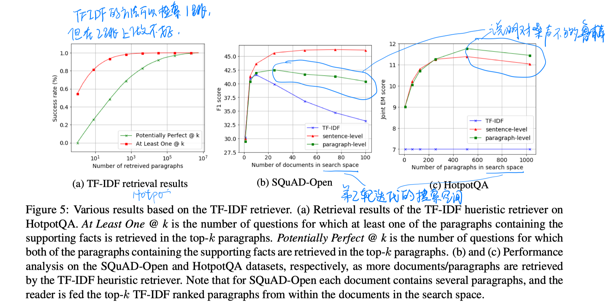

# 结论

- 通过前一轮的检索结果重构问题表示，再进行下一轮，对多跳推理特别有用。
- 但仍然需要先用TFIDF减小搜索空间，否则会降低性能。因为模型对噪声的鲁棒性不是很好。
- 主要是针对的多跳推理，但reader部分使用S-norm，对每个段落单独生成答案，显然不合理！！！！！