> >ACL2018，抽取式QA

# 背景

- 目前用于 QA 的神经网络模型都取得了很好的效果（一般都是用双向注意力机制），但是由于要计算问题和文档之间的相互关系，当文档过长时计算复杂度较高，难以扩展到大规模语料上。
- 而且最近的研究结果表明，这些模型对于对抗输入比较敏感。

本文通过飞行试验和结果分析发现数据集中大部分问题的回答只需要一小部分句子集合。

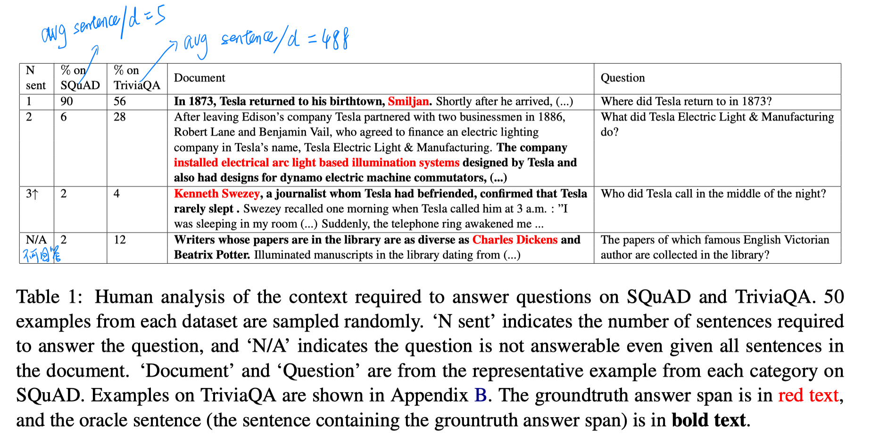

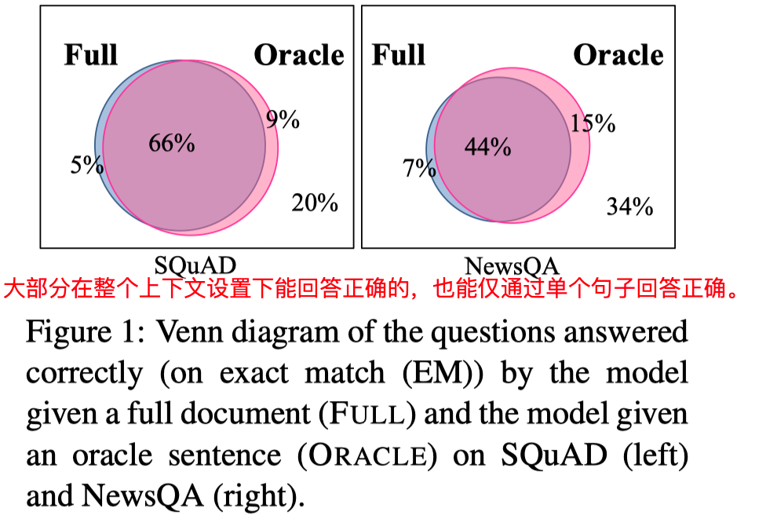

基于此，本文中提出了一个简单的 **sentence selector** 来选择最小的句子集合（句子数是自适应的，根据不同的问题而不同），输入到QA模型中，而且结果表明这种方法对于对抗输入更鲁棒。

 

# 模型

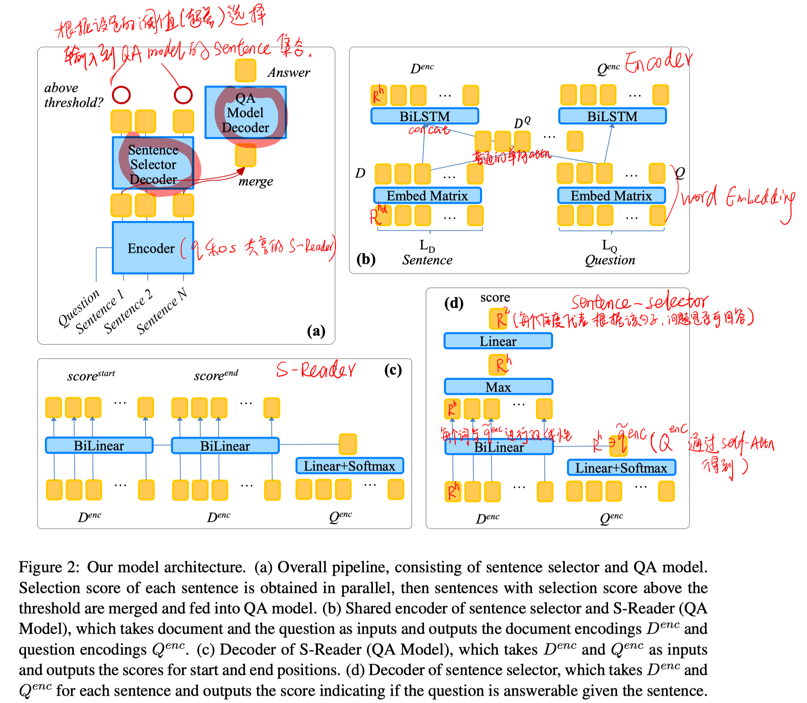

##### Encoder

word embedding

attention：

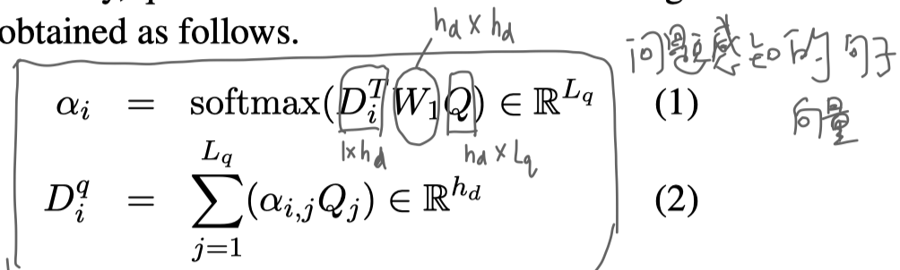

BiLSTM：

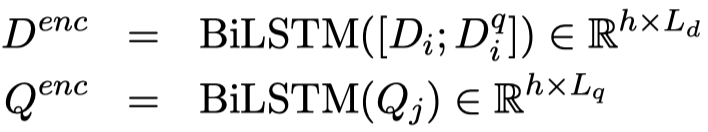

##### sentence selector

question通过self-attention得到向量表示：

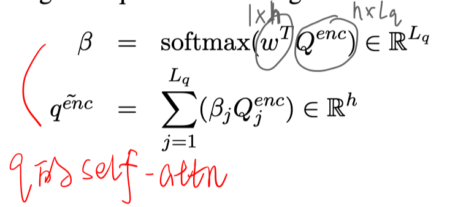

得到每个sentence的socre：

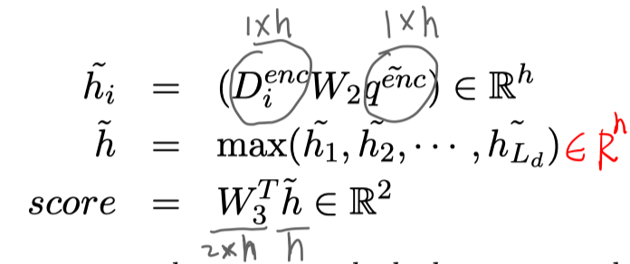

Dym：根据设定阈值和每个sentence的score，选择要输入到QA模块的句子集合。也就是说每个question有不同的句子数。

top-k：选择top-k个句子输入到QA模块。

##### QA Model

S-Reader。

##### 训练与推断

论文好像没有给loss函数。

# 实验

数据集：SQuAD、NewsQA、TriviaQA、SQuAD-Open、SQuAD-Adversarial

实验结果：

- 探究selector的效果

  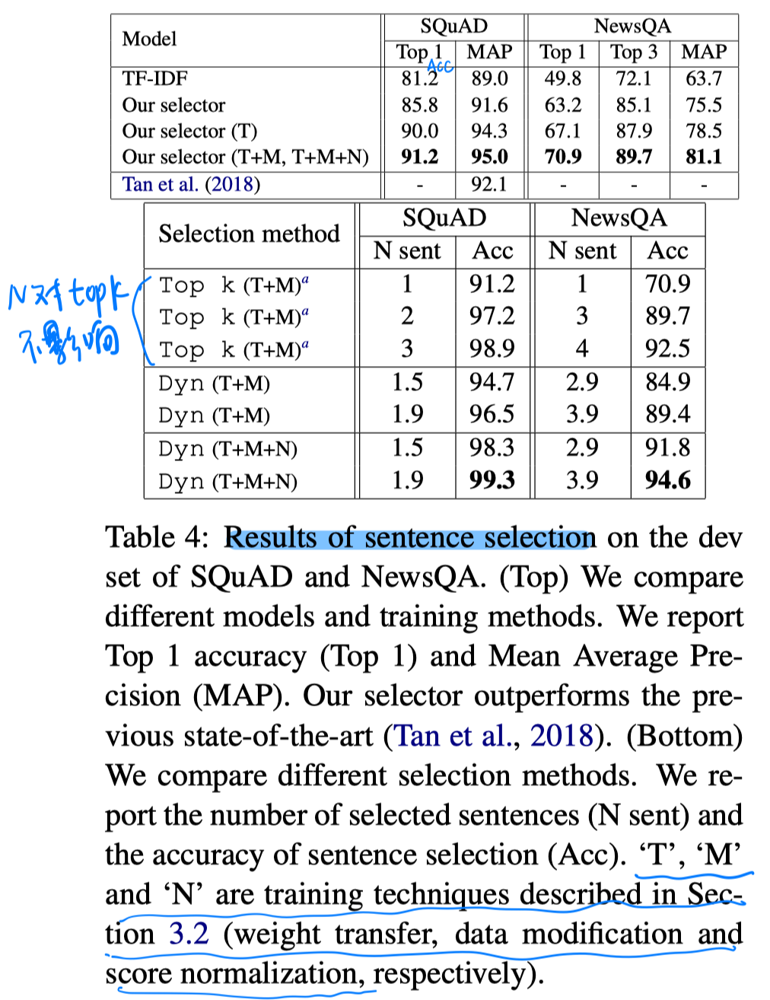

  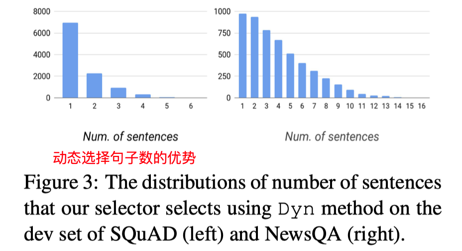

- 整体答案预测的性能

  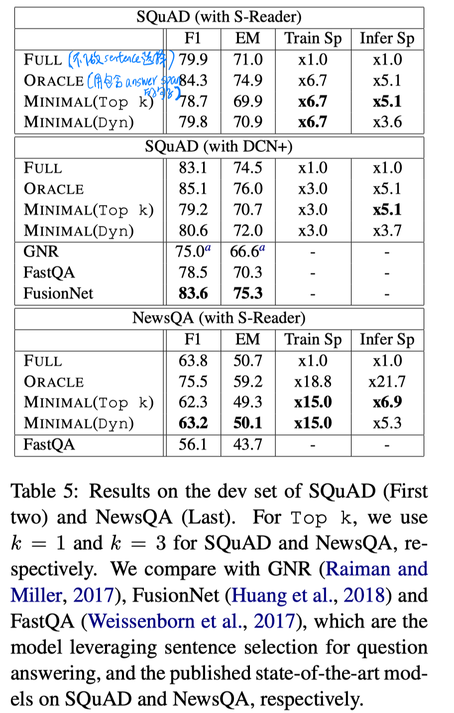

  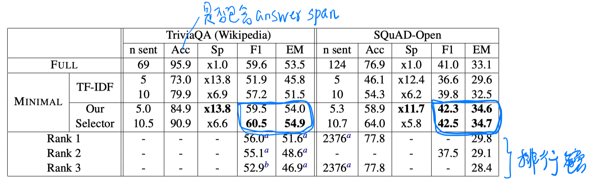

- 对抗性

  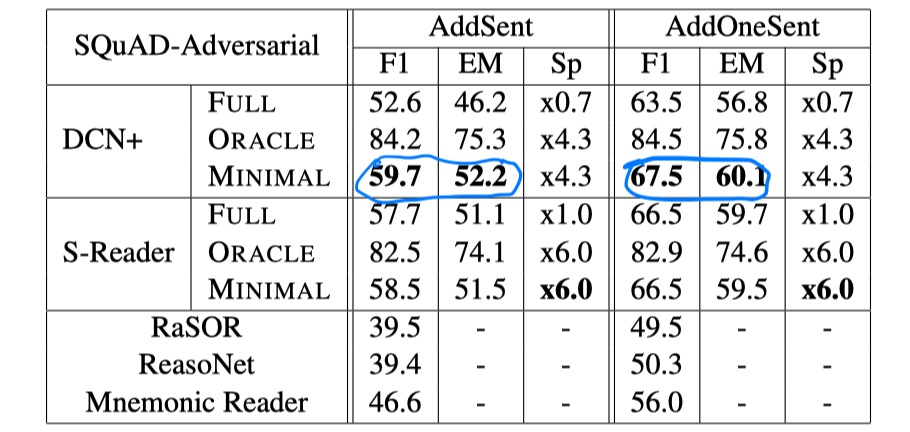

# 结论

- 本文相当于提出了一个sentence-level的reranker，相比阅读整个上下文更高效。但由于该reranker的模型设计比较简单，排序效果可能不是特别好，进而有时会带来答案预测的性能损失。
- 本文的sentence selector是单独对每个句子进行编码，以及与question的交互，没有考虑每个句子的上下文信息（e.g.指代关系），以及句子之间的先后顺序。

