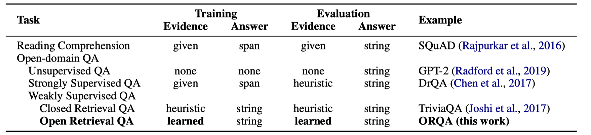
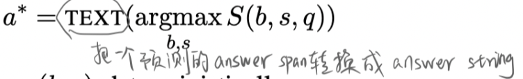
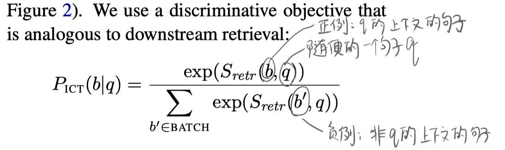
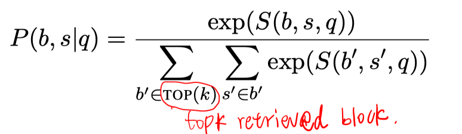
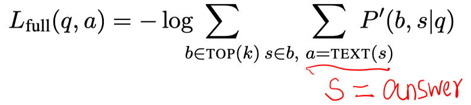
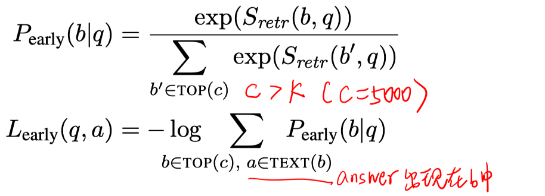
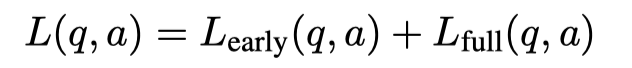
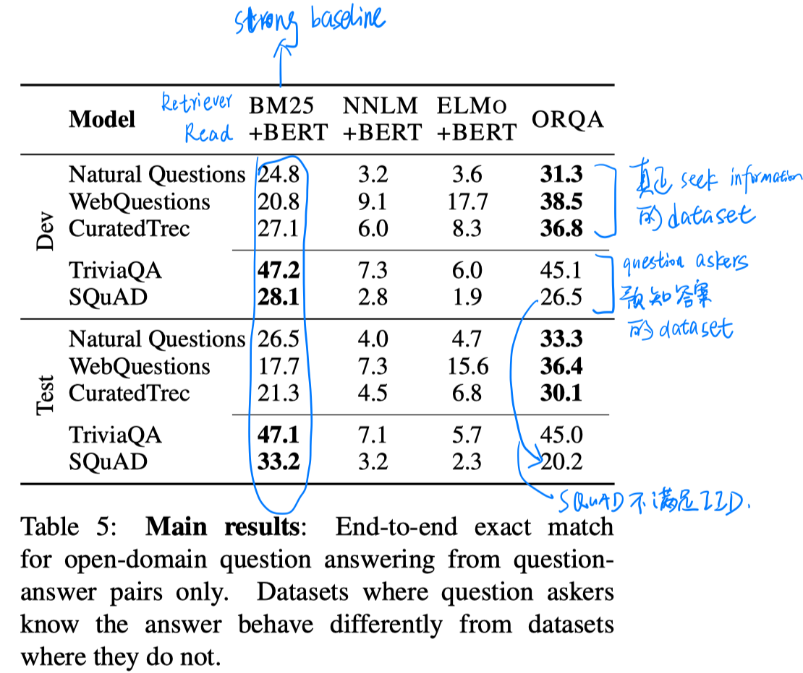
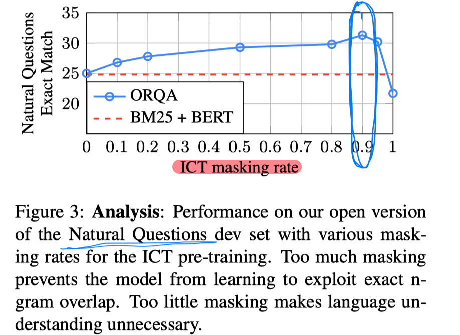

> > ACL2019

# 背景

目前的开放域QA一般都是 retriever+reader 的做法。

训练时：

推断时：

开放域QA的主要问题是规模很大，从超大的搜索空间中进行检索应该是个隐变量，很难从头开始训练。

本文提出OROA模型（Open-Retrieval Question Answering），使用无监督的ICT task预训练retriever，然后通过 question-answer pair 进行微调，直接通过最大化答案来联合学习 retriever 和 reader，不需要任何IR系统。

# 模型

训练的难点在于：1）retriever的搜索空间大；2）使用远程监督会有假正例的噪声（span=answer string，但不是答案）

使用ICT任务预训练retriever的优势：1）通过预训练之后就可以预编码所有evidence block（例如，以每个passage为单位），在微调阶段evidence encoder是固定的。2）联合训练retriever和reader，可以使retriever偏向于真正的相关evidence block，而不是假正例。

##### ICT预训练

ICT任务：给定一个句子，推断它的上下文。

目标函数：

为了学习精确匹配信号，b中90%的情况去除了q，10%的情况包括q。

##### 联合微调

预训练之后，block encoder不再变化，只有question encoder需要微调。

为了帮助更快地训练，提出early update：

最终的目标函数：

##### 推断

预训练之后，就可以对所有的block进行编码，并建立索引，以便之后使用最大内积搜索得到topk个相关的block，并以这k个block进行reader。

# 实验

数据集：Natural Questions、WebQuestions、CuratedTrec、TriviaQA、SQuAD-open

实验结果：

case study：

# 结论

- 抛弃term-based retrieval方法，使用基于机器学习的方法，当然会出现case study中good case的情况。但同时也难以避免细粒度信息的问题。
- 使用ICT任务预训练retriever，使端到端地训练retriever和reader成为可能。

