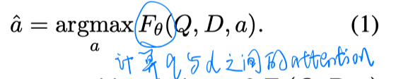
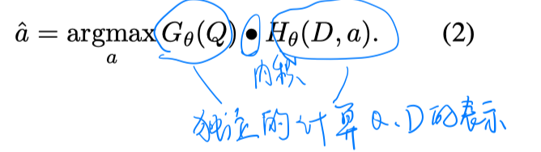
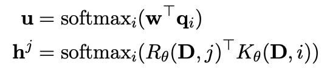
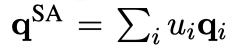
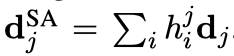
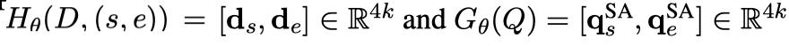
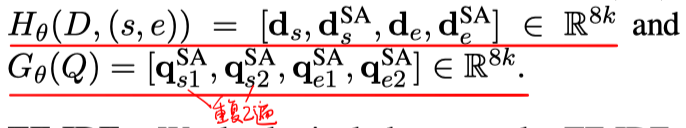
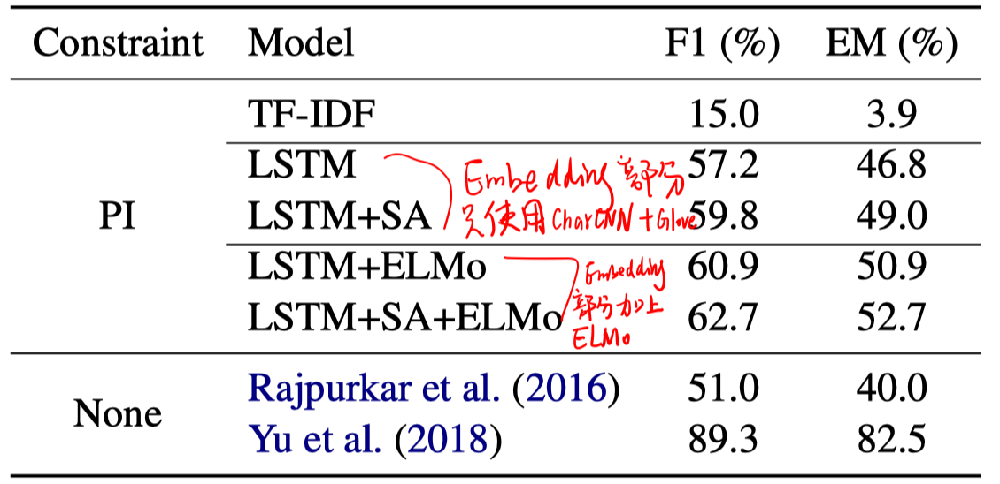
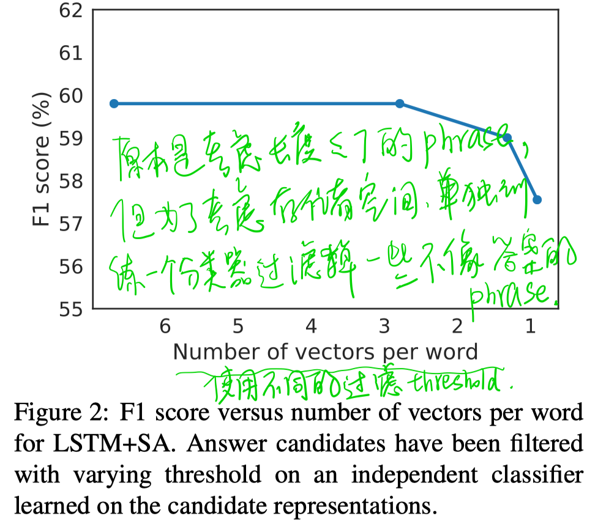

> > EMNLP2018，抽取式QA

# 背景

如果可以完全独立的编码document和question，则可以预计算document phrase（所有的候选answer span）的表示并离线建索引。

传统的方法：

PIQA（Phrase-Index QA）：（a表示一个candidate phrase，即D中的一个span）

# 模型

本文就该任务提出了几个baseline。

- LSTM baseline：embedding layer是CharCNN+Glove；然后将question和document分别通过LSTM层得到q_i和d_i；然后再对question进行self-attention，得到question的向量表示；对document进行self-attention。

  

  

  

  

  （q_s和q_e是使用两组不同的参数得到的，但论文中没说明只是w不同，还是LSTM参数也不共享）

- LSTM+SA：

  

- TFIDF：计算每个phrase（长度<=7）的TFIDF向量。

# 实验

在SQuAD1.1数据集上进行，考虑长度<=7的span。

对每个phrase的表示单独训练一个分类器，设定阈值threshold过滤掉不太能作为answer的phrase，从而能够节省存储空间。

# 结论

- 加入Phrase-Index的限制，会在一定程度上损失性能，但是会获得效率的提高。

