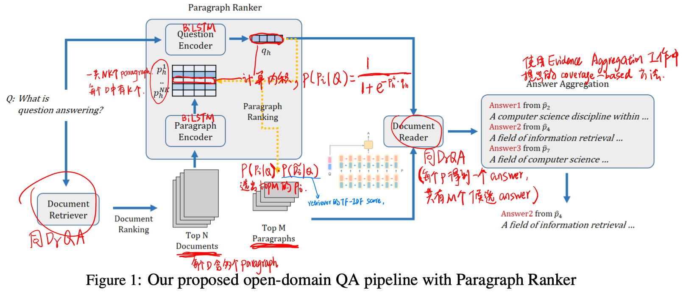
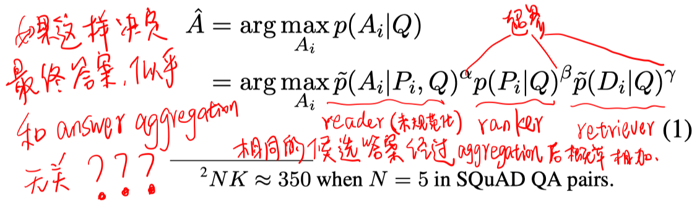
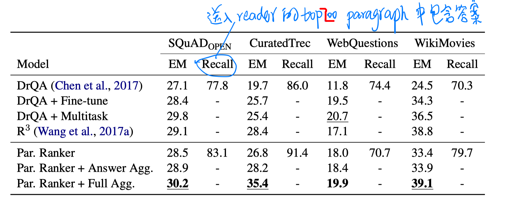

> > EMNLP2018，抽取式QA，Paragraph Ranker

# 背景

当前的openQA模型大多都是选择retrieval阶段几个排序较前的topN文档（DrQA选择top-5）输入到reader模块，由于检索技术的局限，前几个文档可能不包含答案。如果只简单地选择更多的文档，又会因为引入噪声而导致QA的性能下降。因此N的选择其实是接触更多的文档和最小化噪声的平衡。

本文提出了Paragraph Ranker模块，可以接触retrieval后更多的文档，从而提高答案的召回率，同时只要控制输入到reader模块的Paragraph数目就可以保证免受噪声的干扰。

# 模型

最终的答案选择：（不是很理解coverage-based answer aggregation是怎么用的）

本文中设置N=20，M=200。

模型训练采用远监督+负采样：

# 实验

数据集：SQuAD_open、CuratedTREC、WikiMovie、WebQuestions

（在SQuAD的training set上预训练reader和ranker）

实验结果：

- Paragraph Ranker：仅使用未规范化reader输出的结果，和DrQA的方式相同。
- Paragraph Ranker + Answer Aggregation：公式1中的$\beta$和$\gamma$都为0，也就是把相同answer的未规范化的reader输出的结果相加。
- Paragraph Ranker + Full Aggregation：使用公式1的方法。

# 结论

- 增加接触到的文档数对于reader是有帮助的。