> > ACL2019，抽取式QA、端到端、RE^3QA

源码：https://github.com/huminghao16/RE3QA

# 背景

对于多文档机器阅读理解，一般的做法是，一个 retriever + reader + reranker 的pipeline。

这种做法的缺点是：1）每个模块都要重编码输入，会产生context inconsistency问题；2）上游组件不能为下游训练提供帮助。 

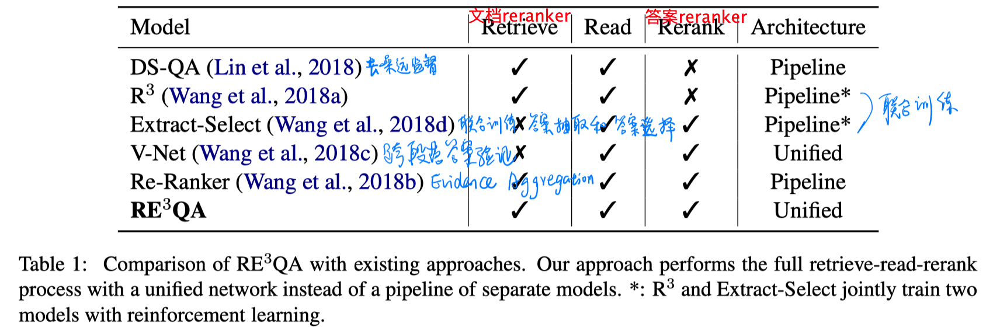

本文提出了RE3QA模型，一个结合三个组件（early-stopped retriever（其实是一个reranker）、a distantly-supervised reader、a span-level answer reranker）的端到端模型来预测答案：1）不同模块共享上下文文本表达；2）使用高质量的上游输出直接监督下游模块。

# 模型

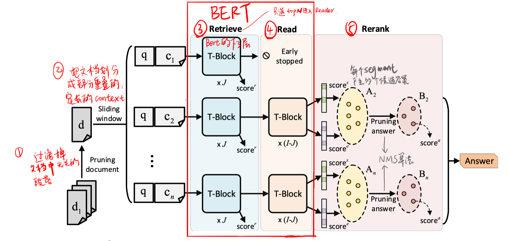

- pruning document（retrieval）

  以段落为单位，选择top-K个与question有最小TF-IDF cosine distance的段落，然后把同一文档内的段落按顺序拼接，形成新的pruning document。

  按照规定的长度和步长，把这些pruning document进行切分，形成多个 text segment。

- retrieval（context rerank）

  把每个segment和question作为BERT的输入。

  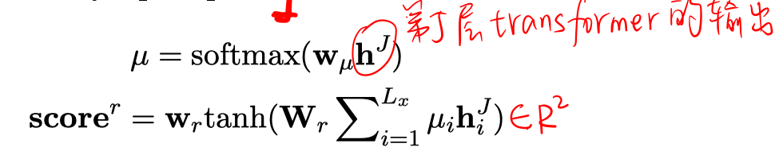

  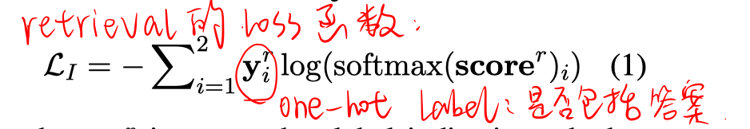

- reader

  对每个segment，产生多个候选答案。

  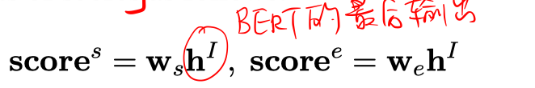

  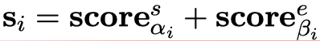

  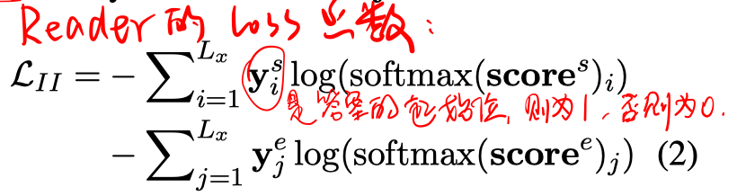

- rerank

  先采用non-maximum suppression算法进行答案裁剪，去掉一些重叠的答案。

  先保留具有最大score的答案A，对剩下的最大score的答案B，如果B和最大答案A有至少一个起止位置重合，则删除答案B，否则保留B；再依次最剩下的答案和AB进行比较，采用同样的方法。直到所有答案都处理完了或者保留的答案数达到设定值。

  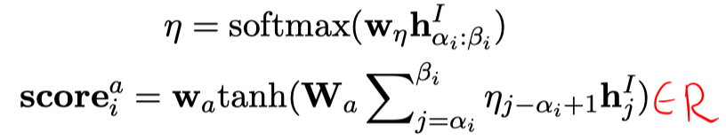

  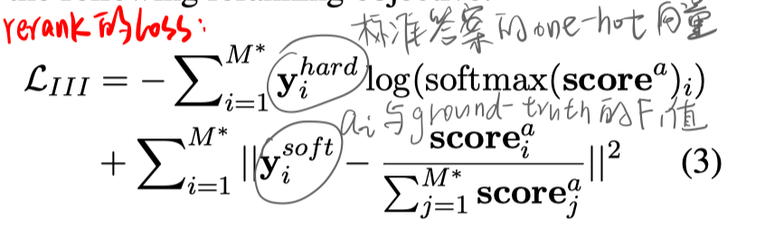

- 训练与推断

  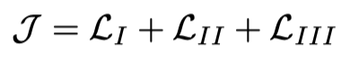

  推断时把三个score值（score_r、score_s、score_a）加权求和。

# 实验

##### 数据集

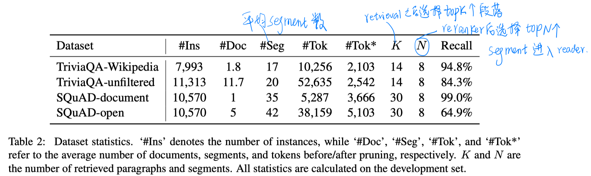

TriviaQA-Wikipedia（每个问答对对应一个或多个wikipedia article）、TriviaQA-unfiltered（开放域设置）、SQuAD-document（每个问答对对应一个wikipedia article）、SQuAD-open（开放域设置）

##### 实验结果

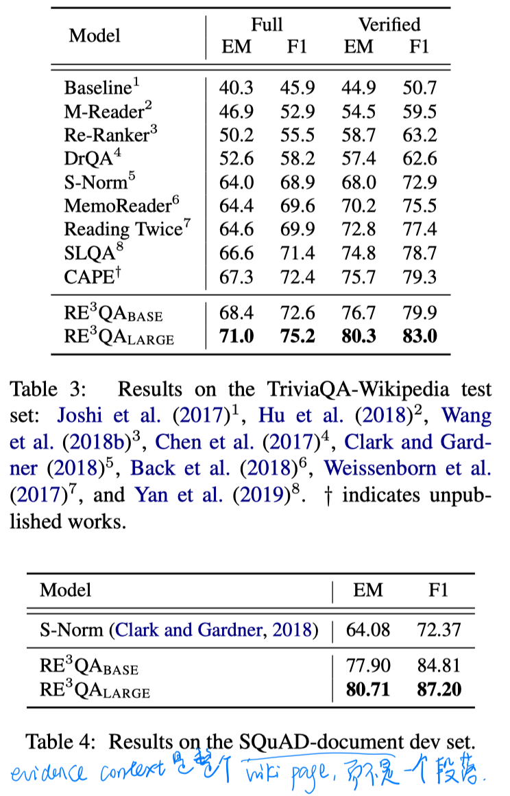

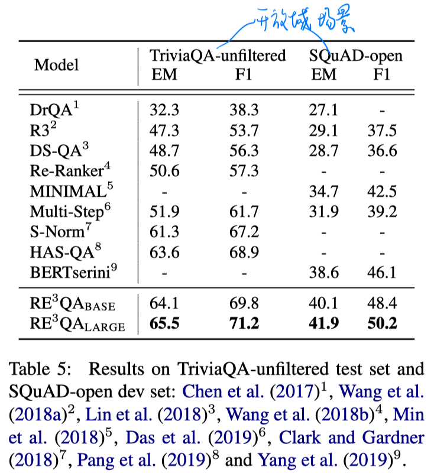

##### 消融实验

- 端到端训练相比pipeline方法的优势

  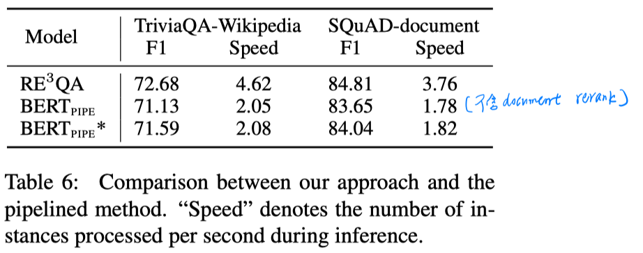

- 不同模块的ablation

  

- document reranker阶段使用BERT的不同底层数

  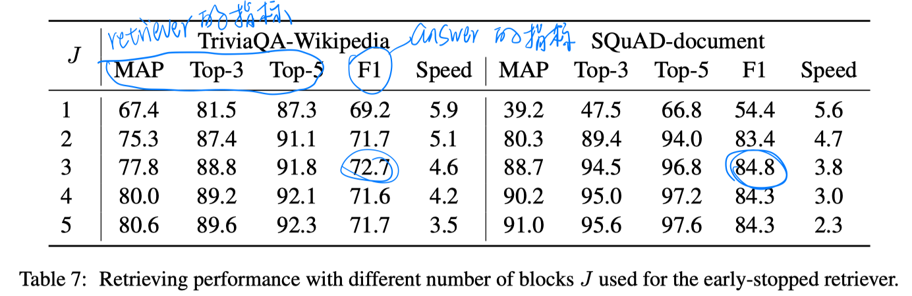

- answer rerank模块的ablation study

  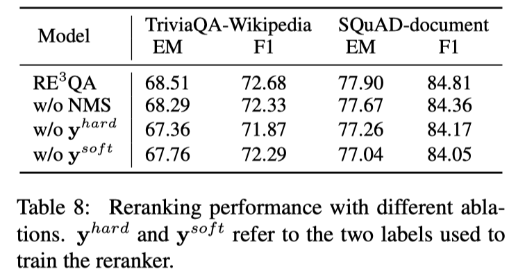

# 结论

- 先逐级进行过滤，document level（本文没有提及具体方法，有两个数据集是有附带对应的document，有两个开放域设置的数据集选择top5，可能使用类似DrQA的方法） + passage level（TF-IDF cos） + segment level（本文所谓的retriever模块）
- 由于最后选择的segment可能来自多个文档，所以也可视为一种多文档的RC。不过不同segment之间没有交互。