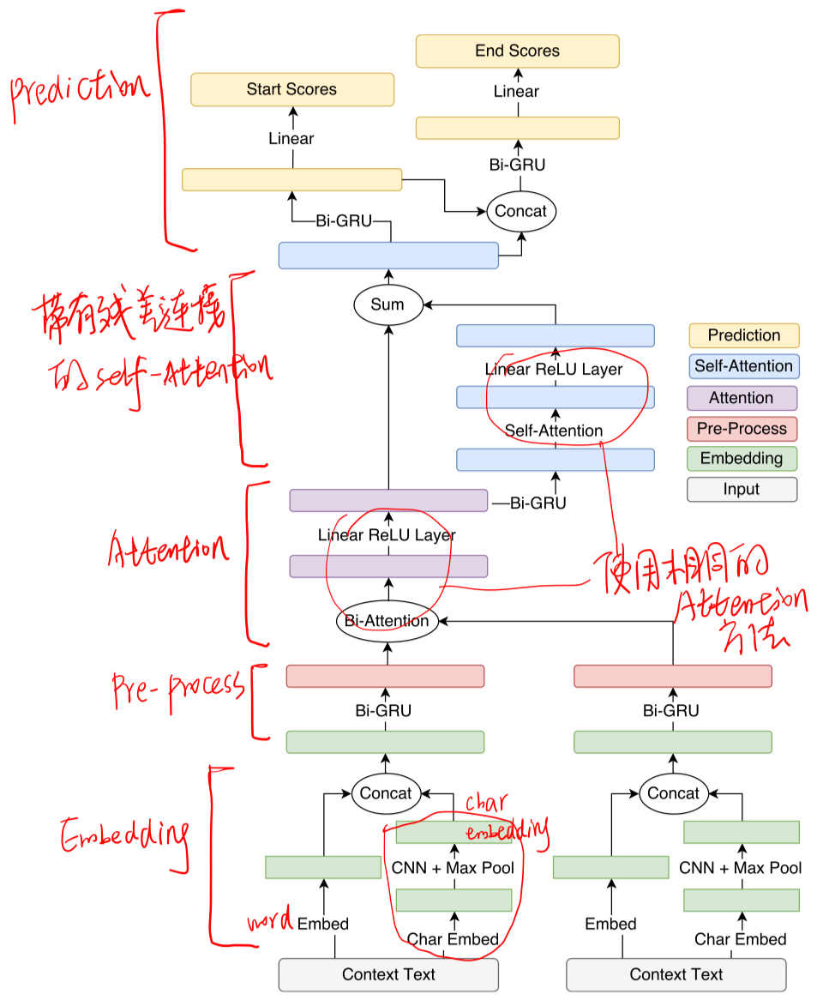
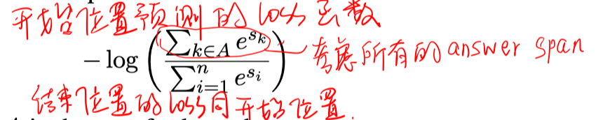
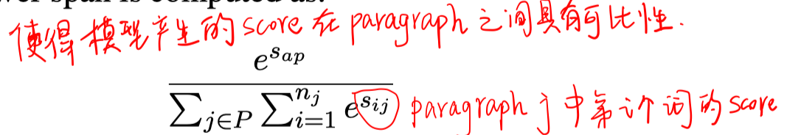
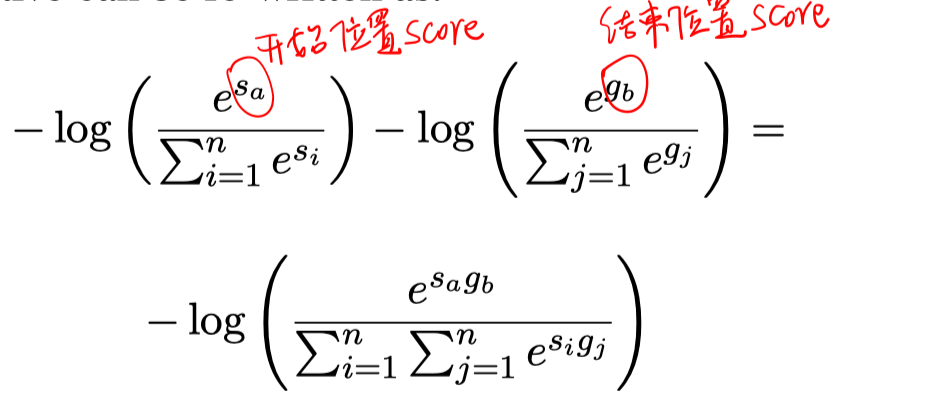
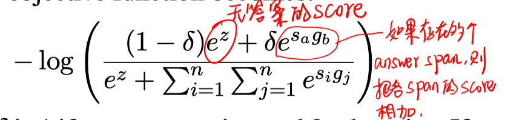

> > 2017，抽取式

# 背景

对于document作为上下文的RC问题，如果把整个文档作为输入，则可能效率和有效性都不太高，一般会把他们转化成passage-leve输入。

常用的做法有2种：1）pipeline模式的方法：先选择一个最可能的段落，再将该段落输入到RC模型生成答案。但该方法容易受到passage selection模块性能的制约。2）置信度的方法：输入多个段落，返回置信度最高的答案。

# 思路

本文先提出一个基于pipeline模式的方法。在此基础上应对多段落输入的场景。

# 模型

#### pipeline模型：

1）paragraph selection：基于TFIDF+cos相似度选择段落

2）RC模型：

loss函数：

#### 置信度模型：

提出了4种方法使上述的pipeline模型适用于多段落输入的情况。多段落是来自document中top ranked和随机采样的段落。只用含answer span的段落训练的模型鲁棒性不高。

1）shared-normalization

单独对每个passage计算每个token的起止得分，然后跨段落进行归一化。

2）merge

把所有段落拼接起来，输入到模型。

3）no-answer option

允许每个段落预测一个“无答案”的得分。

δ是学习得到的，不是超参数。

4）sigmoid

对每个位置的起止得分计算sigmoid，然后用cross entropy损失。

# 实验

数据集：TriviaQA、SQuAD

# 总结

总体来看，shared-normalization的效果最好。