> > ACL2020

# 背景

本文是在PIQA和DenSPI的工作基础上，进一步提出改进方案。PIQA只有语义的稠密表示，导致难以捕捉细节信息。DenSPI通过增加稀疏表示在一定程度上缓解了该问题，但是由于一个文本/段落中的phrase有相同的稀疏表示，这会限制表达能力。

本文提出了一个可学习的上下文稀疏表示方法，来改进DenSPI模型。

# 模型

一个phrase的稀疏表示=【该phrase的起始单词的start表示；该phrase的结束单词的end表示】

start表示和end表示的计算方法相同，只是使用两组参数。下图以计算start表示为例：

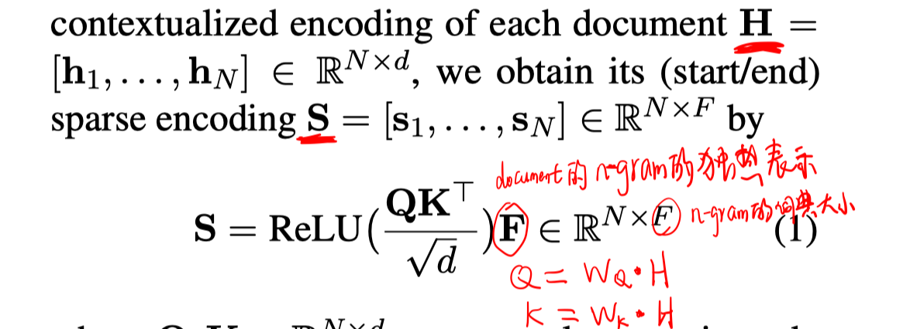

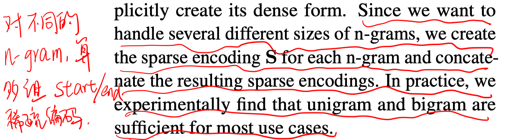

question的稀疏表示学习方法和phrase相同，且共享参数。区别只是question的稀疏表示是CLS处的start表示和end表示的拼接。

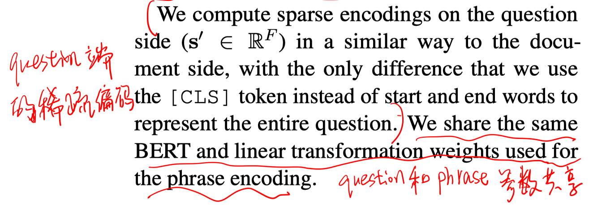

#### 模型训练

使用SQuAD的训练数据进行训练。（包括问答对以及对应的positive passage）

- 核函数

  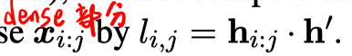

  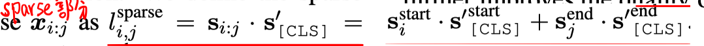

  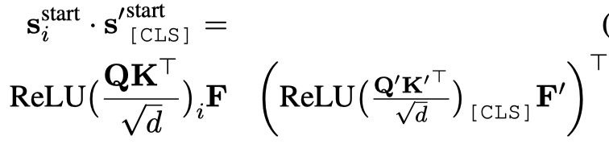

  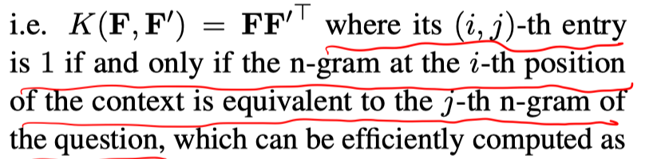

- 目标函数

  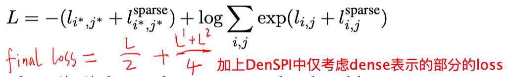

- passage的负采样

  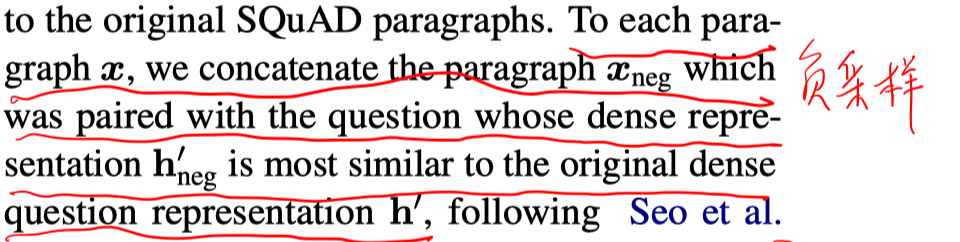

# 实验

训练时使用SQuAD训练集，测试是在SQuAD-open的dev上和CuratedTREC上。

Encoder是使用BERT-large。

##### 实验结果

- 主实验

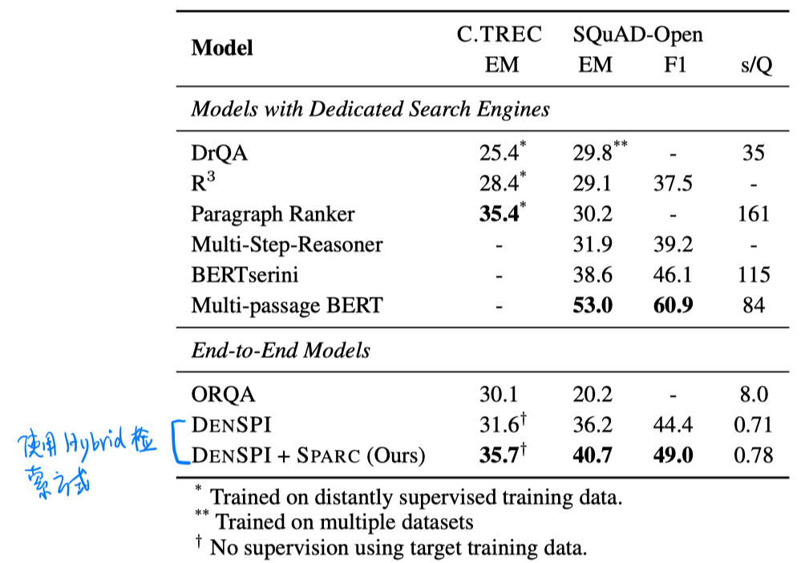

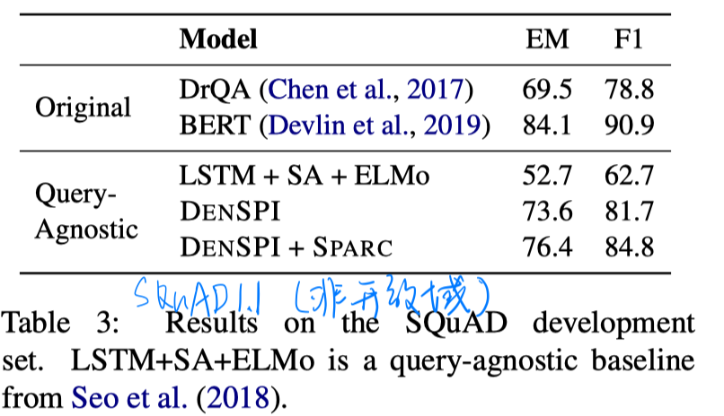

- 消融实验

  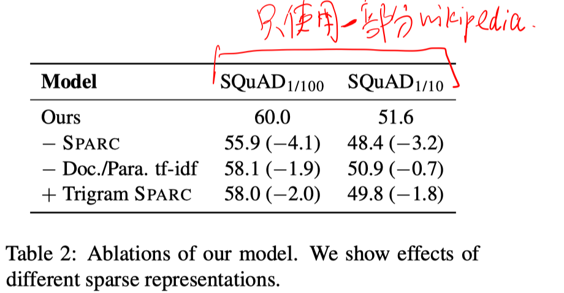

- 不同的检索方法

  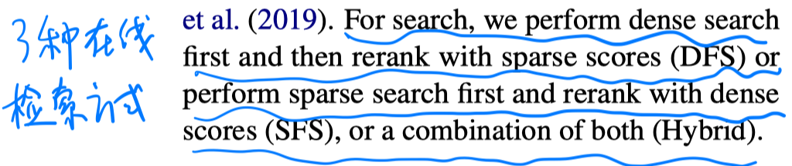

  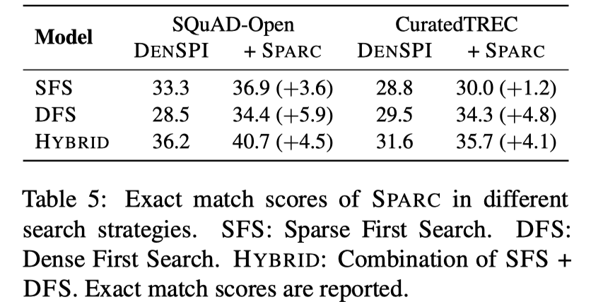

# 结论

- DenSPI中稀疏表示其实是把document/passage中每个term视为相等的权重。
- 本文SPARC方法中稀疏表示其实是start word/end word对其他词的attention加权的TFIDF表示。