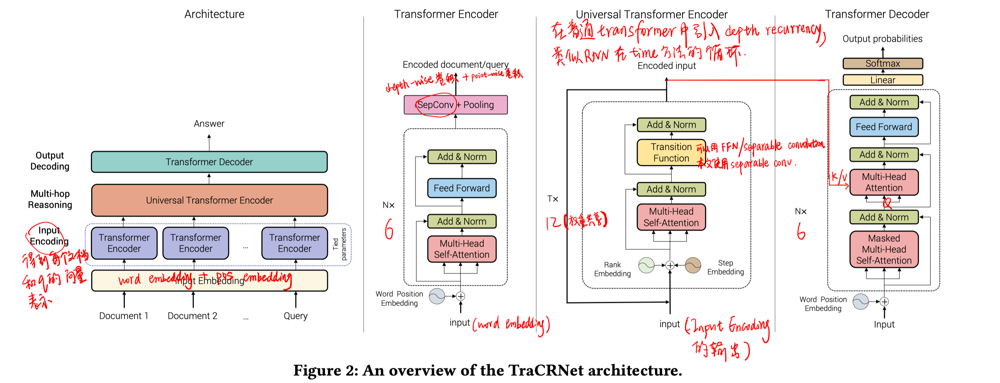
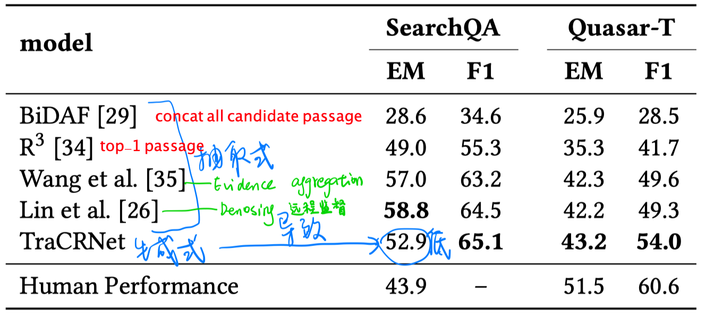
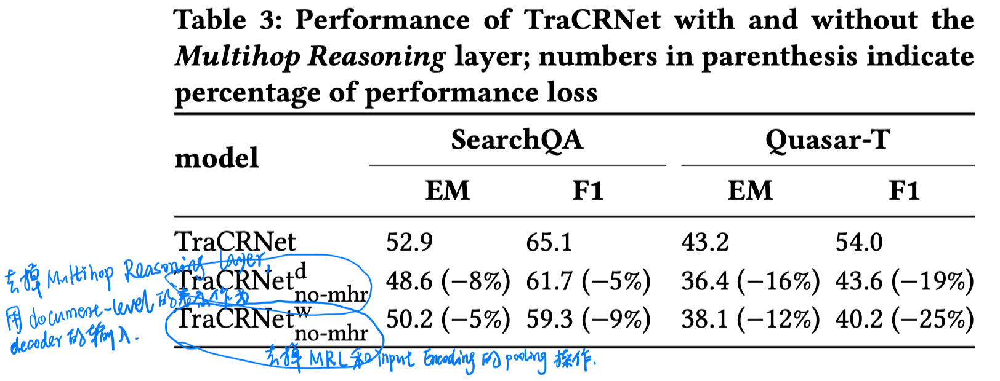
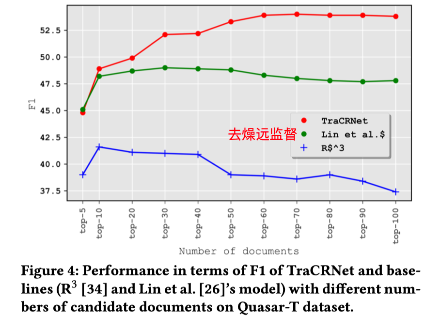

> > WSDM2019，生成式结构解决answer span式QA

源码：https://github.com/MostafaDehghani/TraCRNet

# 背景

在openQA中，有些问题需要结合多文本进行推理，甚至需要retrieval阶段排序较靠后的文本的信息。但以往的工作都视这些文本为噪声，会直接使用top-1或前几个段落进行答案生成，这是不合适的。

# 思路

本文提出TraCRNet模型，使用分层次的架构，显式利用更大量的候选文本，结合这些文本信息进行多步推理，同时不受噪声信息的干扰。

# 模型

- Input Encoding layer

  输入：word embedding + sinusoidal position embedding

  使用6层的普通Transformer encoder结构，然后通过separable convolution和pooling操作得到question和各候选文本的向量表示。

- Multi-hop Reasoning layer

  输入：Input Encoding layer输出的question和各个passage的向量表示 + sinusoidal rank embedding+ sinusoidal step embedding

  

  使用12step的universal Transformer结构，可以起到文本之间多步推理的效果。

- Output Decoding

  使用普通的Transformer decoder结构。decoder部分会使用预训练language model的参数。

注：本文Multi-hop Reasoning layer模块的transition function使用conv而不是FFN，是因为conv具有更少的参数，但其实FFN效果更好。

# 实验

数据集：SearchQA、Quasar-T

实验结果：

消融实验

1. 去掉 Multi-hop Reasoning layer

   

   - Quasar-T 性能下降更明显，是因为该数据集中需要多步推理的question更多。
   - 使用word-level embedding作为decoder的输入，EM指标的效果会更好。

2. 使用不同数量候选段落的影响

   

   - R^3和去燥远监督算法随着候选段落的增加，都会受到噪声的干扰。

# 结论、启发

1. 该方法有效利用了所有的候选段落，而且可以做到有效屏蔽噪声的干扰（随着候选段落的增加，性能没有下降）。
2. 由于网络架构的设计，导致没办法预测answer span，只能使用生成式网络结构预测答案，对于EM指标是不利的。
3. 从该工作来看，SearchQa和Quasar-T数据集也适合来验证需要多步推理的场景。
4. 消融实验部分只分析了去掉multihop reasoning layer的影响，没有分析换其他结构（比如普通的transformer）或者推断步数的影响。
5. 对于如何利用多段落进行答案预测，目前自己的想法是 concat + 跳跃式阅读。