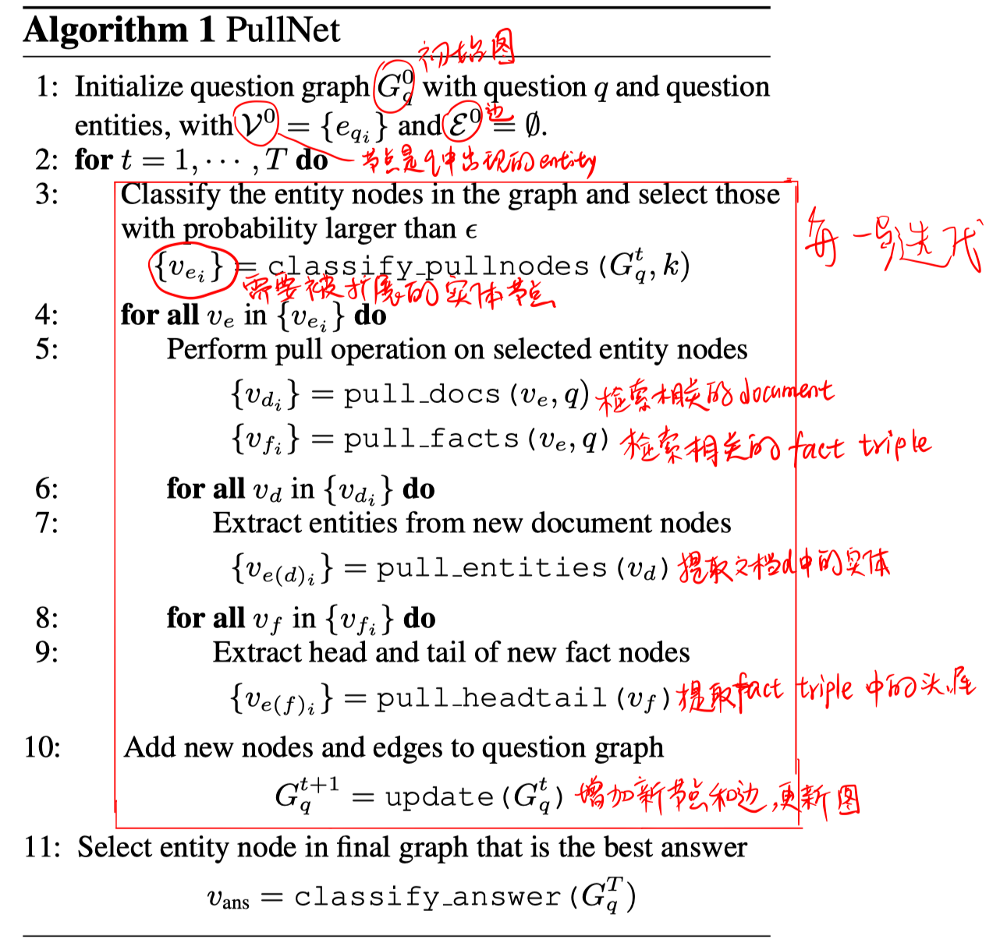
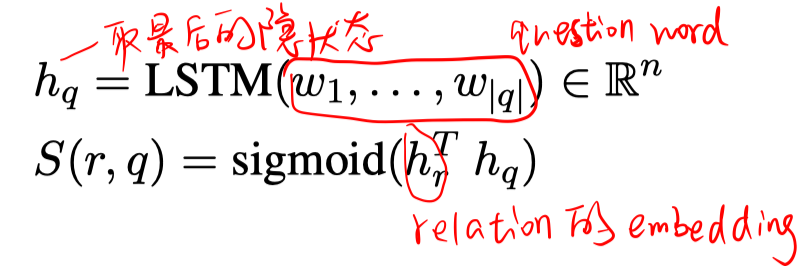
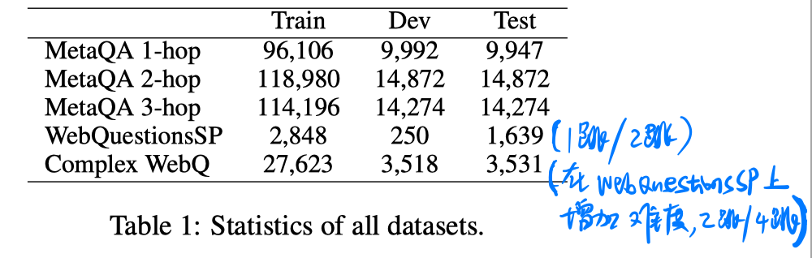
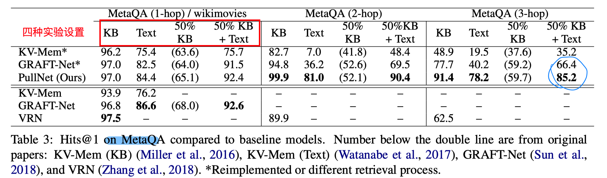
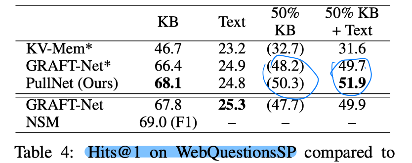
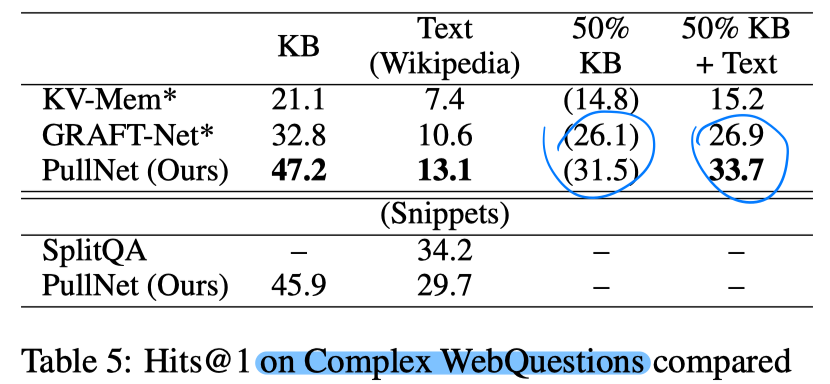

> > EMNLP2019

## 背景

本文的设定场景是：开放域问答，有corpus和KB作为外部知识，问题需要多步推理，且answer是KB中的实体。

本文提出了**PullNet框架**，先学习检索到相关知识，再在各种异质信息上进行推理得到正确答案。

- 使用迭代的过程构建问题特定的子图，子图中包含和问题相关的信息。
- 在每次迭代时，用一个GCN去识别哪些子图节点需要被扩展（这对于多跳推理非常有用）。
- 子图完善之后，用另一个GCN从子图中抽取答案。

## 方法

- 图中有三类节点：1）实体节点；2）文本节点（每个文本节点对应的通常是一个sentence）；3）事实节点（每个事实节点对应事实三元组）。

- 图中有两类边：1）事实节点和实体节点存在边，如果实体节点对应的实体是事实节点的subject或者object；2）文本节点和实体节点之间存在边，如果实体节点对应的实体在文本中有被提及。

- pull_docs（检索相关文本）操作：被检索的文本被限制为必须链接至该实体，而且根据文本和问题的IDF值进行排序，返回前 $N_d$ 个文本。

- pull_facts（检索相关事实）操作：被检索的事实被限制为必须subject或者object是该实体，而且根据该事实的关系与问题的相似度进行排序，返回前 $N_f$ 个事实。

  

- update（更新子图）操作：增加 pull_entiries 和 pull_headtail 新提取到的实体节点，增加pull_docs检索到的文本节点，增加pull_facts检索到的事实节点。以及增加对应满足条件的边。

- classify_pullnodes（检测需要被扩展的实体节点）操作：每次迭代中，使用GCN选择k个概率最大的节点，表示他们需要被扩展。
- classify_answer（检测答案节点）操作：用另一个GCN计算实体节点是答案的概率，选择概率最大的一个。

## 训练

因为在训练时只有question-answer pair可得，不知道潜在的推理路径，因此本文使用**弱监督**的方法。

在KB中找到question entity和answer entity之间的最短路径，该最短路径中的所有实体都是候选中间实体，每个候选中间实体都被标记一个它与question entity之间的最短距离 $e_t$。

在第t步迭代中，训练classify_pullnodes分类器时，只有与 $e_t=t+1$ 的候选中间实体相连的实体节点才被视为正例；训练相似度函数$S(r,q) $ 时，只有与 $e_t=t+1$ 的候选中间实体相连的关系才被视为正例。

classify_pullnodes在选择需要被扩展的节点时，不是选topk的节点，而且选择所有概率大于阈值$\epsilon$ 的节点。除此之外，还采用teacher foring的变体，在每步迭代时，如果 $e_t=t$ 的候选中间实体没有被检索到，则也将其加入子图中。

迭代步数 $T$ 一般选择推理链的最大长度，以便能再子图中包含答案。

## 实验

数据集：MetaQA、WebQuestionSP、Complex WebQuestions

实验结果：

- 主要是在KB不完整而且有corpus作为补充知识的设定下提升比较明显（恰好这种场景更符合现实应用）。

## 思考

1. 迭代构图的方式对于多步推理更加有效。

