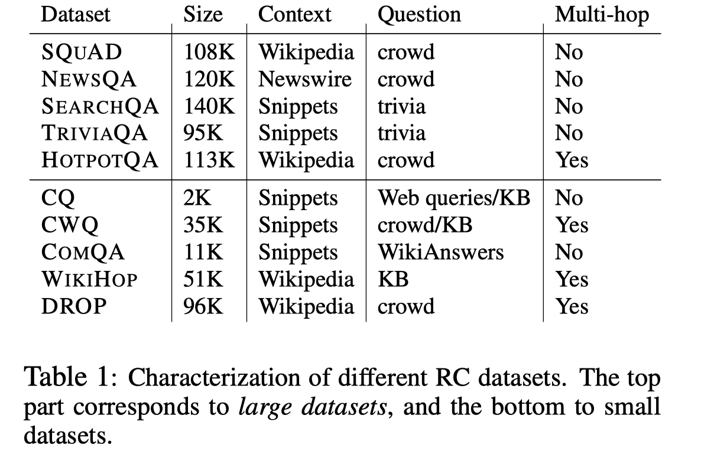
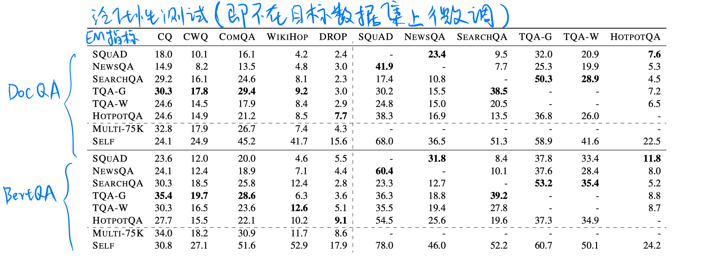
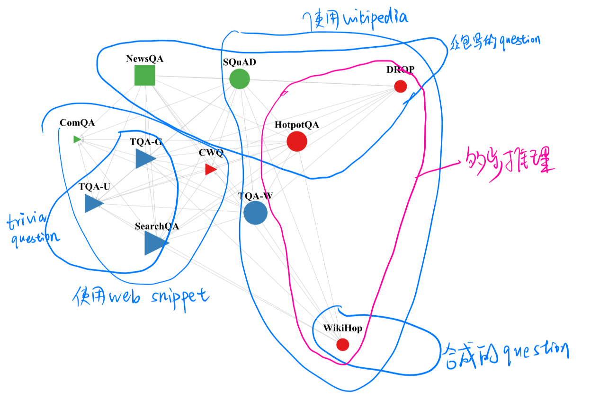
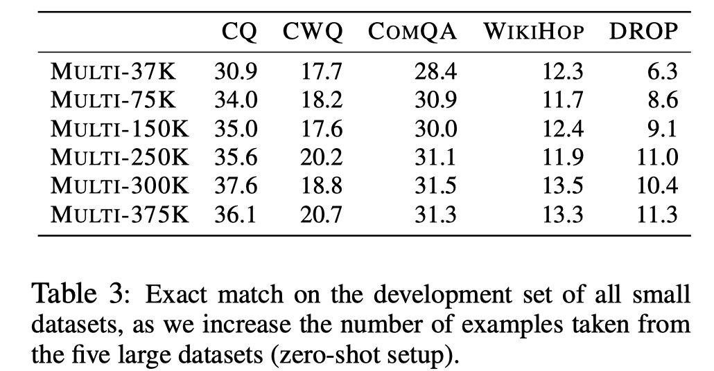
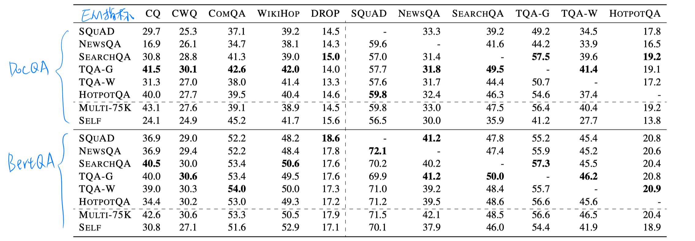
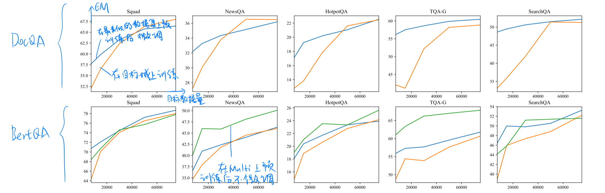
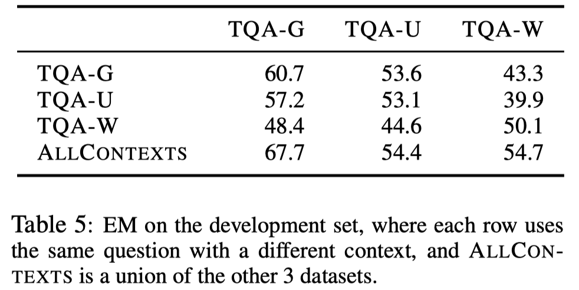
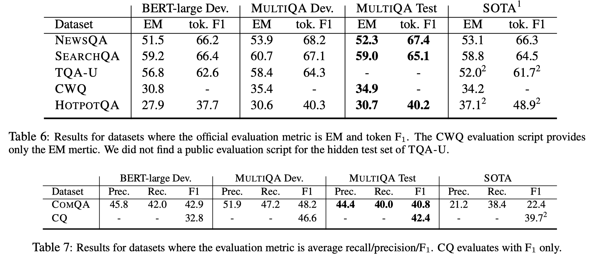

> > ACL2019，分析类文章

## 背景

虽然目前的每个RC数据集都有自己的针对性，但他们之间对于模型的能力需求还是有部分相同的。目前很少有工作来探究不同数据集之间的关系。

## 主要工作

- 本文在10个RC数据集上进行实验，探究在一个或多个源数据集进行训练，然后在目标数据集上的泛化性和迁移性。结果如下：
  - 泛化性分析实验（即在目标数据集上不微调）表明，目前的模型对于一个特定的数据集都存在过拟合现象，所以即使对于一个类似的数据集也会泛化性较差。
  - 迁移性分析实验（即在目标数据集上微调）表明，在一个或多个源数据集上进行训练，迁移到目标数据集时都能获得性能的提升。
  - 在多个源数据集上训练对于泛化性和迁移性都有帮助，同时对目标数据集的数据量需求变小
- 本文提出了在多个数据集上训练得到的基于BERT的MultiQA模型。

## 数据集（抽取式的RC）

## 模型

- DocQA
- BertQA（BERT+FC layer）

## 实验

- 泛化性实验：在单个数据集上训练，在其他数据集上测试（zero-shot）

  

  - 在zero-shot设置下，模型的泛化性很差。
  - 总体而言，BertQA的泛化性好于DocQA。
  - 从Multi-75K（多个数据集采样组成的数据集）的结果看，在多数据集上训练可以提高泛化性。
  - 数据集类型更相似时，泛化性会更好些。
  - 当数据集的context是Wikipedia时，对BertQA更有利。主要因为和BERT预训练语料的分布更相似。

- 可视化不同数据集之间的关系

  

- 泛化性实验：训练集的数据量对泛化性的影响

  

- 迁移性实验：在单个数据集上训练，在其他数据集上测试（微调）

  

  - 选择一个相关的源数据集会更好。
  - 可以选择多个数据集来预训练单个模型，迁移性会更好。
  - 对DocQA，使用web snippets的数据集进行预训练更好；BertQA，使用Wikipedia的数据集进行预训练更好。
  - 虽然在单个模型上训练之后的泛化性较差，但通过少量目标数据集的微调即可得到很好的性能。

- 迁移性实验：对目标数据量的需求

  

  - 通过预训练，对目标数据量的需求明显减少的情况下，即可达到不错的性能。

- 迁移性实验：上下文增强对性能的影响

  

  - 上下文增强地区可以提高性能。
  - 泛化性对于上下文的类型比较敏感。

## MultiQA模型

基于Bert-large的模型，在来自5个数据集的375K个数据量进行训练。

