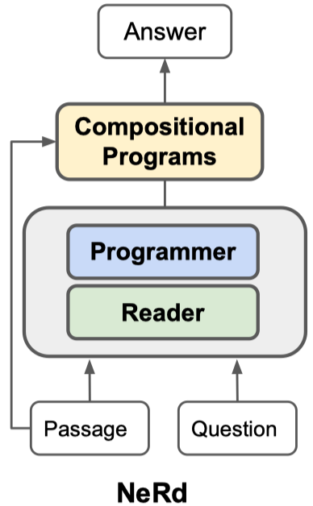
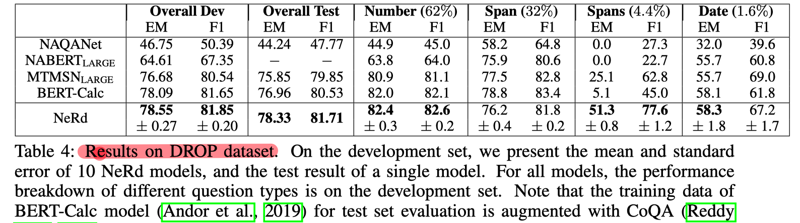
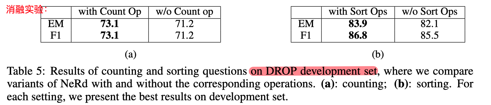
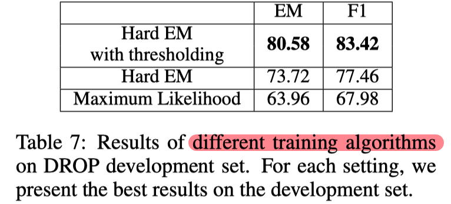
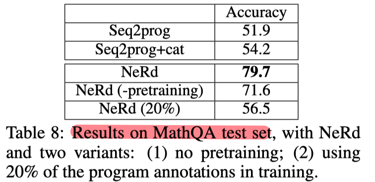

# [MRC ICLR2020] Neural Symbolic Reader: Scalable Integration of Distributed and Symbolic Representations for Reading Comprehension

```
论文作者：Xinyun Chen, Chen Liang, Adams Wei Yu, Denny Zhou, Dawn Song, Quoc Le
论文单位：暂无
论文地址：https://openreview.net/pdf?id=ryxjnREFwH
代码地址：暂无
论文类别：方法
```


## Motivation-论文解决了什么问题

对于需要复杂推理的RC任务（例如，counting、sorting、arithmetics），结合分布式表达和符号操作是很重要的，但目前的方法一般都是依赖于特定的模块，很难适应到多域或者多步推理。


## Motivation-本文的方法思路

本文提出了**Neural Symbolic Reader(NeRd)模型**，包括 reader 和 programmer 两个模块：

- reader 模块：编码question和passage，把每个token编码成一个embedding。
- programmer 模块：生成一个program（program可以理解为该问题的推理类型，比如counting、sorting）用于多跳推理，解码生成答案。

> 注：这两个模块可以使用任何可满足要求的网络。

本文提出的NeRd模型具有两个特点：

- domain-agnostic：该模型架构可以应用到不同的域（此处的域可以理解为不同的推理类型，或者具有不同推理类型集合的数据集）
- compositional：复杂的program可以由operator组合生成。


## Method-模型概述

#### 模型架构：



#### 弱监督训练：

该模型训练的难点在于，虽然获取question-answer pair很容易，但很难获取每个question的program标签。

- 用数据增强解决冷启动问题

  对于counting操作：把span selection类的问题的疑问词改成”How many“，再对其答案计算COUNT。

  对于sort操作：使用CoreNLP进行实体识别，为每个实体找到一个关联的数字，从而提取出键值对；然后对其排序，则会得到正确的答案，就可以将其添加到训练集中。

  对于其他操作：通过穷举搜索，找到可通过span selection或算术运算回答的问题，将其加入到训练集。

- 用 hard EM with threshold 方法解决 spurious program问题

  通过上述操作，每个question-answer pair都会得到一组programs，但是存在一些错误的program也可以预测得到正确的answer（即spurious program）。

  hard EM 是指，用当前的模型选择对正确答案的预测概率最高的program，然后最大化被选择的program的似然。

  但是也存在一些questions没有正确的program。为了解决该问题，当question-answer pair的所有program的概率都很小（低于threshold）时，则在训练时忽略该样本。


## Experiment-实验

**数据集**：[DROP](https://arxiv.org/pdf/1903.00161.pdf)、[MathQA](https://arxiv.org/pdf/1905.13319.pdf)（这两个数据集是2019年提出的，要求自然语言理解和离散推理能力）

**模型**：reader模块使用BERT_large，programmer模型使用基于attention的LSTM解码器。

**实验一：在DROP上的实验结果**







**实验二：在MathQA上的实验结果**




## Highlight

提出了NeRd模型，将分布式表达和符号操作结合起来，进行MRC任务。

