> > ACL2020

源码：https://github.com/StonyBrookNLP/deformer

# 背景

本文提出了DeFormer，在低层解耦question和document的编码。

这样结构的优势在于：1）可以预先计算并存储document的表示，加快在线计算速度。2）DeFormer和原模型（e.g. BERT、XLNet）的结果类似，可以使用预训练的参数进行初始化。

这样结构的可行性在于：1）之前的研究表明低层捕捉的是局部信号（e.g. 语法层面），高层捕捉的是全局信号（e.g.语义层面）； 2）通过飞行试验表明，Bert的低层学习的document表示和question的关系不大。

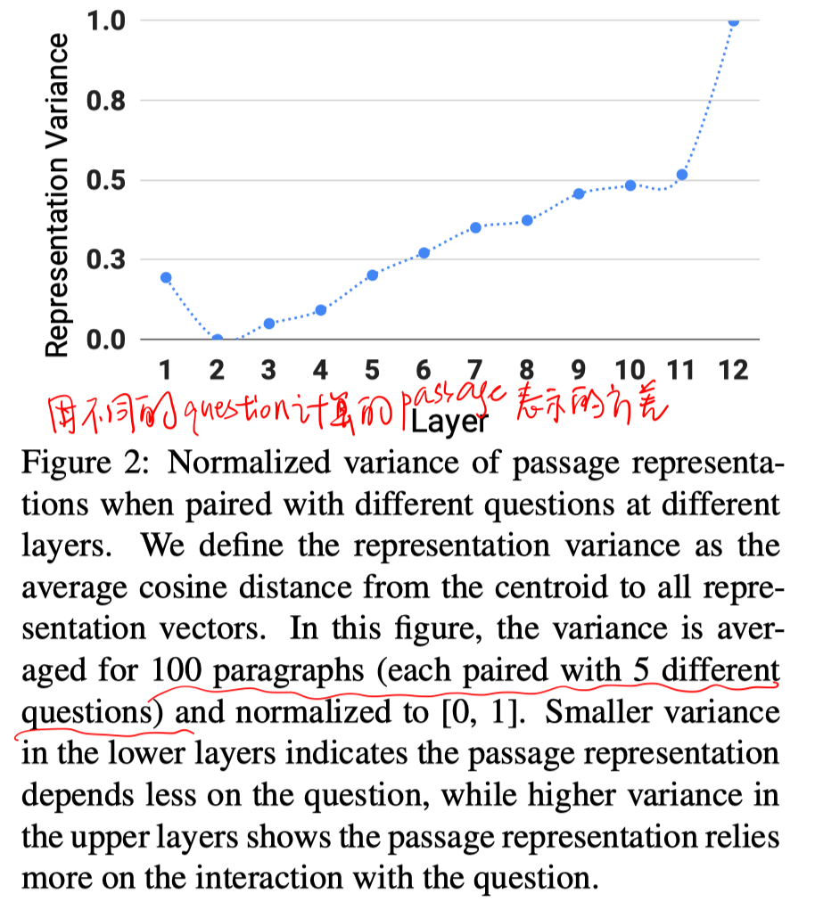

# 模型

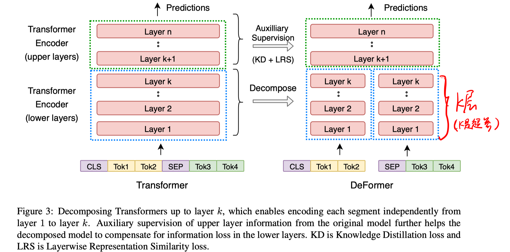

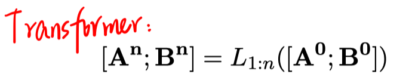

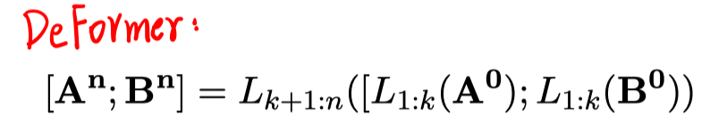

##### 训练

先用Bert预训练参数进行初始化。为了减小DeFormer和原Transformer之间的差异，增加两个类似蒸馏的辅助loss。

- 知识蒸馏损失

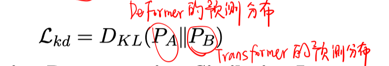

- 每层表示的相似度损失

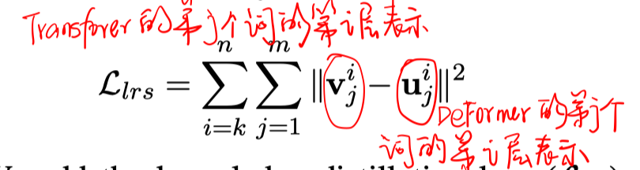

- 总目标函数

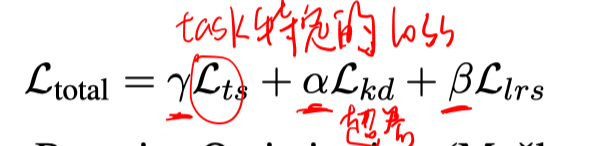

# 实验

##### 数据集

SQuAD1.1、RACE、BoolQ、MNLI、QQP

##### 实验结果

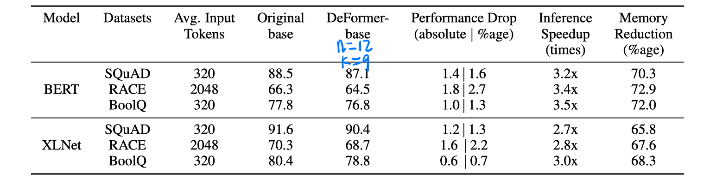

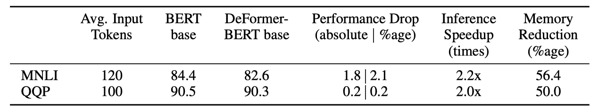

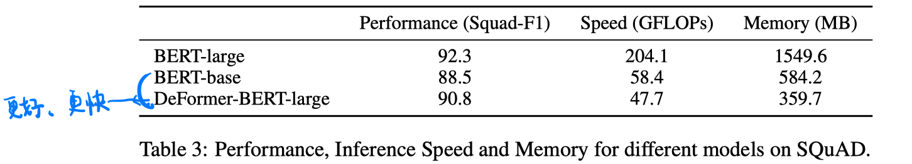

##### 消融实验

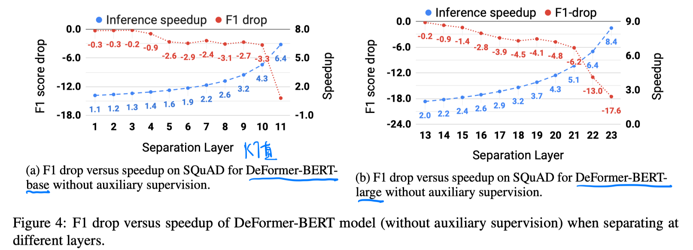

# 结论

