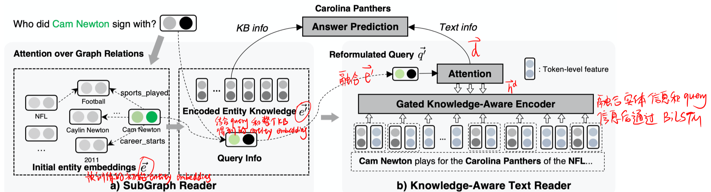
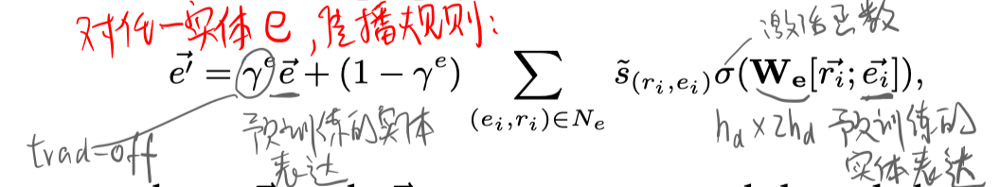
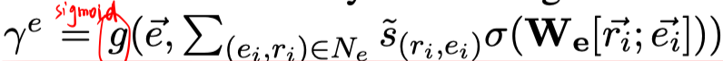
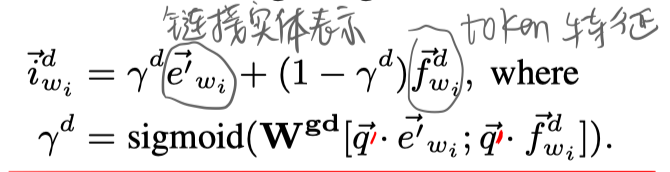

> >ACL2019，开放域QA，外部知识

代码/数据地址：https://github.com/xwhan/Knowledge-Aware-Reader/tree/master

## Motivation-论文解决了什么问题

KB对于回答事实性问题很重要，但是构建KB需要耗费大量人力，且通常是不完整的、不足以涵盖开放域问题所需的全部证据。另一方面，互联网上大量的无结构文本可以轻松涵盖广泛的知识。因此，可以用文本数据扩展 KB。

对于多文档QA目前仍然做不好的原因，本文的假设是：缺少背景知识来区分相关信息和不相关信息。

## Motivation-本文的方法思路

本文提出了一种新的端到端模型，该模型包括

- 一个简单而有效的子图阅读器（subgraph reader），该阅读器可以从 与问题相关的KB子图中 积累知识，得到每个KB实体的表达 ;
- 知识感知型文本阅读器（knowledge-aware text reader），该阅读器通过条件门控机制有选择地结合所学的有关实体的知识库知识。

## Method-模型概述

#### 问题定义

- 输入：question $Q$ ，Q中包含的实体集合 $\mathcal{E}_{0}=\{e | e \in Q\}$ ；知识库 $\mathcal{K}=\left\{\left(e_{s}, r, e_{o}\right)\right\}$；用DrQA检索得到的Wikipedia文档集合$D$，文档中的实体是被标注的而且链接到了KB中的实体；
- 子图选择：对于每个Q，结合其实体集合$\mathcal{E}_{0}$，用Personalized PageRank检索出一个子图。

- 任务：对于问题Q，检索出answer entity。该entity可能来自KB或者document。

#### SubGraph Reader

subgraph reader 使用图注意机制来积累每个子图实体 $e$ 来自其链接邻居 $N_e$ 的知识。 图注意力机制的设计特别考虑了两个重要方面：（1）邻居关系是否与问题相关；（2）邻居实体是否是问题中包含的实体。 

- Question-Relation Matching

  - 用 shared LSTM 编码 Q 和 每个relation，得到 $\mathbf{h}^{\mathbf{q}} \in \mathbb{R}^{l_{q} \times d_{h}} \text { and } \mathbf{h}^{\mathbf{r}} \in \mathbb{R}^{l_{r} \times d_{h}}$ 。

  - 对 $h^r$ 通过self-attention得到 每个relation 的向量表示 $\vec{r}=\sum_{i} \alpha_{i} \vec{h}_{i}^{r}, \alpha_{i} \propto \exp \left(\vec{w}_{r} \cdot \vec{h}_{i}^{r}\right)$

  - 基于 $\vec{r}$ 和 $h^q$ ，得到该关系与Q的匹配分数：$s_{r}=\vec{r} \cdot \sum_{j} \beta_{j} \vec{h}_{j}^{q}, \beta_{j} \propto \exp \left(\vec{r} \cdot \vec{h}_{j}^{q}\right)$

- Extra Attention over Topic Entity Neighbors

  加一个额外的特征：判断通过关系 $r_i$ 与实体 e 相连的邻居$e_i$是否出现在Q中。 直观地，如果该邻居出现在问题中，则其可能比其他邻居对问题的回答更为重要。 所以最后的分数为：$\tilde{s}_{\left(r_{i}, e_{i}\right)} \propto \exp \left(I\left[e_{i} \in \mathcal{E}_{0}\right]+s_{r_{i}}\right)$

- Information Propagation from Neighbors

  

  

#### Knowledge-Aware Text Reader

- Query Reformulation in Latent Space：这里主要为了将 KB 信息引入到 Q 中。

  - 首先对 Q 进行self-attention，得到向量 $\vec{q} = \sum_{i} b_{i} \vec{h}_{i}^{q}$ 。 

  - 然后对 Q 中出现的所有实体，整合上一步得到的实体表示 $\overrightarrow{e^{q}}=\sum_{e \in \mathcal{E}_{0}} \overrightarrow{e^{\prime}} /\left|\mathcal{E}_{0}\right|$

  - 将 KB 信息引入到 Q 中，得到 $\overrightarrow{q^{\prime}}=\gamma^{q} \vec{q}+\left(1-\gamma^{q}\right) \tanh \left(\mathbf{W}^{\mathrm{q}}\left[\vec{q}, \overrightarrow{e^{q}}, \vec{q}-\vec{e}^{\vec{q}}\right]\right)$，其中 $\gamma^{q}\ = operatorname{sigmoid}\left(\mathbf{W}^{\mathbf{g} \mathbf{q}}[\vec{q}, \overrightarrow{e^{q}}, \vec{q}-\overrightarrow{e^{q}}]\right)$

- Knowledge-aware Passage Enhancement
  - 通过document中的实体标注以及与KB中相应实体的链接关系，将每个词的 token feature 和 entity feature融合，
  - 将 $\vec{i}_{w_{i}}^{d}$ 通过BiLSTM，得到 $\vec{h}_{w_{i}}^{d} $

- Entity Info Aggregation from Text Reading
  - 与question $\overrightarrow{q^{\prime}}$ 进行交互，得到document的表示 $\vec{d}=\sum_{i} \lambda_{i} \vec{h}_{w_{i}}^{d}$
  - 对于实体e所出现在的document集合，计算 $\vec{e}_{d}=\frac{1}{\left|\mathcal{D}^{e}\right|} \sum_{d \in \mathcal{D}^{e}} \vec{d}$

- Answer Prediction

  计算实体 $e$ 是答案的概率：$s^{e}=\sigma_{s}\left(\overrightarrow{q^{\prime}}^{T} \mathbf{W}_{\mathbf{s}}\left[e^{\vec{\prime}} ; \vec{e}^{d}\right]\right)$

#### 训练：

使用因子为0.1的标签平滑，计算cross-entropy loss.

## Experiment-实验

数据集：WebQSP

实验结果

- 可以看到， SGREADER 在不完整的 KB setting 下获得更好的结果，而完整 KB 则与其他模型相当。

## Highlight

- 结合 incomplete KB 和 text 文档信息，帮助进行KBQA任务。

