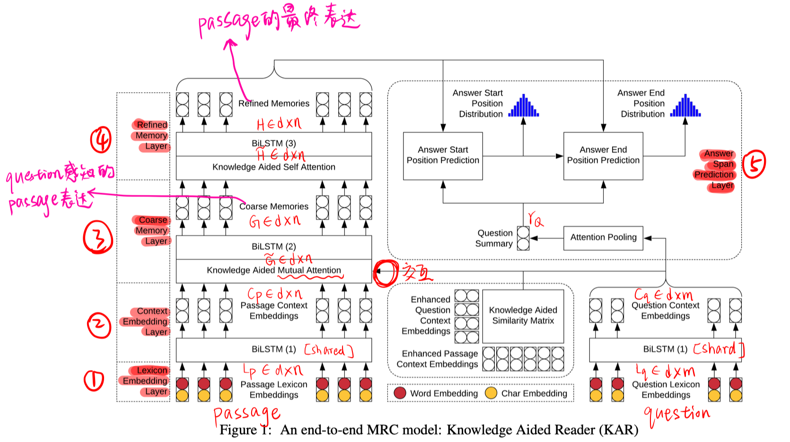
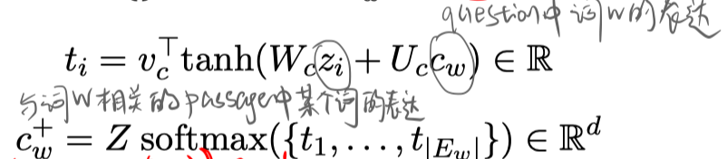
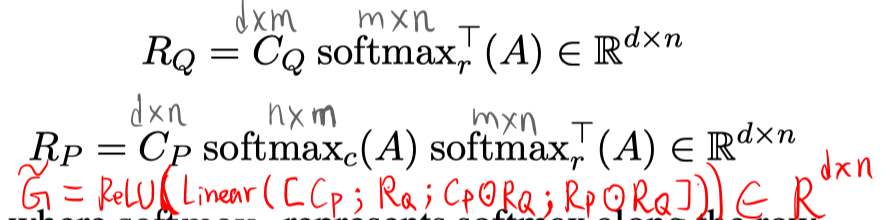
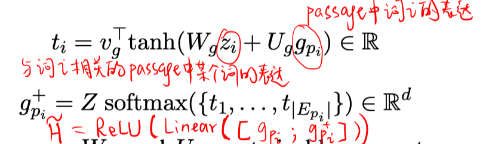
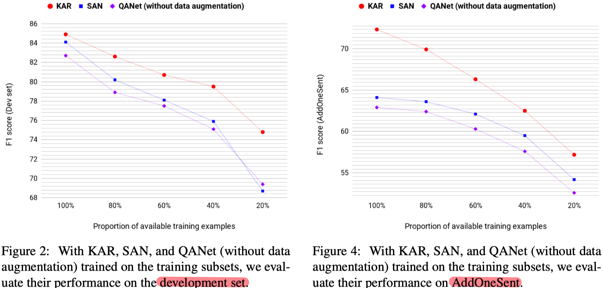
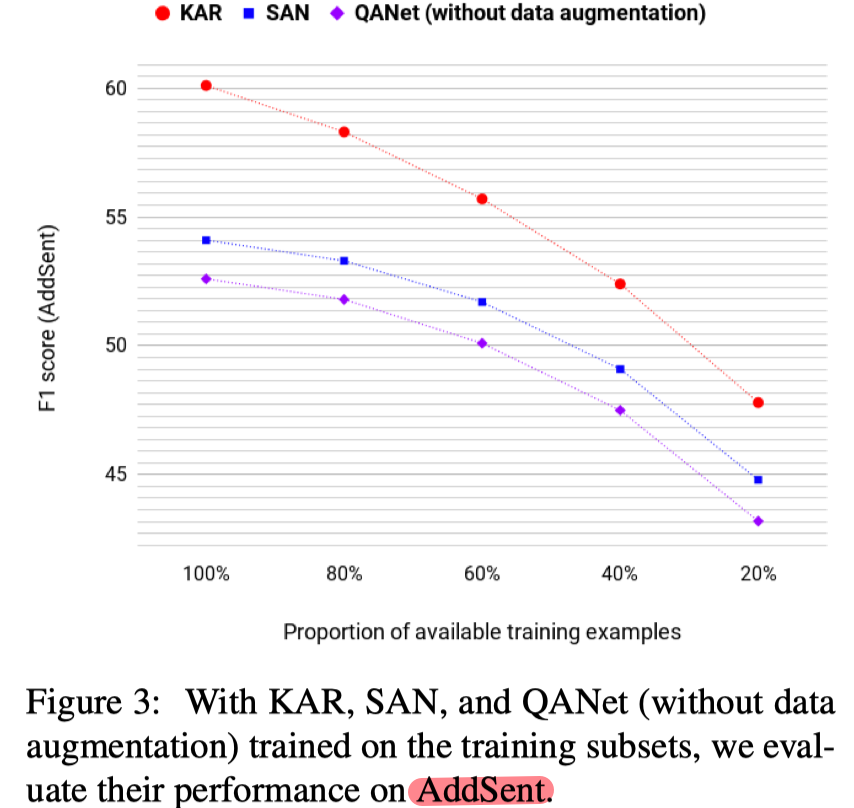

> >ACL2019，单段落MRC，外部知识（WordNet），KAR（Knowledge Aided Reader）模型

## Motivation-论文解决了什么问题

- MRC模型与人的区别在于，对大量训练数据的需求 以及 对噪声的鲁棒性。

- 作者提出**显式利用知识**来提升阅读理解的模型效果和鲁棒性。`显式的利用`突出不同于以往隐式利用，即把知识编码成embedding，这样的方法<u>不可控不可解释</u>引入的知识。

  

## Motivation-本文的方法思路

- 首先利用WordNet抽取词语间的语义关系作为 general Knowledge
- 提出KAR（Knowledge Aided Reader）模型，显式利用抽取出来的知识帮助进行MRC
- 实验验证了在小数据量和对抗测试集（鲁棒性）上的有效性

## Method-模型/方法概述

作者分两个部分介绍模型，首先介绍如何利用wordnet从给定的q-p对中抽取词语间的关系（知识），然后介绍KAR模型的主要结构，最后详细介绍了KAR中引入知识的注意力机制。

### 抽取知识

-  wordnet包含同义词集，同义词集之间通过语义关系相连（语义关系包含上位词，下位词，部分整体关系等）。wordnet可以看成由同义词集及其语义关系链接而成的图，那么任意两个词可以通过一个路径连接起来，即称为semantic relation chain。给定一个词，就可以在wordnet上找到k跳以内的所有和该词相连接的词，即称为一个词的扩展同义词集。
- 知识抽取就是，针对question和passage中的每一个单词w，计算其k跳之内的所有词集合A，看集合A中的词哪些在文本中出现，以及出现的位置，这些出现的词就和w建立了联系。

### KAR模型

模型不同于以往模型的地方在于，在两个attention计算模块利用抽取到的知识。（以往的相似度计算是来自两个单词的隐含向量表示。作者方法的核心在于，已经通过wordnet知道该词可以和文本中的一些词建立联系，那么就用与该词建立联系的词的词向量来增强该词的隐含向量表示。增强后的表示再用来计算单词之间的相似度。）

>
>
>- Lexicon Embedding Layer
>
>  串接word embedding（Glove）和char embedding（基于CNN）后，通过共享的FFN层（ReLU激活），得到d维的embedding向量。
>
>- Context Embedding Layer
>
>  通过共享的BiLSTM层。
>
>- **Coarse Memory Layer  【利用抽取到的知识】**
>
>  question上下文向量与passage上下文向量进行co-attention，得到 $\tilde{G} \in \mathbb{R}^{d \times n}$ 后，通过BiLSTM得到G。
>
>  >具体计算$\tilde{G} \in \mathbb{R}^{d \times n}$ 的方法：
>  >
>  >
>  >
>  >
>  >
>  >
>  >
>  >
>  >
>  >
>  >
>  >
>  >
>  >
>  >
>  >
>  >
>  >
>
>- **Refined Memory Layer  【利用抽取到的知识】**
>
>  passage自身进行self-attention，得到$\tilde{H} \in \mathbb{R}^{d \times n}$ 后，通过BiSLTM得到H。
>
>  >具体计算$\tilde{H} \in \mathbb{R}^{d \times n}$ 的方法：
>  >
>  >
>
>- Answer Span Prediction Layer
>  $$
>  计算开始位置：（r_Q 是对C_q进行attention\ pooling得到的）  \\
>  \begin{array}{l}{t_{i}=v_{s}^{\top} \tanh \left(W_{s} h_{p_{i}}+U_{s} r_{Q}\right) \in \mathbb{R}} \\ {o_{s}=\operatorname{softmax}\left(\left\{t_{1}, \ldots, t_{n}\right\}\right) \in \mathbb{R}^{n}}\end{array}   \\
>  计算结束位置： (H_{o_{s}}没说明怎么算，自己理解可以根据o_s进行加权) \\
>  \begin{array}{c}{t_{i}=v_{e}^{\top} \tanh \left(W_{e} h_{p_{i}}+U_{e}\left[r_{Q} ; H o_{s}\right]\right) \in \mathbb{R}} \\ {o_{e}=\operatorname{softmax}\left(\left\{t_{1}, \ldots, t_{n}\right\}\right) \in \mathbb{R}^{n}}\end{array}
>  $$

## Experiment-实验

- 实验数据集：SQuAD 1.1 ， SQUAD对抗测试集 AddSent 和 AddOnesent
- 实验验证了以下几点

1. KAR在SQuAD和原来模型效果相当，在对抗测试集表现最好，如下图

   

2. 跳数k的超参数实验：k越大，引入噪声越多，效果会下降；如果k太小，即仅仅考虑synset内部词之间连接，那么效果也不好。

  

3. KAR在只用部分训练数据的时候效果好于其他模型

## Highlight

- 作者提出一种新的利用wordnet作为知识源的方式，该方法有创新性，以往引入wordnet仅仅考虑synset内词语之间的关系，作者通过k超参数实验说明考虑wordnet多跳关系有效性。
- KAR模型与其他模型相比，对数据集不那么饥渴，而且对噪声的鲁棒性更高。