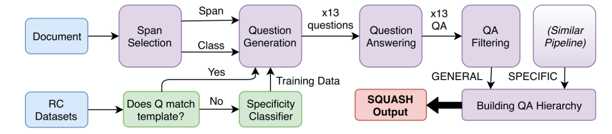
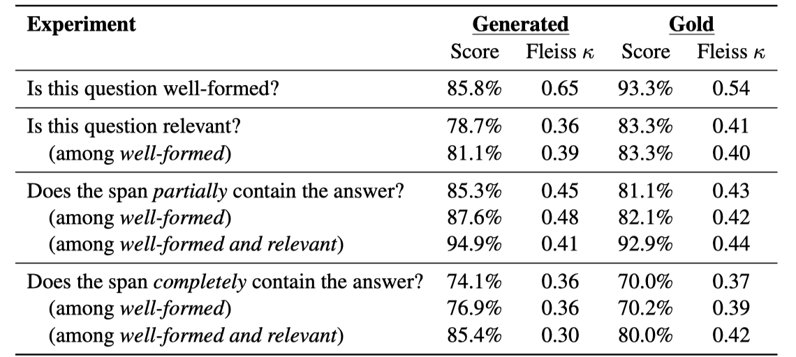
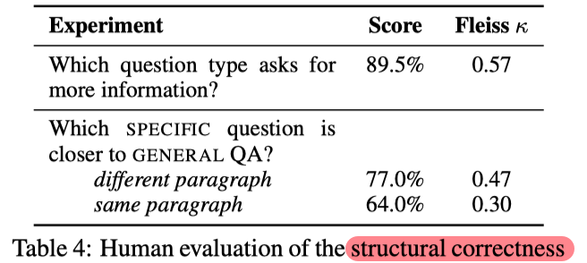

> > ACL2019

## Motivation

知识获取的过程可被视为一种师生间的问答游戏，学生往往首先从宽泛、开放式的问题开始，之后再深入到具体的问题。这种教学法的（pedagogical）观点启发了一种新的文档呈现方式。

QA对是知识获取、信息展示、商业客服的一种重要形式。自动生成QA对，对企业和互联网社区具有巨大价值。

本文提出**SQUASH（Specificity-controlled Question-Answer Hierarchies**），为输入文档自动生成相关QA对的新任务。一个文档可能有若干`General`的QA对，每个`General`的QA对下可能再有若干`SPECIFIC`的QA对。

## 方法

蓝色部分为输入（一个段落+一个问题），红色部分为输出。

绿色部分，训练QG：以模板+机器学习（用人工标注的小部分数据训练的CNN layer）相结合的方式，对现有的RC数据集（SQuAD、QuAC、CoQA）中的question分类（`General`、`SPECIFIC`、`YESorNO`）。

五个紫色部分是核心的5个模块：

- Span Selection：训练时选择ground truth的answer span；预测时选择每个单独的句子及实体和数字。
- **Question Generation**：一个encoder-decoder架构，decoder部分加入attenrion和copy机制。而且输入的问题类别作为embedding加入到decoder的每一步。 （在预测阶段，为了增加生成的问题的多样性，使用beam search和random sample，对每个样本生成13个问题）
- Question Answering：使用在QuAC数据上预训练的BiDAF++。
- QA Filtering：对QA对的过滤：
  - 若QA模型生成的A与输入QG作为答案的span匹配程度不够阈值，则滤除该QA对；
  - 以及其他简单的、启发式的方法（heuristics）。
- Building QA Hierarchy：用span的overlap来决定`SPECIFIC`问题的上级`General`问题，构建QA hierarchy。

## 评估

用众包的方式对所生成QA对进行了评估，指标包括：单个问题的质量、相关度、Q与A的关系、QA hierarchy的结构性质。最后，分析了所提pipeline的一些优缺点。

## Highlight

- 自动生成层次化的QA对，用于文档的展示。提出了新任务。

- 利用已有的RC数据集构造模型所需的训练数据。