> >ACL2019，对话式QA的question生成

代码：https://github.com/ZJULearning/ReDR

# Motivation-论文解决了什么问题

近年来有一些对话式QA的数据集发布，例如CoQA、QuAC。但毫无疑问，这些数据集的构造都需要大量人力。

近年来，**自动问题生成任务**致力于基于一些特定形式的数据资源来生成question。但之前的工作都是基于给定的passage生成独立的问题。

本文提出了一个新任务 **Conversational Question Generation (CQG)**，基于给定的passage和对话历史来生成下一个question。该任务需要对目前有哪些东西已经被问过，下一轮应该问什么信息有深刻的理解，以便能够生成具有连贯性的对话。

# Motivation-本文的方法思路

本文提出了 **Reinforced Dynamic Reasoning (ReDR) network**。

- 动态推理：结合动态推理可以更好地理解哪些已经被问过，下一轮应该问什么。
- 强化学习：为了产生更有意义的问题，使用DrQA模型对生成的问题预测答案，和ground truth答案计算F1值，作为反馈信号。

# Method-模型/方法概述

#### 任务定义：

根据给定的passage和历史对话的question-answer pair，预测下一个问题。

#### Rationale Seclection：

使用基于规则的方法，简单地选择passage中的每个句子作为每轮对话的rationale（依据）。

在CoQA数据集上进行实验时，其数据集中的每轮对话都提供了在passage中的rationale span。

#### Encoding & Reasoning:

- 输入：

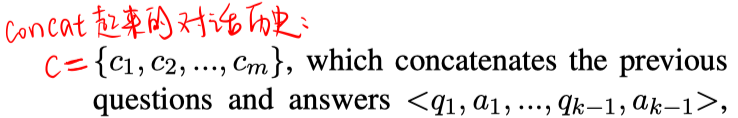

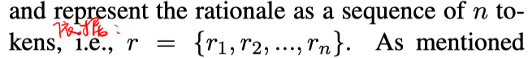

- Embedding：Glove 词向量

- Encoding：通过BiLSTM，得到 $\mathbf{C} \in R^{d \times m} \text { and } \mathbf{R} \in R^{d \times n}$

- Reasoning：

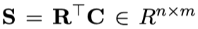

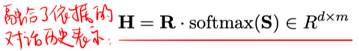

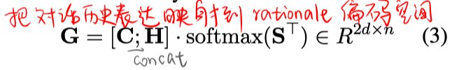

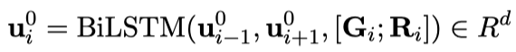

#### Dynamic Reasoning:

为了能够更好地理解rationale和conversation history之间的关系，使用迭代的多步推理，把第一次推理得到的 $U^0$ 作为下一步推理的输入，即

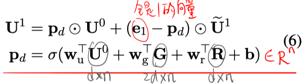

本文的实验部分是共进行了3次推理。

#### Decoding:

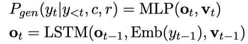

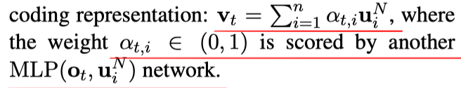

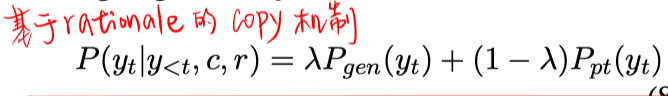

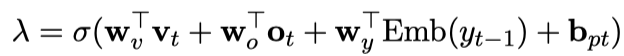

#### Reinforcement Learning:

为了产生更有意义的问题，使用DrQA模型对生成的问题预测答案，和ground truth答案计算F1值，作为反馈信号。

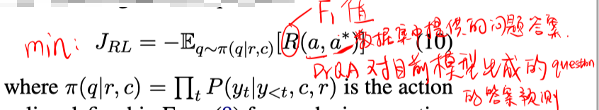

> 注：DrQA模型的作用还在于，对模型应用于实际场景生成问题时，对生成的问题预测答案，这样才能作为历史会话，使得模型可以生成下一轮问题。

# Experiment-实验

数据集：CoQA

实验结果：

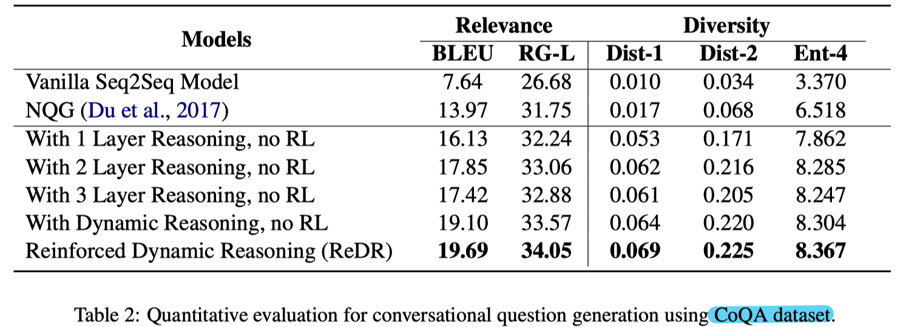

- With Dynamic Reasoning 是指加上公式6，否则直接以 $U^1=\widetilde{\mathbf{U}}^{1}$ 。

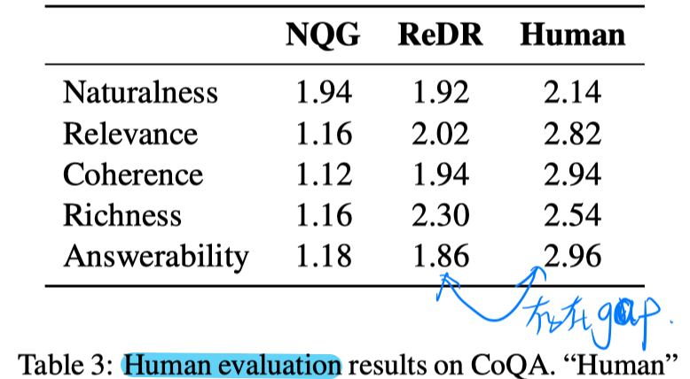

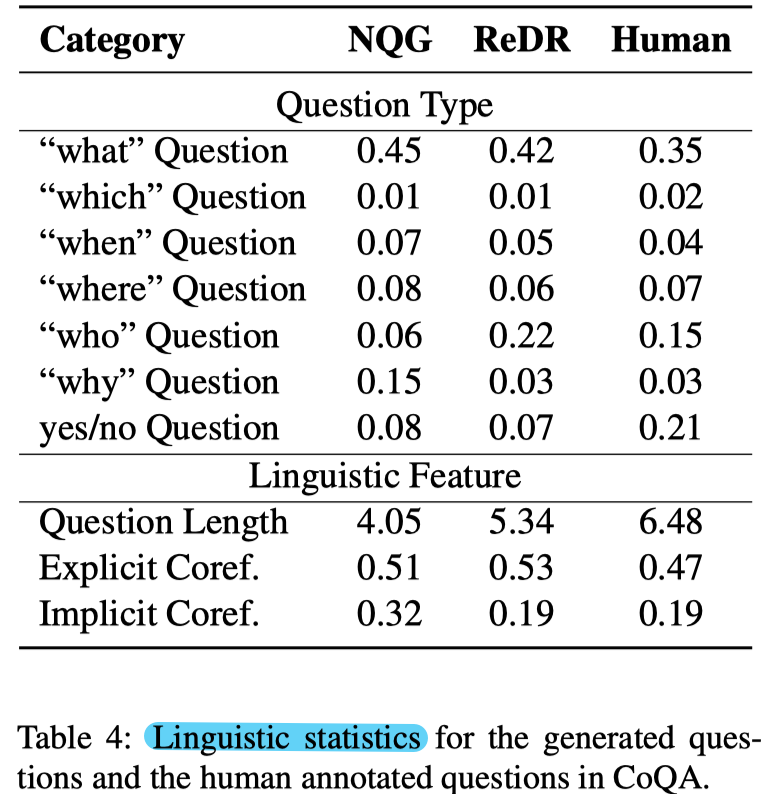

# Highlight

- 利用会话历史的方法过于naive。。。只是concat起来了历史question-answe pair。

