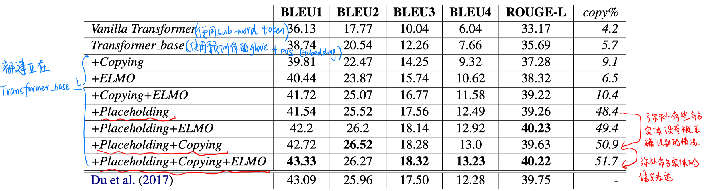
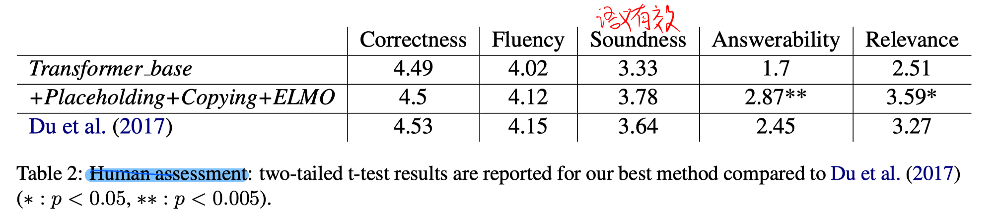

> > ACL2019，问题生成

## 背景

本文针对答案不可知的问题生成任务，并针对OOV问题，提出在Transformer中融合几种机制：

- copy机制
- placeholders
- contextual word embedding

## 方法

##### 基础模型

2层Transformer，d_model=256，d_ff=512，H=2

##### placeholders机制

基于命名实体更容易是OOV的假设，本文采用的做法是：识别passage和question中的所有命名实体，按照他们的实体类型以及出现顺序，使用特殊的标记来代替。（推断时，生成完question后，再反向映射回去）

##### copy机制

在解码阶段加入copy机制，弥补有些命名实体没有被placeholders正确识别的情况。

##### contextual word embedding

在编码阶段concat contextual word embedding（ELMo），弥补命名实体缺失语义表达的问题。

## 实验

数据集：SQuAD

结果：

