> > ACL2019

## Motivation-论文解决什么问题

目前的抽取式MRC模型无法很好地判断问题是否可回答。

本文提出了一种方法，可以自动生成不可回答的问题，因此可以作为一种数据增强来提高QA模型。

## Motivation-本文的方法思路

- 本文提出了一种MRC数据增强技术：由可回答的问题和包含其答案的段落，通过一个pair-to-sequence模型捕捉问题和段落间的交互，生成与上下文相关的不可回答的问题。

- 本文也提出了一种方法，可以利用现有的MRC数据集构造不可回答的问题生成模型所需的训练数据。

## Method-模型/方法概述

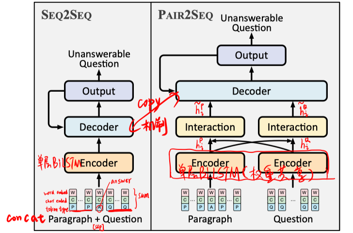

#### seq2seq model

- embedding = word embed + char embed + token type embed

- encoder = 单层BiLSTM

- decoder = 单层BiLSTM + attention + copy机制

  

  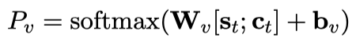

  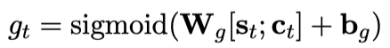

  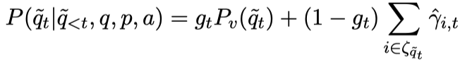

#### pair2seq model

- encoder （与seq2seq的encoder部分一样）

- interaction

  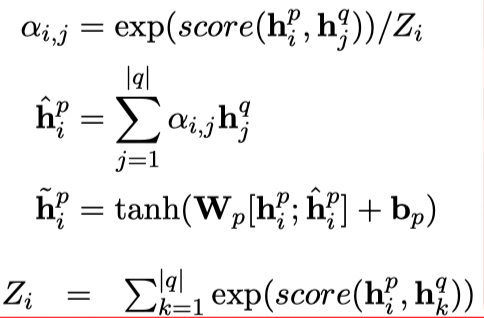

  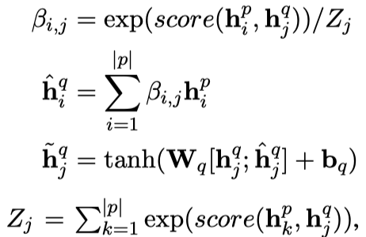

- decoder （与seq2seq的decoder部分类似，区别如下）

  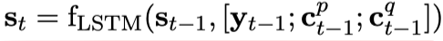

  copy机制部分，passage和question中的词都算入。

#### loss函数

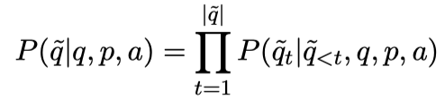

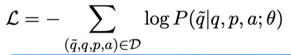

## Experiment-实验

#### 数据集构造

SQuAD 2.0数据集中包括answerable question和unanswerable question。其中每个不可回答问题都对应一个(plausible) answer spans。同时每个(plausible) answer spans也对应一个或多个可回答问题。

用(plausible) answer spans为pivot来对齐answerable和unanswerable question。对(plausible) answer spans刚好只对应一个answerable question和unanswerable question的，就将这两者作为一对。对于(plausible) answer spans对应多个answerable和unanswerable question的，将所有可能的pair按Levenshtein distance排序、保留最小的那个；并保证每个问题只出现在至多一个pair中。

作者按此方法在SQuAD 2.0上获取了共20220个pair。

#### 实验及结果

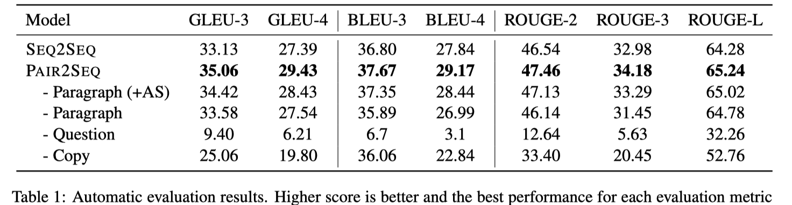

- 实验表明，具有问题和段落交互的Pair2Seq要优于Seq2Seq。

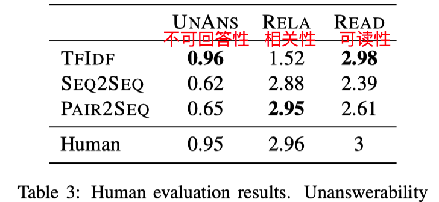

- TFIDF是用可回答的问题的词去检索其他段落的问题。
- 结果表明，本文的方法生成的不可回答问题与段落的相关性很高，这是很重要的。

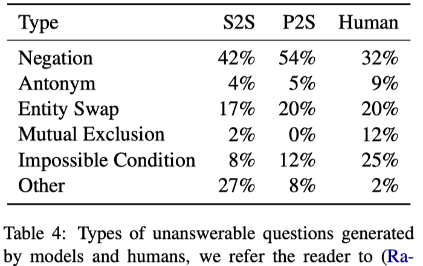

- 结果表明，本文的方法生成的不可回答问题主要是通过加反和实体置换的方式。与人的方式相同。

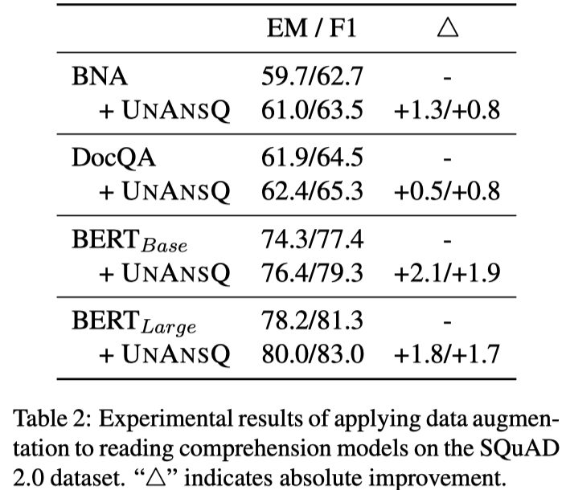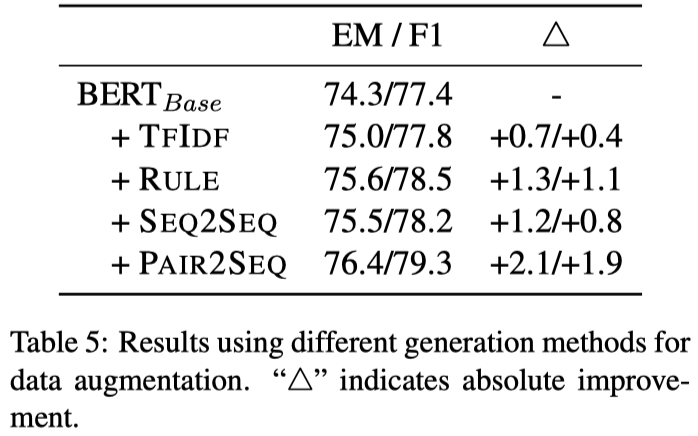 

- 训练得到69090个不可回答的问题作为数据增强，使得BiDAF-No-Answer (BNA)、DocQA、BERT微调模型在RC任务上的表现都有了进一步的提升。
- Pair2Seq相对其他生成unanswerable问题的数据增强方法对BERT-Base的提升效果最明显。

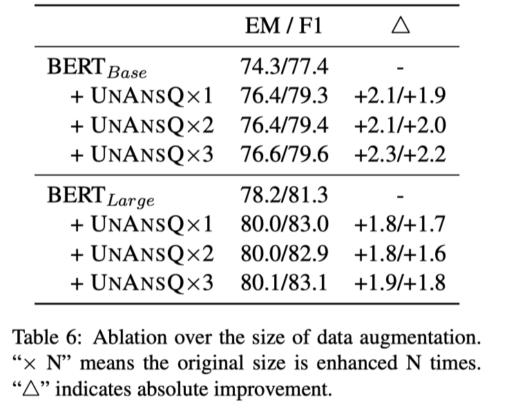

- 通过beam search size控制生成的不可回答问题数量，结果表明，增大数据增强的数据量能进一步提升模型表现。

## Highlight

- 通过观察目前RC模型的缺陷，提出生成unanswerable问题并作为一种数据增强手段的方法，提高了RC模型的表现。
- 利用已有的、同时具有answerable和unanswerable问题的SQuAD 2.0数据集，构造生成unanswerable问题的数据。
- 针对RC任务特点，引入了有助于RC任务的结构：在encoder部分加入了问题和段落的交互。

