> >ICLR2020

## Motivation-论文解决了什么问题

本文研究MRC如何判断给定的文本中是否包含问题的答案（answerability）。

已有MRC模型隐式地判定文本中是否包含问题的答案，缺乏对问题中多种限定的显示建模，即为什么伪答案不能回答问题。

本文提出neural question requirement inspection model，从问题中抽取限定条件，进一步根据这些限定条件是否被满足来判定answerability。这样做performance提高了，而且具有可解释性（不能回答是由于哪些条件不满足）。

## 方法

##### 模型

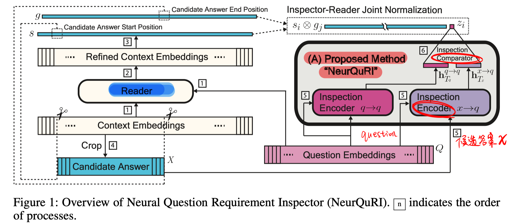

- Reader：输入是question和context，输出是预测的最可能的answer span（起止位置，contextual word-level representation）。

  可以用任何现有的RC模型。

- NeuralQuRI：输入是question和Reader预测的答案，输出是问题的可回答度 $z^i$。

  - inspection encoder:

    输入：

    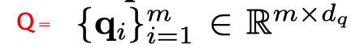

    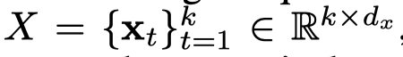

    输出：inspection vector $h$，cumulative satisfaction score vector $a \in R^m$.

    整体计算：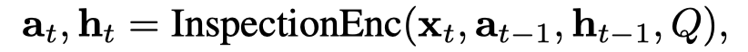

    计算过程：

    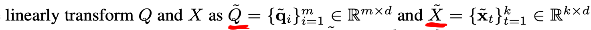

    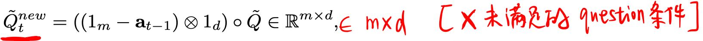

    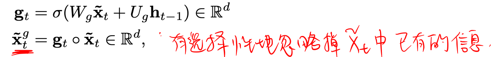

    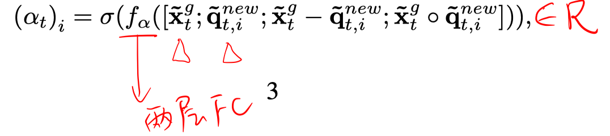

    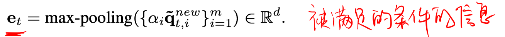

    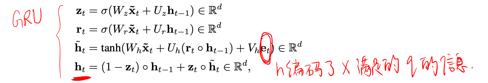

    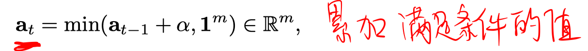

  - inspection comparator

    作者额外把问题作为伪答案同样通过inspection encoder。

    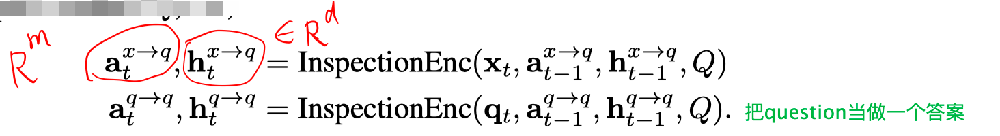

    计算answerability score。

    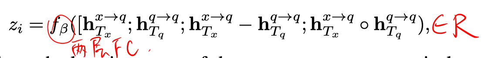

##### 损失函数

- Answerability Classification Loss.：常规交叉熵

  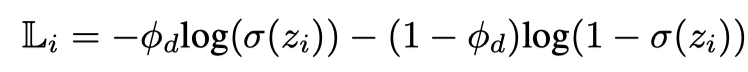

- Satisfaction Score Loss

  

- Inspector-Reader Joint Normalization

  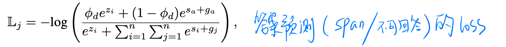

- 总损失函数

  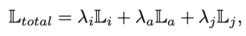

## Experiment-实验

- 实验数据集：SQuAD2.0、MSMARCO、NewsQA
- Reader： BERT、DocQA、 QANet
- 评价指标是EM 和 F1

1. 在SQuAD2.0上，在三个reader模型上加上所提模块后效果有提升，同时对比其他两种answer verifier也有提升。

  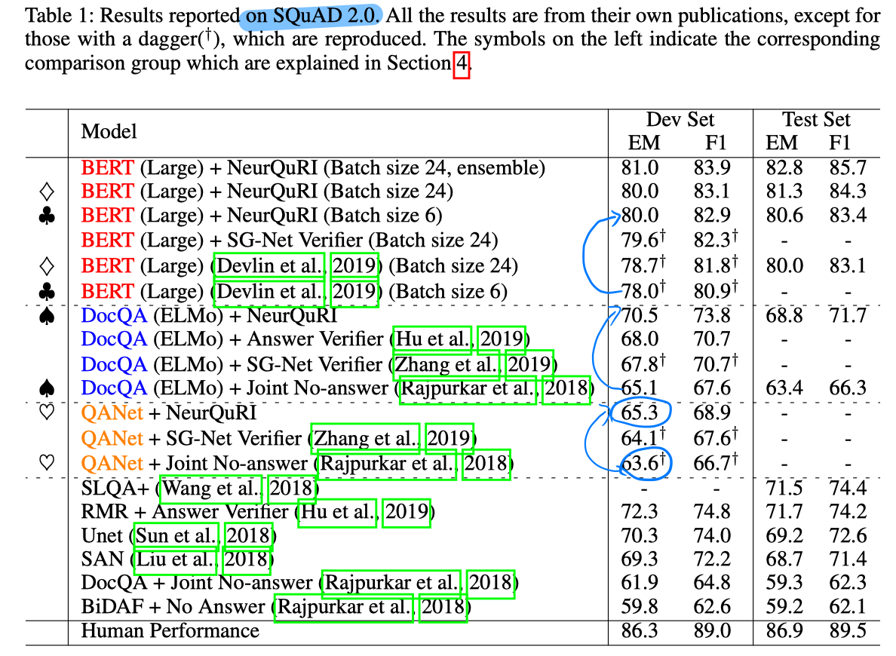

2. 在msmarco和newsqa数据集上的结果

   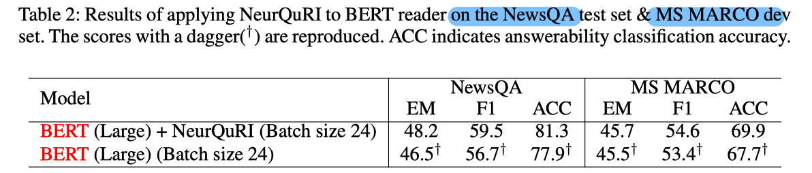

3. 验证多个损失函数的有效性和不去掉question停用词效果更好

   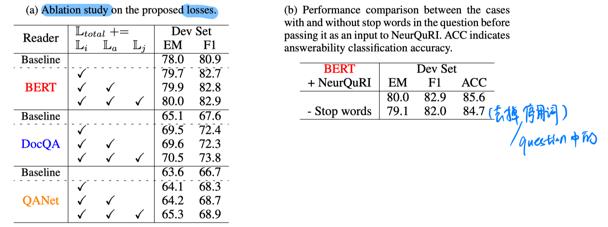

4. 验证对训练时answerable label的更改的有效性，更改方式如下，也就是当Reader抽取的答案和标准的答案重合度比较低的时候训练标签改为不可回答。

   

   实验结果证实修改的有效性，尤其当在差的reader时，更为有效，具体数据结果如下

   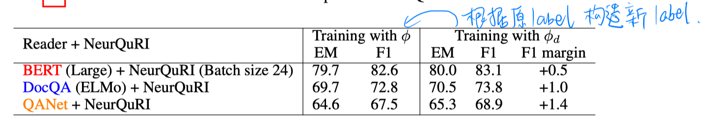

## Highlight

- 提出一个比较好用的answerability 判定模块，用在多个模型上都有效。以往的方法都是提一个整体模型。本文的模块更加通用。
- 文章的思路可以借鉴到其它文本匹配模型上，如qq匹配。做neural checklist模型，先抽取条件，再看条件是否满足。