> > ICLR 2019，多文档的候选答案检索式的QA

# Coarse-grain Fine-grain Coattention Network for Multi-evidence Question Answering

## 背景

本文提出了一个针对多文档作为support documents的QA模型 **CFC（Coarse-grain Fine-grain Coattention Network）** 。它包括一个粗粒度的模块和一个细粒度的模块：

- 粗粒度模块：建模 documents 和 query 之间的关系，然后根据结合了query的document表达计算每个候选答案的得分。即粗粒度得分。
- 细粒度模块：建模 每个候选答案在documents中的mentions 与 query 之间的关系，计算每个候选答案细粒度的得分。

## 模型

##### 整体框架：

> 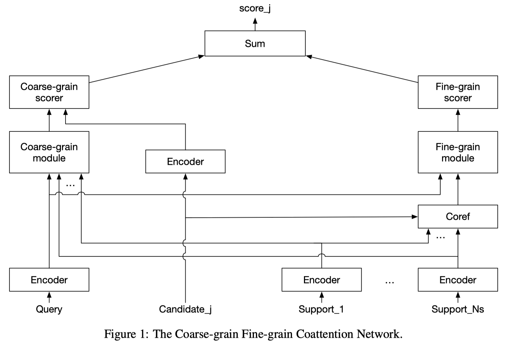
>
> 输入：一个query，N_s 个 support documents，N_c 个 候选答案。
>
> 输出：粗粒度和细粒度得分之和作为每个候选答案的最终得分：$y=y_{\text {coarse }}+y_{\text {fine }}$
>
> loss：cross entropy loss

##### 细粒度模块：

>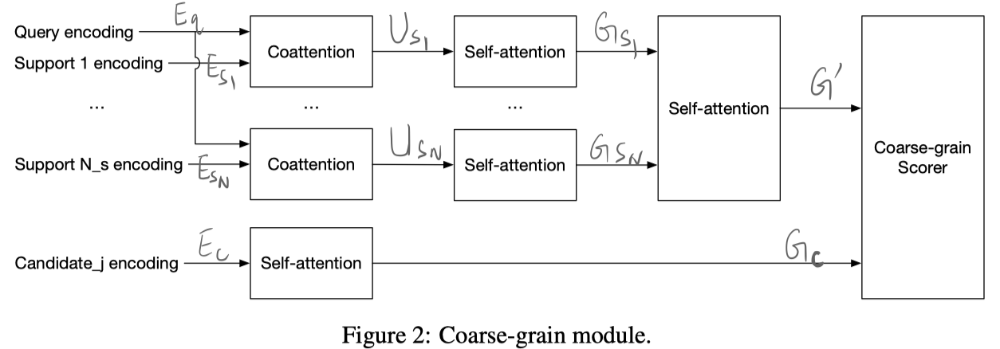
>
>Embedding layer: 使用固定的 glove embedding + character ngram embedding
>
>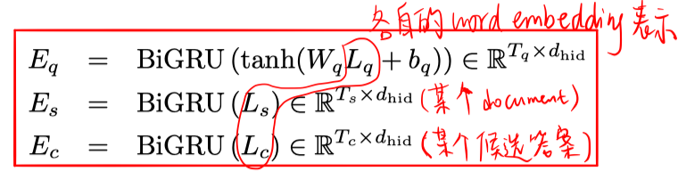
>
>Co-attention layer:    $\operatorname{Coattn}\left(E_{s}, E_{q}\right) \rightarrow U_{s}$
>
>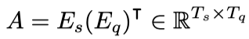
>
>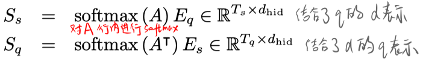
>
>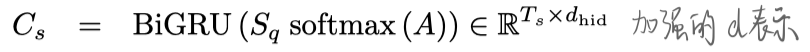
>
>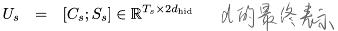
>
>Self-attention layer:   $\text { Selfattn }\left(U_{s}\right) \rightarrow G_{s}$
>
>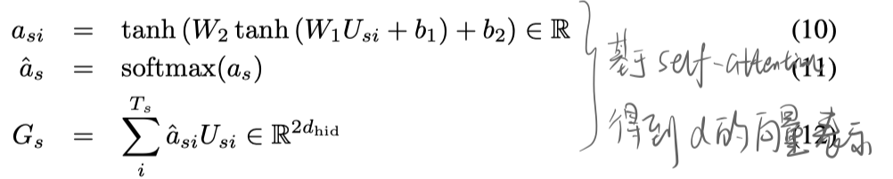
>
>Coarse-grain score:
>
>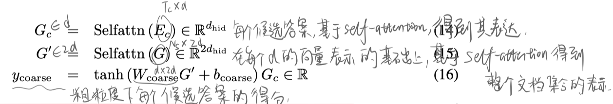

##### 粗粒度模块：

> 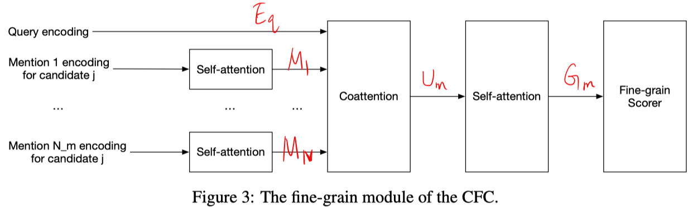
>
> 对候选答案j的每次mention进行self-attention：
>
> 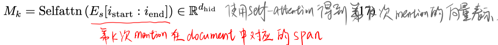
>
> 所有的mentions 与 query 进行 co-attention：
>
> 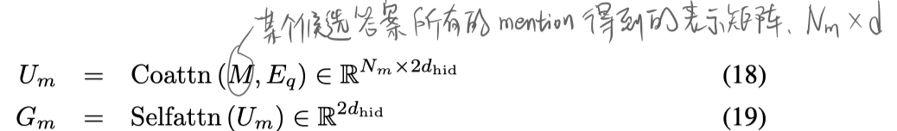
>
> Fine-grain score：
>
> 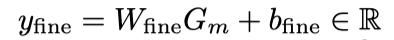

## 实验

**数据集**：WikiHop、TriviaQA

>WikiHop:
>
>该数据集是由知识库Wikidata中的实体与文档库Wikipedia之间的链接关系构成的。给定事实三元组中主体和关系作为query，一些实体作为客体的候选答案，相关的维基百科页面作为support documents。

> TriviaQA:
>
> 把该数据集重新形式化为 span rerank 任务。即 rerank 其他 span抽取模型（BiDAF++） 的输出（top50候选答案）。

**实验1：在WikiHop上的实验**

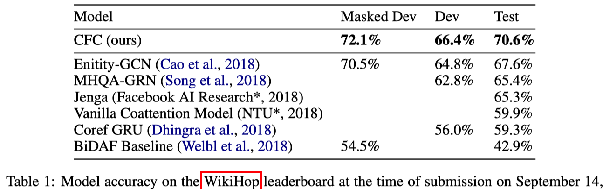

- 结果表明，这样粗粒度和细粒度分开的方式，可以让每个模块的attention关注输入的不同部分。
- 结果表明，CFC有能力处理长文本集合作为support documents的QA任务。

**实验2：在WikiHop上的实验**

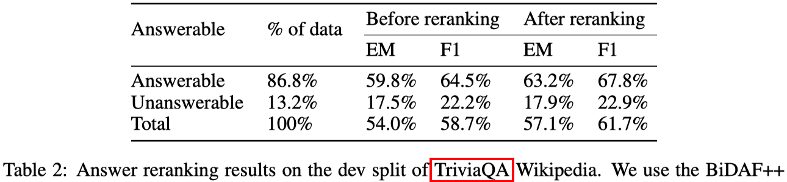

- 结果表明，CFC可以进一步优化其他的 span抽取模型的输出。

**实验3：消融实验**

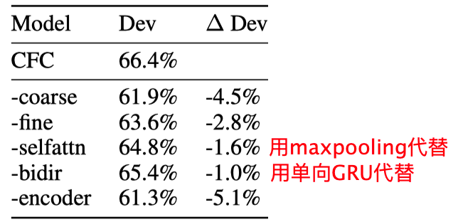

## 亮点

- 使用候选答案在documents中的提及，建模细粒度信息。

