## Motivation-论文解决什么问题

本文解决的是多段落生成式MRC任务。

之前的任务只能对每种answer style（例如NLG、QA）构建一个模型，但本文提出的**Masque模型**可以解决不同的answer style场景。

## Motivation-本文的方法思路

Masque结合了多源生成式摘要技术和多任务学习技术。

## Method-模型概述

#### 问题形式化

给定问题$$
\left\{x_{1}^{q}, \ldots, x_{J}^{q}\right\}
$$、K个文本段落（每个段落为$$
\left\{x_{1}^{p_{k}}, \ldots, x_{L}^{p_{k}}\right\}
$$）、answer style $s$，生成答案$$
y=\left\{y_{1}, \dots, y_{T}\right\}
$$ 、每个段落是否是supporting $$
\left\{r^{p_k} \right\}
$$、问题的可回答性 $a$.

#### 模型 

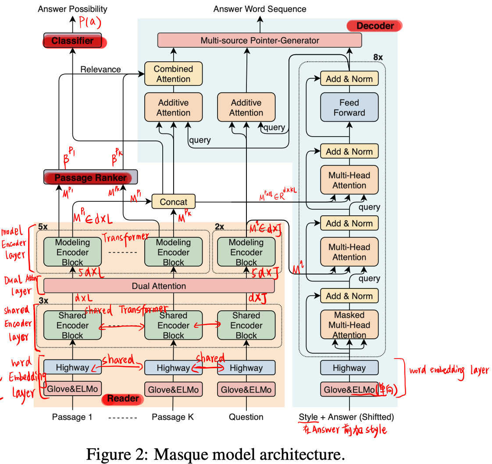

- **question-passage reader**
  - word embedding layer：采用ELMo和GLove拼接，再经过两层共享的highway network。
  
  - shared encoder layer：采用共享的堆叠的transformer层。
  
  - dual attention layer：采用的是双向的attention。
  
    
  
    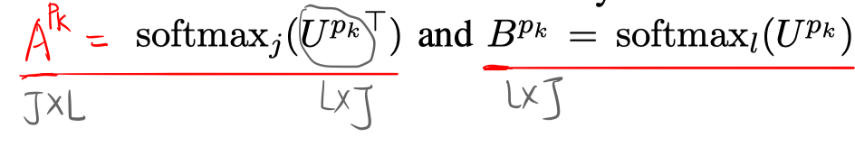
  
    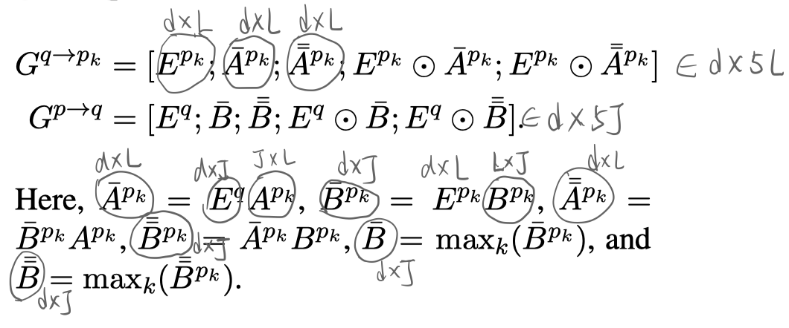
  
  - modeling encoder layer：堆叠的transformer层。
  
- **passage ranker**
  使用passage的第一个词的表示，经过一层FC+sigmoid，对每个passage进行打分。
  
  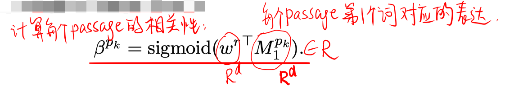
  
- **answer possibility classifier**
  将所有passage的第一个词的表示concat，经过FC+sigmod，计算问题的可回答性。
  
  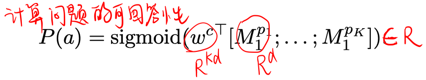
  
- **answer sentence decoder**
  
  > 训练时在答案的前面加上answer style指示词。
  >
  > 在推断是，通过控制第一个词来控制不同答案类型的生成。
  
  - word embedding layer：同reader部分的一样，只是使用单向EMLo。
  
  - attention decoder layer：如图所示，基于transformer的变体的堆叠。
  
  - multi-source pointer-generator：
  
    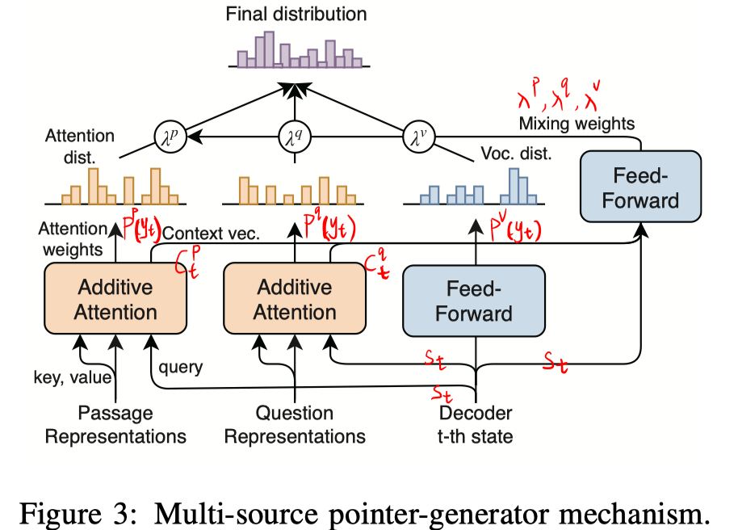
  
    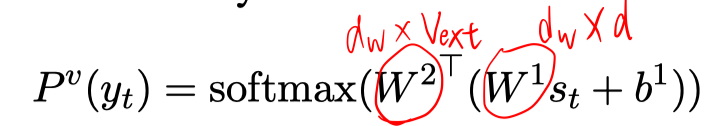
  
    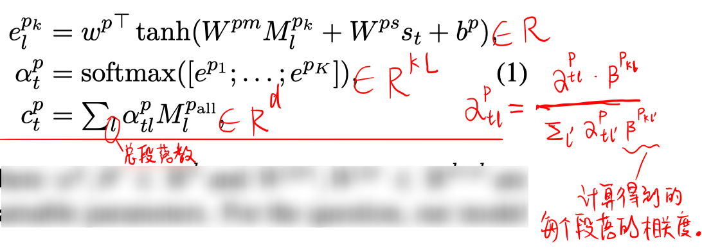
  
    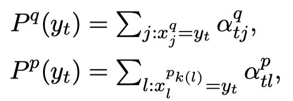
  
  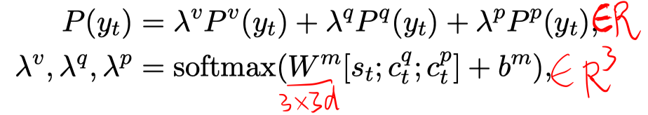

#### Loss函数

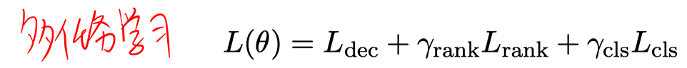

依次为解码损失，passage相关性损失和answer possibility损失。

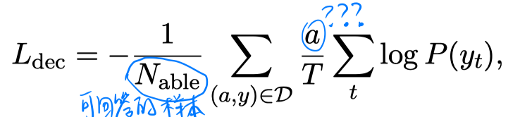

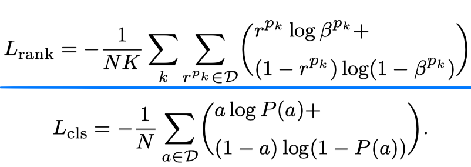

## Experiment-实验

- 数据集：MS MARCO的QA任务、NarrativeQA

- 评价指标：ROUGE-L、BLEU-1

- 在marco上的实验结果

  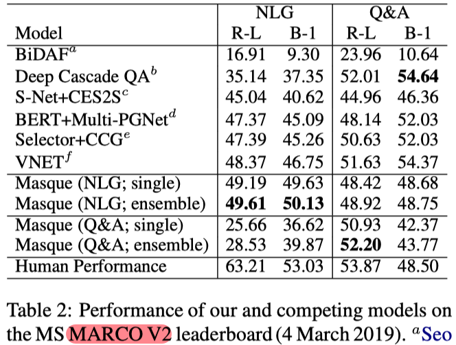

  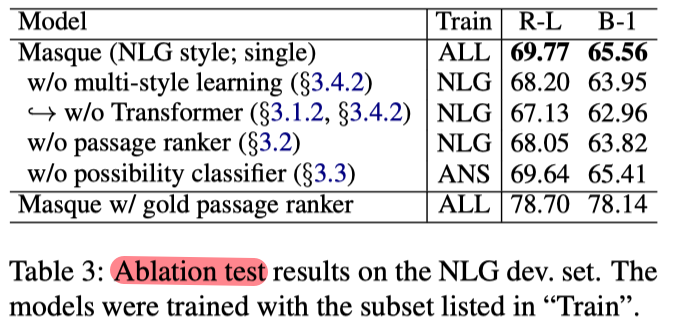      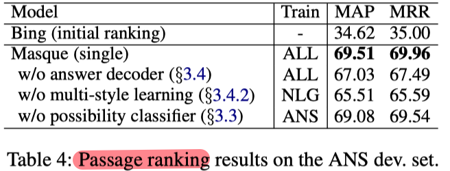

  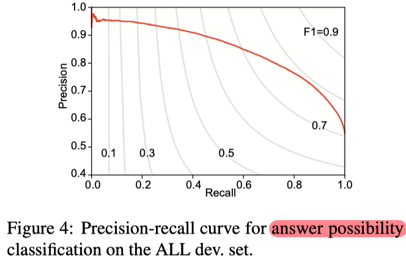

  - Table3验证了多style answer一起训练的好处
  - table3的最后一行表明，passage ranker是提升模型性能的一个关键。
  - table4表明，多任务学习也可以提高passage ranking的性能。
  - Figure4表明，本模型可以很好地预测问题的可回答性（F1=0.7893）

- 在NarrativeQA上的实验结果

  将NarrativeQA数据集和MARCO中NLG子集组合成一个新的数据集，以模拟multi-style answer。

  

