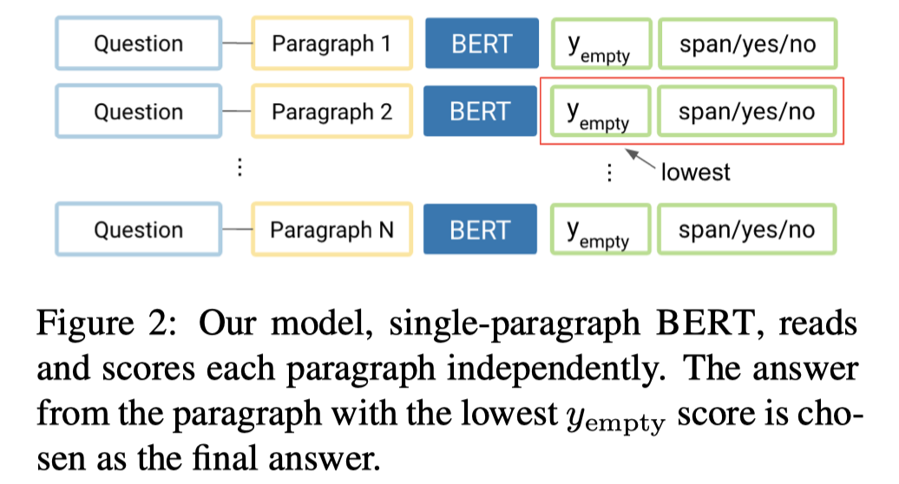
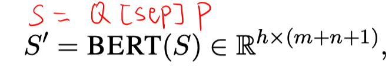
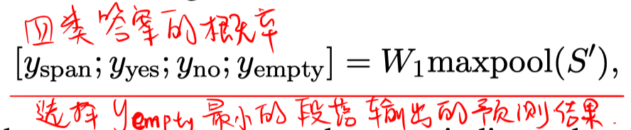
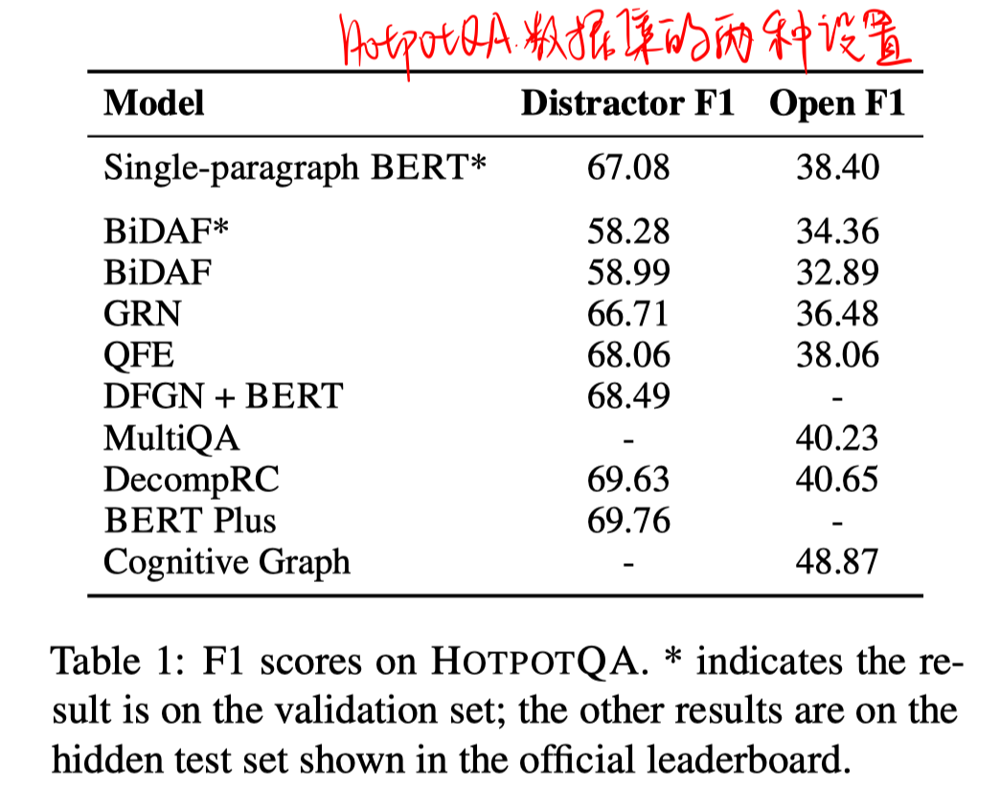
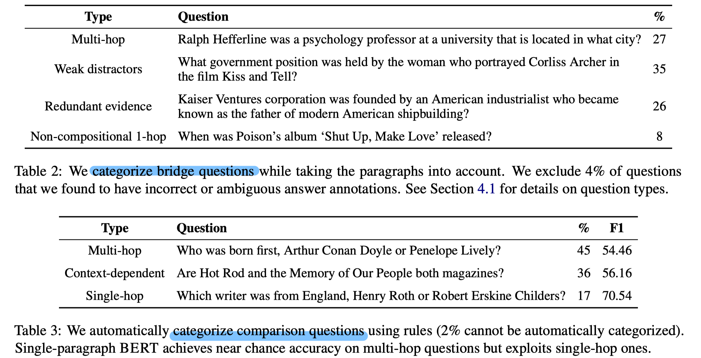

> > ACL2019，分析类文章

源码：https://github.com/shmsw25/single-hop-rc

## 背景

本文作者的观点是，问题中可能包含了冗余的事实，但是在计算答案时被忽略了。如果一个组合问题是针对特定实体类型或者有冗余的事实被提供，则可以用单跳来解决。

## 模型

基于bert的单跳QA模型，输入= question + [sep] + passage.

## 实验

1. 在hotpotQA上的实验结果

   

2. 人工评估及分析

   hotpotQA中的组合问题分2类：Bridge and Comparison。

   进一步对两类问题进行分类：

   

   > weak distractors：有实体类型这样的弱干扰项，但确定好实体类型之后就可以单跳解决了。。。但这样的情况在开放域设置下无法单跳解决。
   >
   > redundant evidence：忽略问题中的干扰时，该问题其实是一个单跳问题。

## 思考

1. 论文与其说是提出某种方法，倒不如是对HotpotQA数据集的具体分析。。（论文中很多观点成立只是建立在HotpotQA的问题类型导致的，，实际应用中并不是所有的问题都有这样的特点。）
2. 但是值得思考的是，人类在解决这些问题时，的确会利用这些漏洞来得到答案。
3. 同时也说明，目前很多数据集的构造的确会有一些缺陷。论文最后也提到，我们应该使用更好的检索系统来构造干扰项，保证问题的确需要多步推理才能解决。。而目前基于TFIDF检索得到的干扰项显然不足够。。同时，这也为我目前的工作找到额外的motivation！！！！