> > ACL2019，多跳MRC，结合图神经网络

## 背景

多跳MRC任务需要跨多文档进行推理，从而得到最终答案。。目前的研究还缺乏跨文档推理的能力。。也有一些多跳数据集的提出（WikiHop、HotpotQA）。

本文提出了基于图神经网络的多跳MRC模型 **Heterogeneous Document-Entity (HDE) graph**。其特点在于：

- 图中包含3类节点，分别代表 support document、candidate answer、entity。不同类型的 query-aware 的节点分别表示不同粒度的信息。

- 使用 self-attention 和 co-attention 学习得到节点的初始表示。

- 图中包含7种类型的边，分别表示不同的结构信息。不同类型的节点之间的交互可以帮助正确的进行推理。

  > 七种类型的边：
  >
  > 1. 文档-候选答案：表示该候选答案在该文档中出现
  > 2. 文档-实体：表示该实体抽取自该文档
  > 3. 候选答案-实体：表示该实体是该候选答案的mention
  > 4. 实体-实体：表示两个实体抽取自同一文档
  > 5. 实体-实体：表示两个实体是同一 candidate answer 或者 query subject 的 mention。
  > 6. 实体-实体：不满足上述两种关系的实体。
  > 7. 候选答案-候选答案：所有两个候选答案之间都存在边。

## 模型

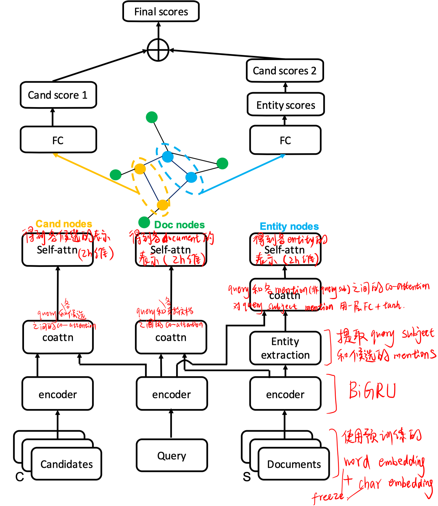

### context encoding

**输入**：以(sbuject, relation, ?)形式表示的query、supporting document 集合$S_q$、candidate answer 集合$C_q$.

**Embedding layer**：使用预训练的300维glove词向量和100维char embedding的concat。训练时freeze。

**Context Encoding layer**：使用BiGRU编码上下文信息，$\mathbf{H}_{q} \in \mathbb{R}^{l_{q} \times h}, \mathbf{H}_{s}^{i} \in \mathbb{R}^{l_{s}^{i} \times h}, \mathbf{H}_{c}^{j} \in \mathbb{R}^{l_{c}^{j} \times h}$

**Entity Extraction**：使用精确匹配策略，在 support documents 中抽取 query subject 和 candidate answer 的mentions。每个entity mention的表示用对应的文档词的上下文表示。

 **Co-attention**：在query-document、query-candidate、query-entity(非query subject)之间进行co-attention。对query subject entity mention进行一层FC+tanh。

> co-attention的计算：（以query和某支持文档为例）
>
> 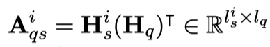
>
> 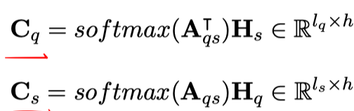
>
> 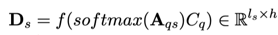
>
> 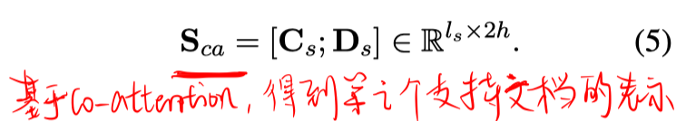

**Self-attention**：

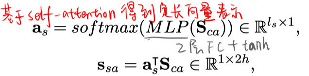

### reasoning over HDE graph

**节点的初始化表示**：用上述步骤得到的定长向量进行每个节点的初始化。

**信息传播**：共进行K次

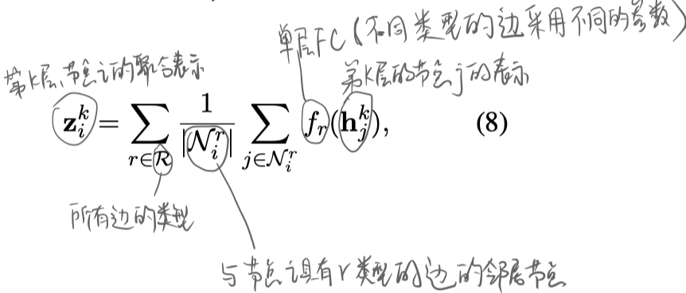

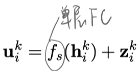

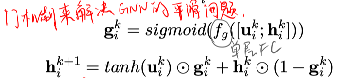

### score accumulate

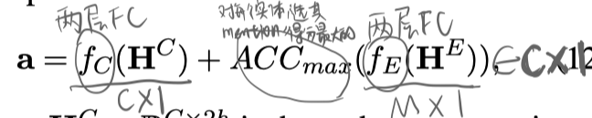

### 训练

使用cross-entropy loss。

## 实验

数据集：WikiHop

实验结果：

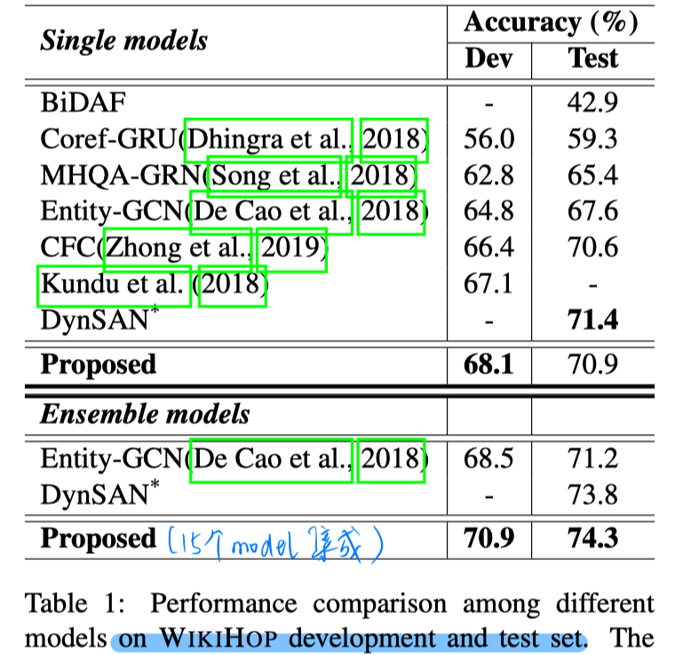

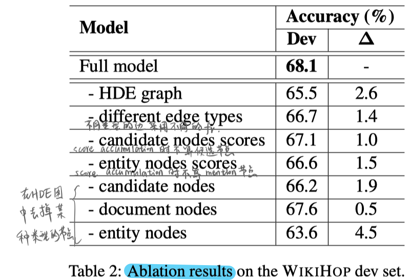

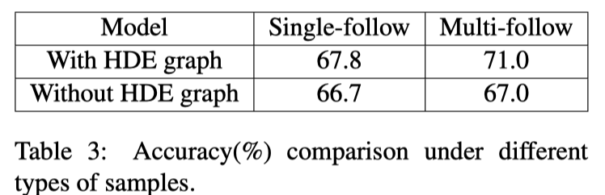

- 表3结果证明了HDE图在多文档上较好的推断性能。

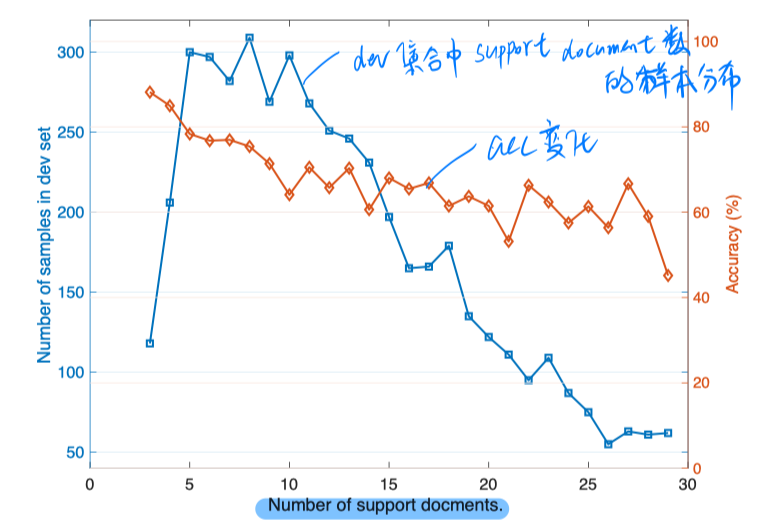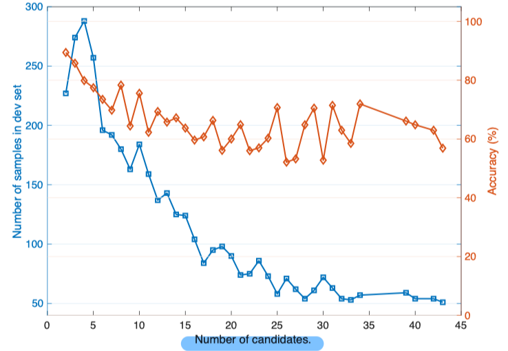

- 上图说明，支持文档数越多，性能会下降。可能是因为文档越多，抽取的实体越多，而且图会越大，会导致推理更难。
- 候选答案数的影响类似，除了图越大的原因，还可能是更多的候选答案导致更难选择。

## Highlight

- 文中为了避免GCN的smothing problem，专门加了门机制。按理来说可能K就不止是2了，但实验部分没说明K是多少，也没有针对K做实验。

