> > ACL2019，多跳QA，多步推理

源码：https://github.com/woshiyyya/DFGN-pytorch

## 背景

本文针对的问题是多段落的抽取式QA任务，给定一个问题和多个段落（并不是每个段落都有用），要求模型预测出答案。

针对该任务，目前的挑战或者一些工作的不足之处在于：

- 因为并不是每个文档都包含相关信息，需要模型能够过滤掉噪声，提取有用的信息。目前的工作都在静态全局实体图上应用GNN，但本文认为query主导的多步推理应该在动态局部实体图上进行。
- 之前的工作都是融合所有的文档信息到一个实体图中，然后直接从图中选择一个实体作为答案。但是实际中，答案不一定存在于实体图中。

## 本文思路

本文提出**Dynamically Fused Graph Network（DFGN）**，这个模型受人类一步步推理行为的启发，首先为文档中出现的实体构建图网络，之后从给定问题中提到的实体出发，沿着文档构造的实体图进行搜索，逐步给出文档中的实体或文本片段作为最终答案。

## 方法

##### 整体模型

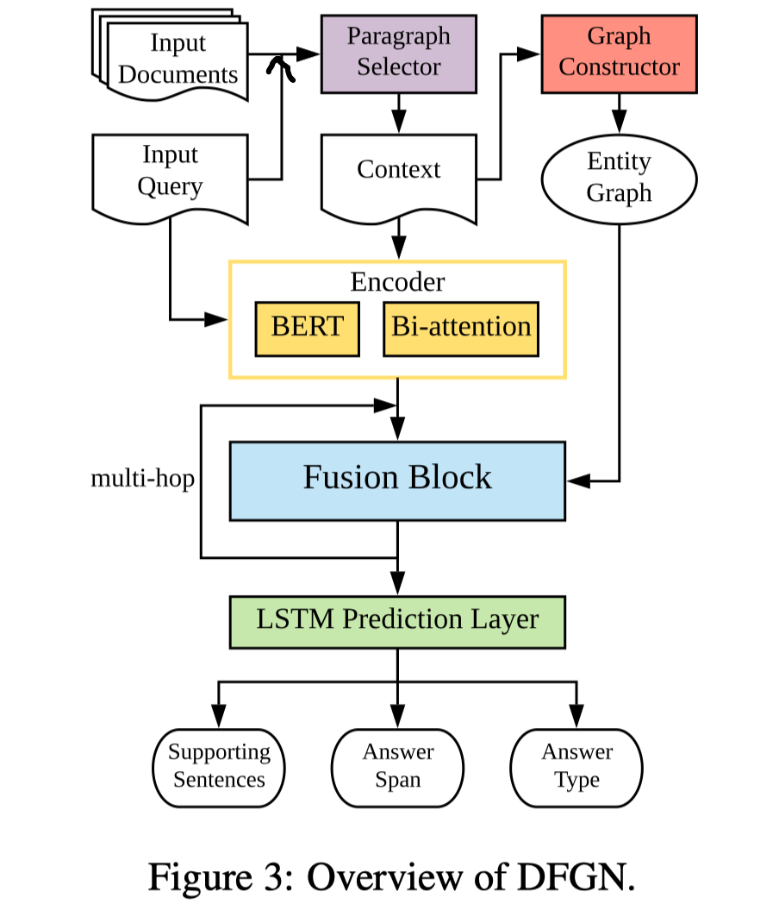

- 相关段落选择

  以query和每个段落作为输入，使用预训练的BERT模型+分类层（sigmoid）预测段落的相关性。

  在推断时，只有分值大于阈值的段落才拼接起来作为context $C$。

- 实体图构建

  从context中识别出所有的实体，每个实体作为图中的一个节点。

  边的构造有3种情况：1）出现在同一句子中的实体对之间；2）具有相同mention的实体对之间；3）每一个文档的中心实体与该文档的其他实体之间，其中文档的中心实体是从文档的标题句中抽取得到的。

- 编码层

  把query和context拼接起来通过预训练的BERT，得到 $Q = \left[\mathbf{q}_{1}, \ldots, \mathbf{q}_{L}\right] \in \mathbb{R}^{L \times d_{1}}$ 和 $ \mathbf{C}^{\top}=\left[\mathbf{c}_{1}, \ldots, \mathbf{c}_{M}\right] \in \mathbb{R}^{M \times d_{1}}$ 。

  再把 $Q$ 和 $C$ 进行bi-attention，得到 $\mathbf{Q}_{0} \in \mathbb{R}^{L \times d_{2}} \text { and } \mathbf{C}_{0} \in \mathbb{R}^{M \times d_{2}}$ 。

- 多跳推理

  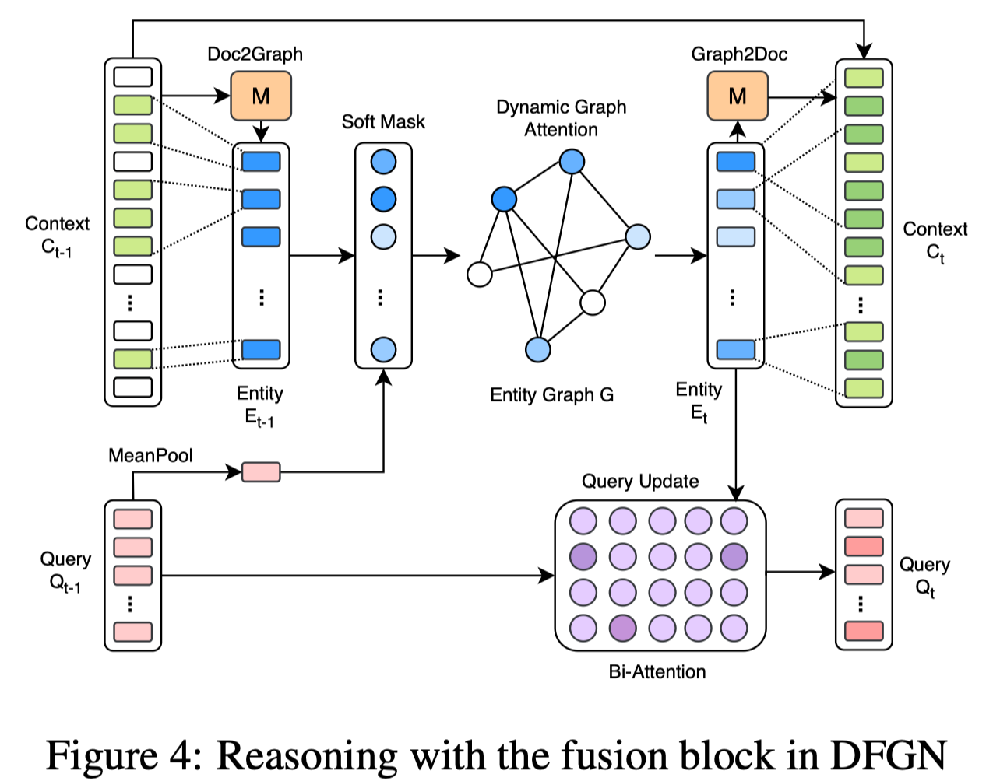

  - Document to Graph flow

    构建二进制矩阵$M$，M_ij的值表示context中的第i个词是否在实体图的第j个实体节点中。

    根据 $C_{t-1}$ 和 实体图中每个实体所含的词，对每个实体所含的词的表示进行max-pooling和mean-pooling，得到 $\mathbf{E}_{t-1}=\left[\mathbf{e}_{t-1,1}, \dots, \mathbf{e}_{t-1, N}\right]$，每个实体节点被表示成$2*d_2$维的向量，图中共有N个实体节点。

  - Dynamic graph attention

    先识别该步推理下，每个实体节点与query的相关度，根据相关度对实体节点表示进行惩罚。

    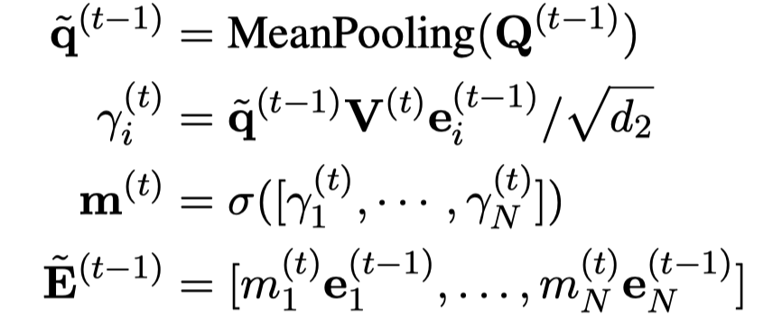

    计算实体之间的相关性，每个实体根据其邻居信息来更新自身的表达。

    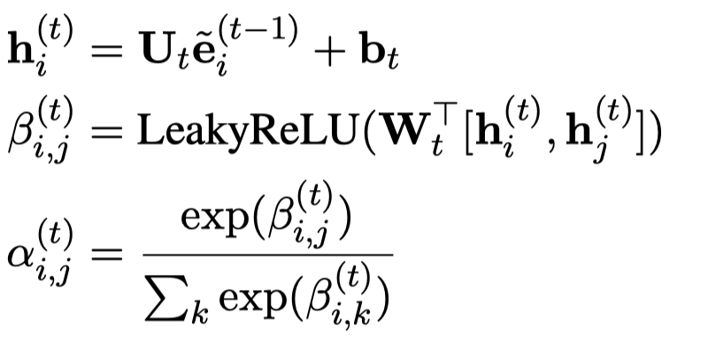

    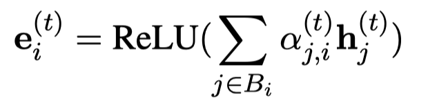

    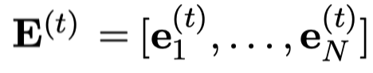

  - query update

    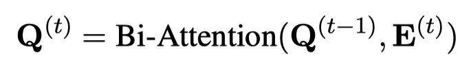

  - graph to Document flow

    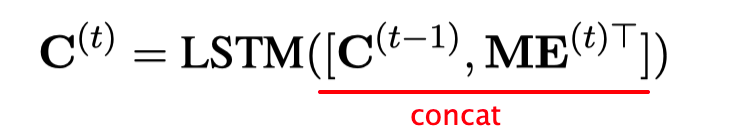

- 预测层

  模型包含4个输出：1. supporting sentences, 2. the start position of the answer, 3. the end position of the answer, and 4. the answer type.

  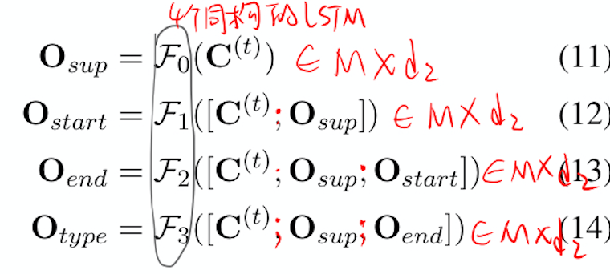

  同时优化4个cross-entropy loss：

  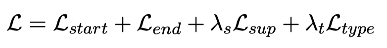

##### 弱监督

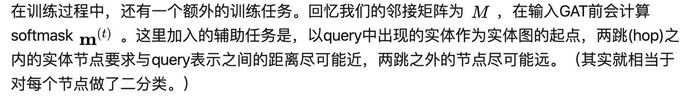

再加一个二进制的cross entropy loss到目标函数中。

## 实验

数据集：HotpotQA

结果：

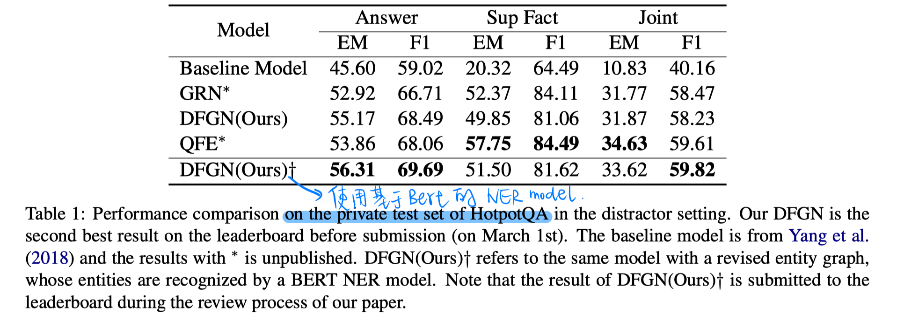

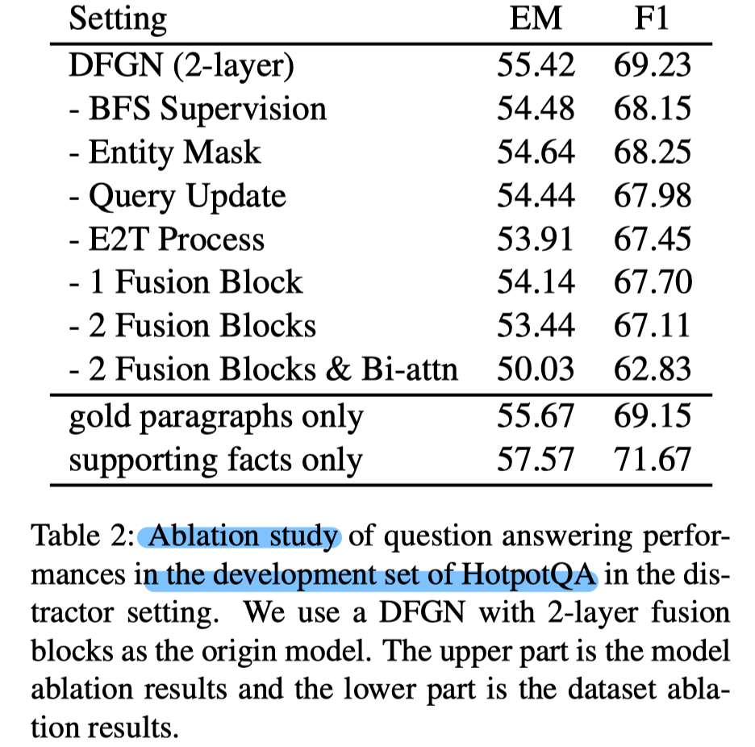

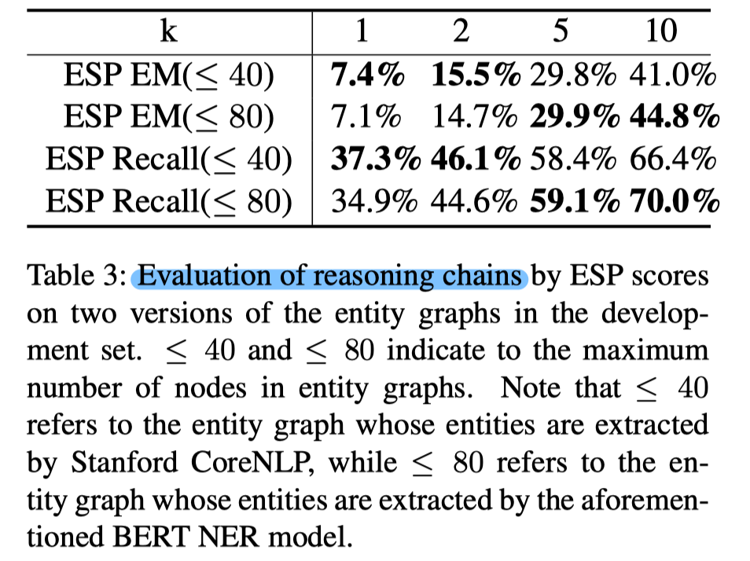

