> >ACL2019，多段落的多选阅读理解任务，

代码：https://github.com/allenai/PathNet

## Motivation-论文解决了什么问题

本文为**多段落的多跳阅读理解任务**提出了一个基于路径的推理模型**PathNet**。

之前的基于路径的推理模型一般是基于结构化知识图谱的，但本文的方法是基于无结构化文本。

## Motivation-本文的方法思路

- 路径抽取
- 路径编码和打分

## Method-模型概述

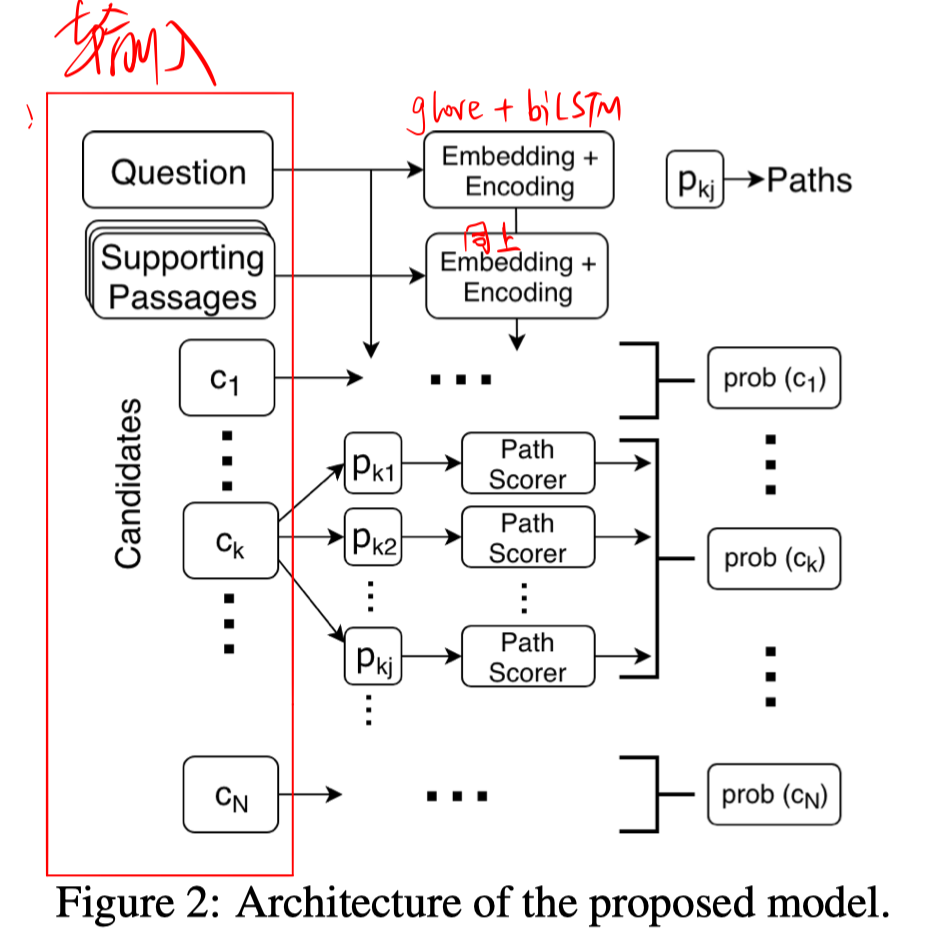

#### 任务定义：

给定一个question和一组passage，模型从一组预定的candidate answer中预测出正确答案。

#### 路径抽取

> 对于WikiHop数据集，question是以 $(h_e, r, ?)$，候选答案集合也是实体 ${c_1,c_2,…，c_N}$。
>
> 对于OpenBookQA数据集，question和候选答案都是自然语言句子。我们从question中抽取所有的头实体，从候选答案中抽取所有的尾实体。（以所有名词短语和命名实体为实体）
>
> 这两个数据集大部分都是2跳推理的。

路径抽取步骤：

- 找到包含 $h_e$ 的 段落 $p_1$
- 找到和 $h_e$ 出现在同一句子中的所有命名实体和名词短语，作为 中间实体 $e_1$
- 找到包含 $e_1$ 的段落 $p_2$
- 检查 $p_2$ 中是否包含某个候选答案

符合以上条件的路径即为要抽取的路径，每个路径可以用一个实体序列表示，例如 $h_e, e_1, c_k$

#### PathNet

- **Embedding & Encoding**

  用Glove(freeze) + BiLSTM分别得到每个passage、question、candidate answer的表示。

  第p个段落的表示：$\mathbf{S}_{p} \in \mathbb{R}^{T \times H}$

  question的表示：$\mathbf{Q} \in \mathbb{R}^{U \times H}$

  第k个候选答案的表示：$\mathbf{C}_{k} \in \mathbb{R}^{V \times H}$

- **Path Encoding**

  - context-based path representation

    每个实体可表示为，以其在passage中的起止位置的词的表示的拼接作为其表示。

    每个关系可表示为：

    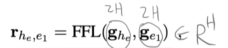

    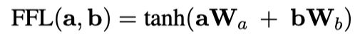

    每个路径可表示为：

    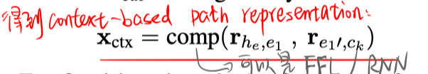

  - Passage-based path representation

    将每个段落与question进行co-attention，
    $$
    \mathbf{A} \in \mathbb{R}^{T \times U}  \\
    \mathbf{S}_{p}^{q_{1}}=\mathbf{A} \mathbf{Q}  \in \mathbb{R}^{T \times H}  \\
    \mathbf{Q}_{p}=\mathbf{A}^{\top} \mathbf{S}_{p} \in \mathbb{R}^{U \times H} \\
    \mathbf{S}_{p}^{q_{2}}=\mathbf{A} \mathbf{Q}_{p} \in \mathbb{R}^{T \times H}  \\
    $$
    对每个段落进行self-attention，得到每个段落的表示：
    $$
    \mathbf{S}_{p}^{q}=\mathbf{S}_{p}^{q_{1}} \| \mathbf{S}_{p}^{q_{2}} \in \mathbb{R}^{T \times 2 H}  \\
    a_{t}^{p} \propto \exp \left(\mathbf{s}_{p, t}^{q} \mathbf{w}^{\top}\right) ; \quad \tilde{\mathbf{s}}_{p}=\mathbf{a}^{p} \mathbf{S}_{p}^{q}
    $$
    基于段落的表示，得到每个路径的表示：

    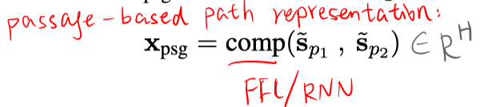

- **Path Scoring**

  基于question的首尾单词表示，得到question的向量表示：

  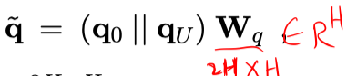

  基于question和context-based path representation，计算得分1：

  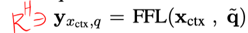

  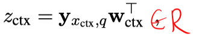

  对候选答案 $c_k$ 进行self-attention，得到其向量表示 $\tilde{\mathrm{c}}_{k} \in \mathbb{R}^{H}$ 。

  基于候选答案表示 和 Passage-based path representation 计算得分2：$z_{\mathrm{psg}}=\tilde{\mathbf{c}}_{k} \mathbf{x}_{\mathrm{psg}}^{\top}$ 。

  最终得分： $z=z_{\mathrm{ct} x}+z_{\mathrm{psg}}$

  标准化得分：对所有得分应用softmax。

  计算某个候选答案的概率：

  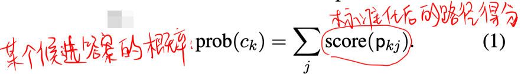

## Experiment-实验

数据集：WikiHop、OpenBookQA

实验结果：

  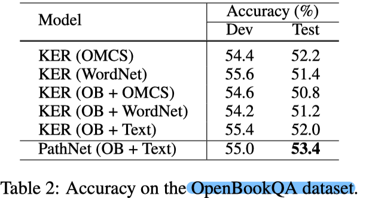

- 性能更好的情况下，该方法的可解释性可更好。

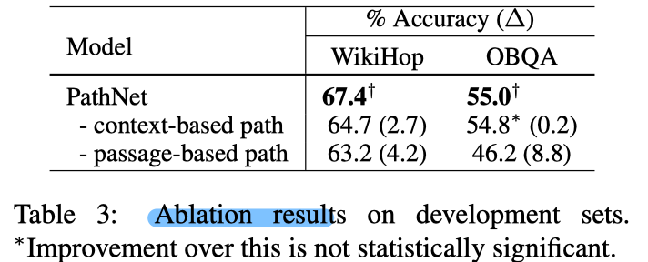

- context-based representation是捕捉的更细粒度的信息。
- passage-based representation是考虑了整个段落表示。
- 对于OpenBookQA数据集，很难通过实体链找到显式的context-based路径，这时passage-based representation会更重要。

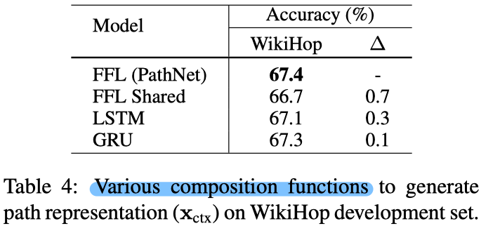

## Highlight

- 基于实体的显式推理路径建模

  