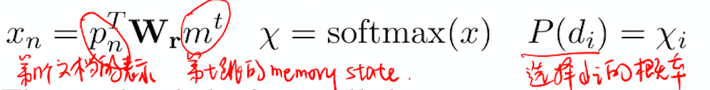
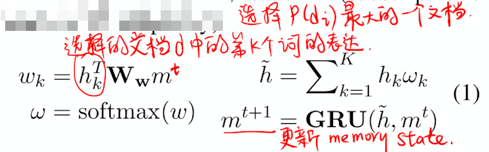
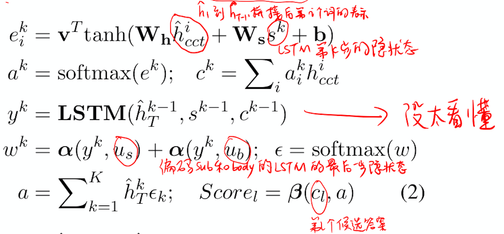

> > ACL2019

源码：https://github.com/jiangycTarheel/EPAr

## 背景

本文提出了一个可解释的具有3个模块的 Explore-Propose-Assemble 模型用于多跳MRC任务：

- Document Explorer：迭代地选择相关的文档，用树结构表示不同的推理链，从而能够从所有的链中吸收信息。
- Answer Proposer：从推理树中每条根到叶子节点的路径产生一个answer。
- Evidence Assembler：从每条路径中抽取一个包括所得出答案的句子，把他们结合起来预测最终的答案。

该模型模拟了人在面对多个长文档时由粗粒度到细粒度的阅读理解行为。

## 方法

##### 问题描述

给定query $q$（由一个subject $q_{sub}$ 和一个body $q_{bod}$ 构成）和 支持文档 $D=\left\{d_{i}\right\}_{i=1}^{N}$，从候选答案集合 $A=\left\{c_{l}\right\}_{l=1}^{L}$ 中找到答案 $a$。

##### 整体模型

- retrieval and encoding
  - retrieval：先找到与query具有最短TF-IDF距离的文档d，再找到$N'-1$个与d具有最短TF-IDF距离的文档。这N'个文档共同构成context。
  
  - encoding：
  
    1）先用highway Network融合character embedding 和 word embedding，得到 $\mathbf{X} \in \mathbb{R}^{N^{\prime} \times K \times d}$ , $\mathbf{Q}_{\mathrm{sub}} \in \mathbb{R}^{J_{s} \times d} \text { and } \mathbf{Q}_{\mathrm{bod}} \in \mathbb{R}^{J_{b} \times d}$ 。其中K表示每个文档的长度。
  
    2）对每个文档、subject 和 body 分别使用BiLSTM，得到 $\mathbf{H}=\left\{h_{1}, \cdots, h_{N^{\prime}}\right\} \text { s.t. } h_{i} \in \mathbb{R}^{K \times 2 v} $ ，$\mathbf{U}_{\mathrm{sub}} \in \mathbb{R}^{J_{s} \times 2 v}, \mathbf{U}_{\mathrm{bod}} \in \mathbb{R}^{J_{b} \times 2 v}$ 。
  
    3）对每个文档，用self-attention pooling得到每个文档的向量表示 $\mathbf{P}=\left\{p_{1}, \cdots, p_{N^{\prime}}\right\}$。
  
- Document Explorer

  该模块使用一个层级的memory Network。

  - 读操作：

    

  - 写操作：

    

  以上的读写操作构成 $\left(\hat{h}_{t+1}, m^{t+1}\right)=f_{D E}\left(m^{t}\right)$，迭代多次，每次选择的文档就构成了一条推理链 $\hat{\mathbf{H}}=\left\{\hat{h}_{1}, \cdots, \hat{h}_{T}\right\}$。

  重复多次，形成的多跳推理链就构成了推理树。

- Answer Proposer

  对每条推理链作为输入，预测出一个答案。

  

- Evidence Assembler

  把每条推理链得到的答案所在的句子拼接起来，形成文档 $h'$.

  对 $h'$ 使用双向attention后得到加权后的向量表示，再与各候选答案计算相似度。

##### 联合优化

联合优化三个模块的loss，每个模块都采用cross entropy loss。

- retrieval and encoding：用弱监督的方法计算第一跳和最后一跳的loss。第一跳的ground truth是与query具有最近TFIDF距离的文档。最后一跳的ground truth是任何包含正确答案的文档。
- Answer Proposer：每条推理链所预测答案的cross entropy loss。
- Answer Proposer：最终预测答案的cross entropy loss。

## 实验

数据集：WikiHop、MedHop

## 思考