> > ICLR2020

源码：https://github.com/AkariAsai/learning_toretrieve_reasoning_paths

## 背景

目前的开放域QA问题的解决方法一般是：1）先用非参数的方法（BM25、TFIDF）检索得到固定的文本集合；2）再用一个RC模型抽取得到answer span。虽然这样的pipeline方法在单跳QA中取得了不错的结果，但是对于多跳QA来说，可能每个evidence document与question只有部分重合，因此用这样的方法是检索不回来的。除此之外，对多跳QA，独立地检索每个文档是不合适的，没有考虑文档之间在多跳推理时的关系。

本文提出一个基于图的循环检索模型，以推理路径的方式检索evidence document，来回答复杂问题。

- retrieval 部分：用一个RNN模型，在考虑之前检索到的文档的条件下，检索新一个推理步的envidence document。
- reader 部分：对每条推理路径进行重新打分，并从最佳推理路径中抽取答案。

## 方法

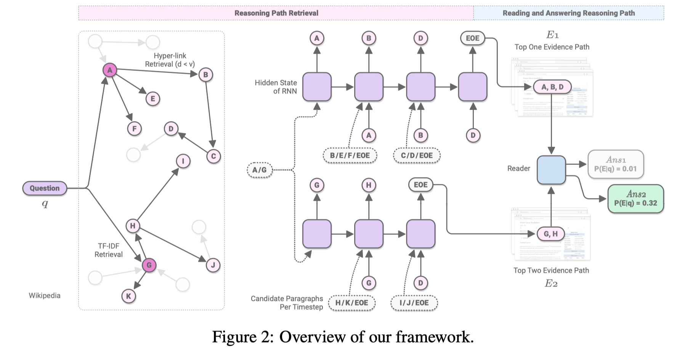

##### 问题描述

以Wikipedia的每个passage作为开放域QA的背景。每条推理路径$E$ 表示为一个passage序列。

把开放域QA任务分解为两个部分：

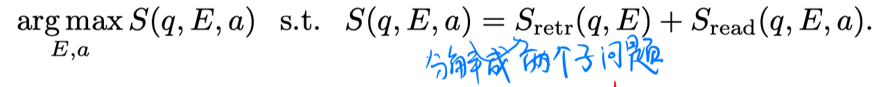

##### retrieval阶段

- 构建图

  每个Wikipedia的passage作为图中一个节点。边的构建有两种：1）通过Wikipedia中包含的超链接，得到passage之间的有向边；2）同一个Wikipedia页面不同段落之间存在双向边。

- 推理得到多跳推理路径

  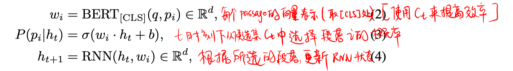

  每个推理步，使用束搜索从候选passage集合$C_t$中选择B个最可能的段落，直至公式3计算出[EOE]的概率最高。最终会得到B个可能的推理路径。

  关于候选passage集合的构造：1）$C_1$是选择F个与question的TF-IDF值最高的段落。2）其他$C_t$的构建，是根据上一时刻选择的段落，找到它指向的passage集合，再加上t时刻除了选择的最高概率的passage外的K个概率最高的passage再加上[EOE]标记。

- 训练

  根据数据集的标注，得到ground truth的推理路径，再用数据增强的方法得到一些推理路径的正例。

  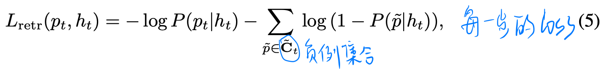

##### reader阶段

多任务训练：选择最优的推理路径，以及从最优推理路径中选择answer span。

- reader

  把question和该条推理路径上的所有evidence passage拼接起来。

  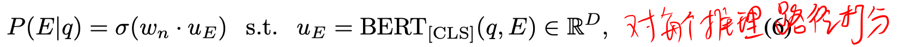

  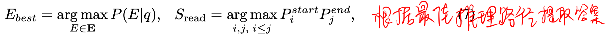

- 训练

  除了数据集中标注的ground-truth envidence passage，再利用远程监督得到一些envidence passage的正例。

  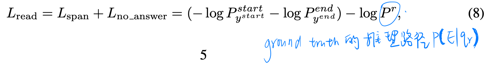

## 实验

数据集：HotpotQA、SQuAD open、Natural Question Open

实验结果：

1. 在三个数据集上的结果

   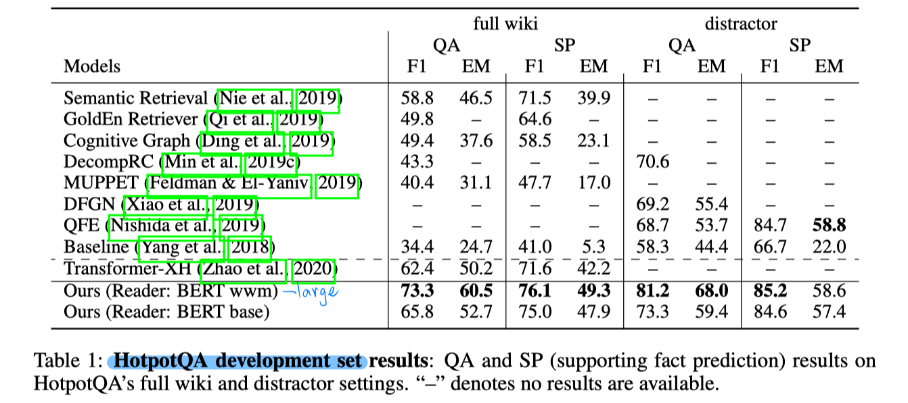

   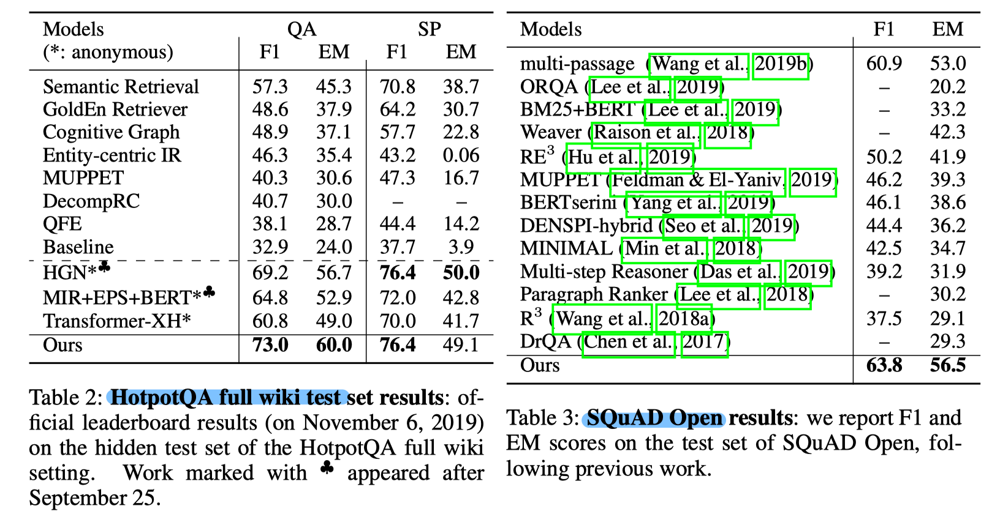

   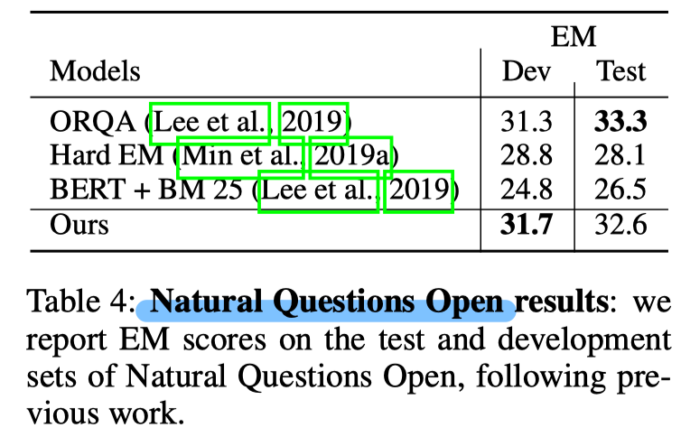

2. 针对检索模块

   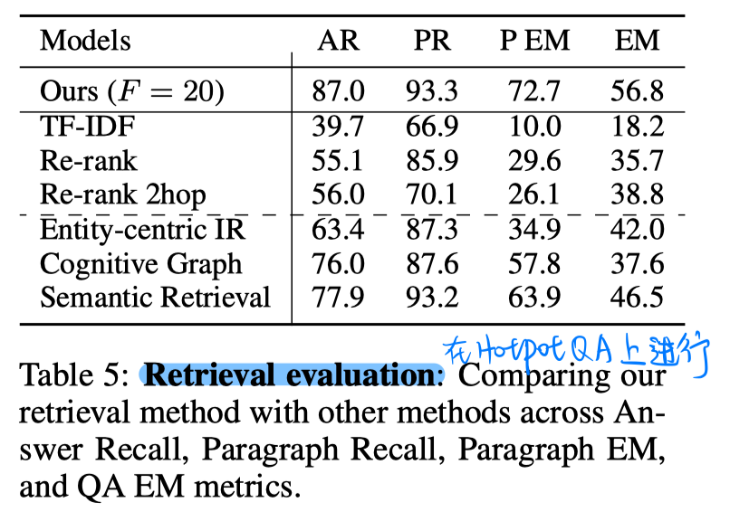

3. 消融实验

   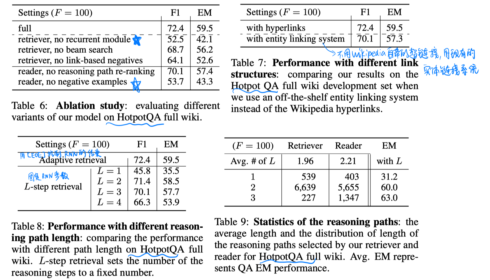

## Highlight

1. 在检索式用RNN，考虑之前推理步所检索的文档
2. 在reader部分对检索得到的候选推理路径进行重排序

