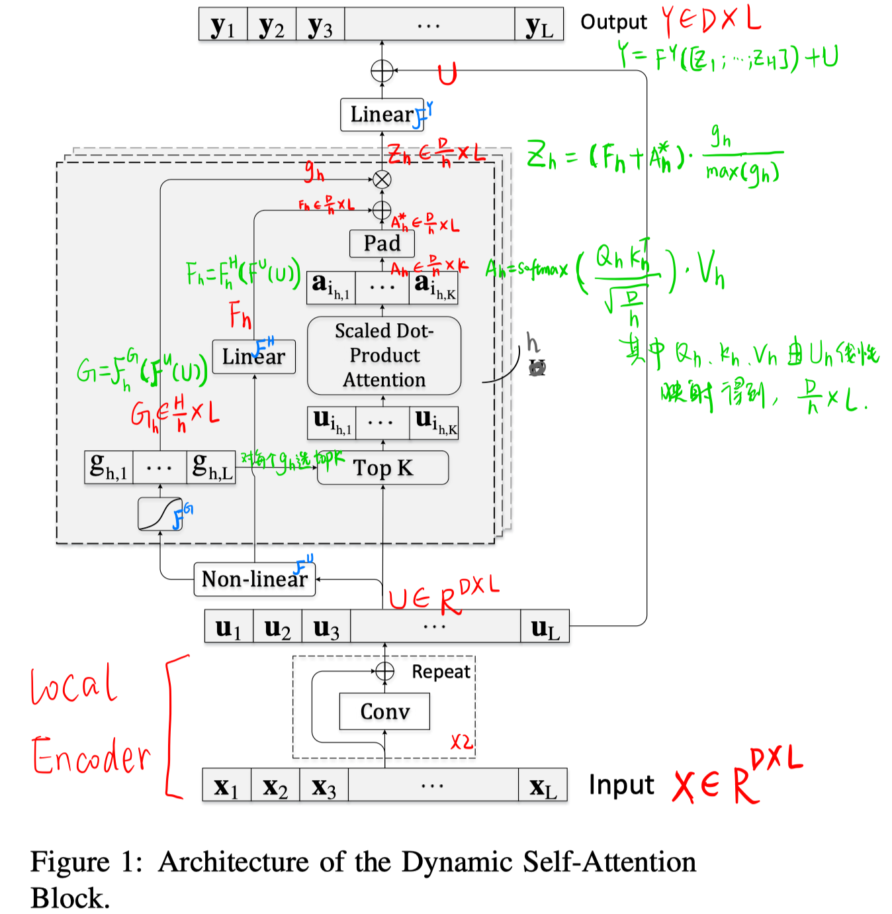
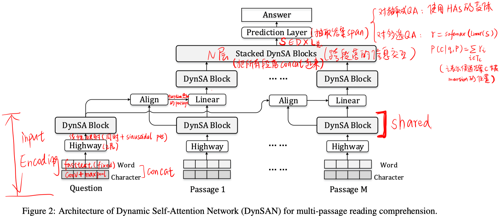
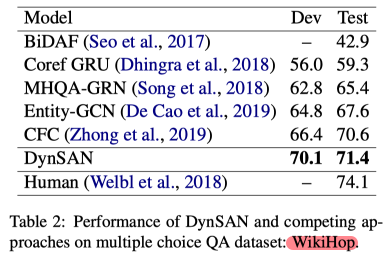

>>ACL2019，多段落MRC

## Motivation-论文解决了什么问题

- 多个支撑文本的阅读理解，要求跨多个文本寻找答案，以往模型往往得到每个文本的表达，然后再进行文本之间的交互，缺乏细粒度多个文本之间的信息交互。
- 本文提出一种动态自我注意力机制，减少注意力机制计算代价和显存，帮助进行词粒度的文本交互，提升模型效果

## Method-模型/方法概述

##### 动态自我注意力模块：首先从长文本序列中评估词的重要性，选出topk的词集合，然后在该集合上进行自我注意力机制的计算。（可以节省资源）

##### 整体模型

## Experiment-实验

- 实验数据集：SearchQA、Quasar-T、WikiHop（多选QA数据集，评估指标为acc）
- 实验及结论

1. 在三个数据集上的结果

            

2. 消融实验
   

3. 在SQUAD上验证所提结构的速度快，内存消耗小
   

4. 验证超参数K的作用：K增大到一定程度后，效果不再增长。通过K可以控制速度、内存、精度的trade-off；图b说明使用的passage越多，效果越好。

   

## Highlight

- 论文提出一种新颖的快速计算self attention的方法，相比进行attention weight的截断，作者直接进行token选择，减少计算量同时效果也有提升。