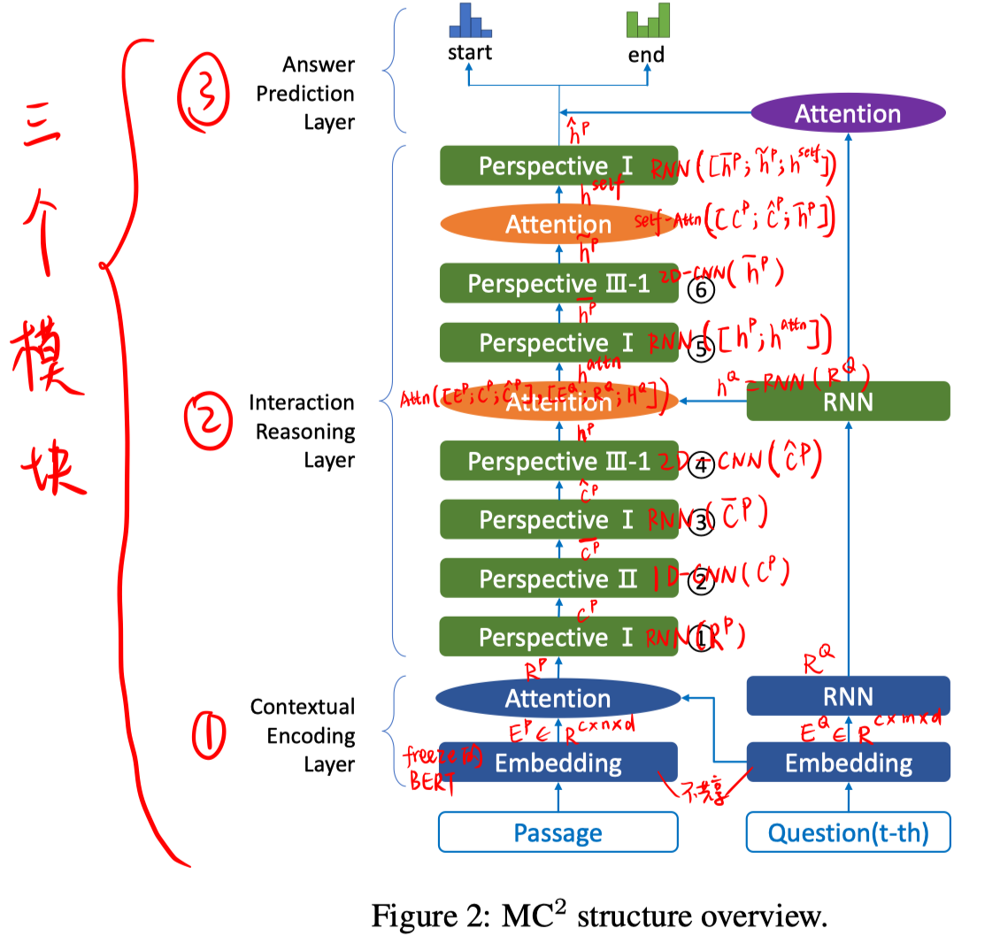
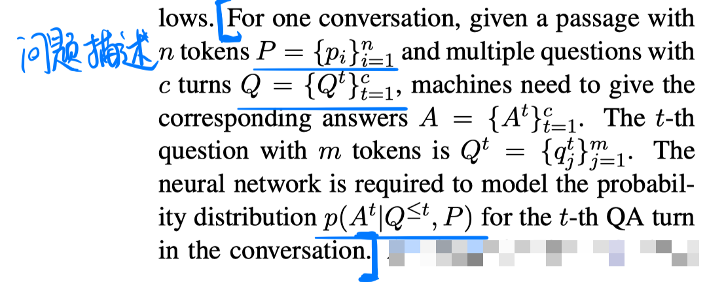
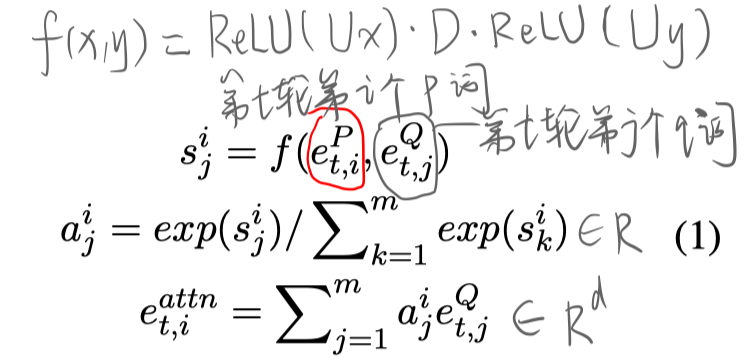
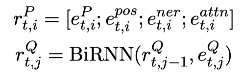
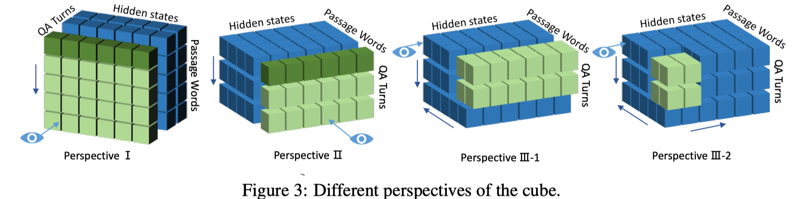
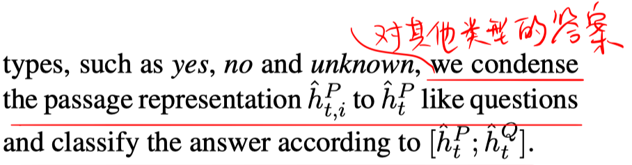
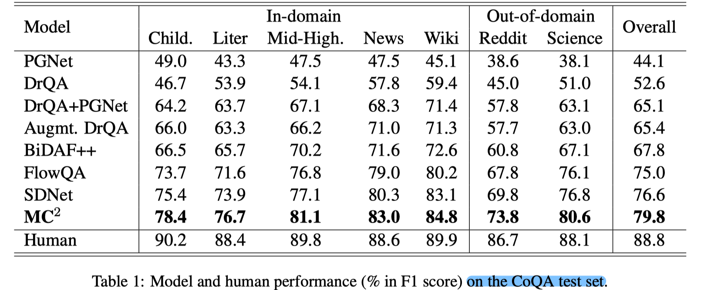
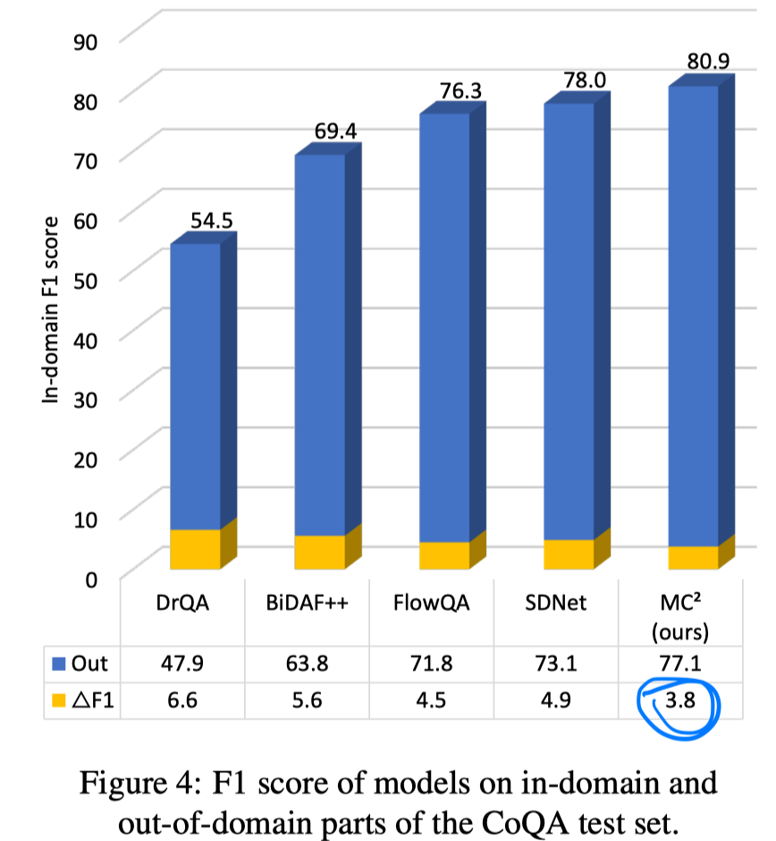
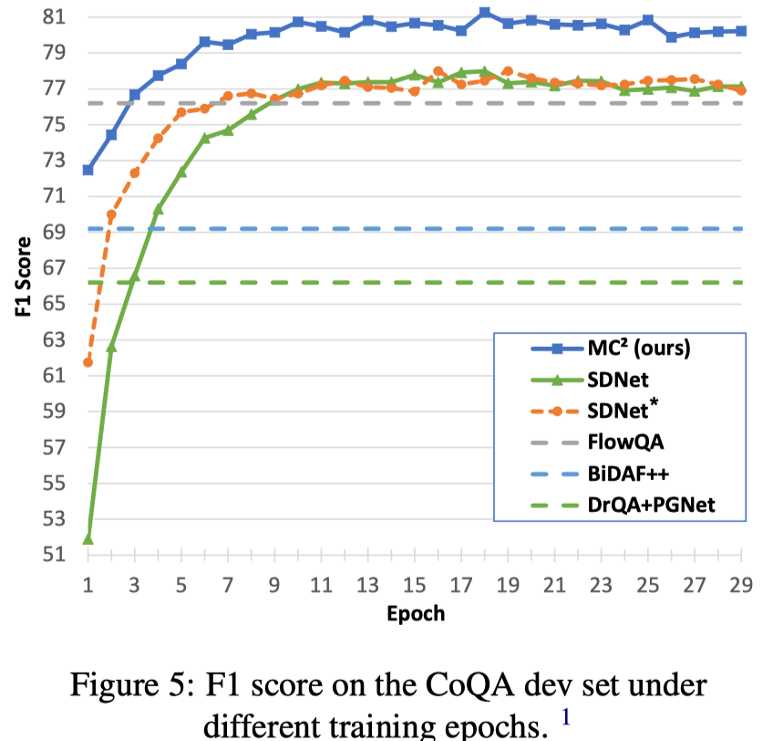
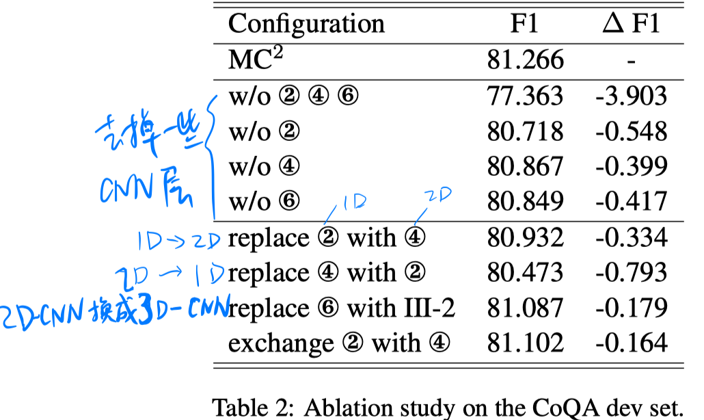

> > ACL2019，对话式阅读理解

## Motivation-论文解决什么问题

- 对话式阅读理解将传统的阅读理解扩展到多轮交互，需要考虑对话历史。目前大多数模型的做法是将之前的历史问题联合一起放到RNN进行推断，本文认为RNN只能得到前向和后向两个方向的信息，但是人们通常可以从不同的角度考虑历史对话并全面回答问题。
- 为了能够从多个角度理解历史对话信息，本文提出了融合了CNN和RNN的**Multi-perspective Convolutional Cube（MC^2）**模型，将每个对话表示为一个cube。
- 一方面，CNN可以有效地并行提取各个维度的局部信息。 将CNN引入RNN可以使模型有效地考虑局部和全局特征。 另一方面，通过在模型中融合1D和2D卷积，机器可以从不同的角度更深入地理解对话历史。 另外，为了避免下一轮对话的信息泄漏，本文将causal convolution扩展到二维。

## Method-模型/方法概述

#### 问题描述

#### Contextual Encoding Layer

- **Embedding**：采用freeze的BERT-large，分别对passage和第t轮的question得到表示 $E^{P} \in \mathbb{R}^{ n \times d}$，$E^{Q} \in \mathbb{R}^{c \times m \times d}$，把$E_{P}$重复c次，得到 $E^{P} \in \mathbb{R}^{c \times n \times d}$。其中每个词的表示是通过聚合BERT的L层输出得到的 $e_{i}=\gamma \sum_{l=0}^{L} \alpha_{l} h_{i}^{l}$。对每个词，其第一个piece的输出作为该词的表示。对长句子进行切分，最后得到表示后，再合并起来。

- **Attention**：对passage中的词，加额外的三个特征：POS tag，NER tag，aligned question embedding。

  

- **RNN**：对question的表达$E_Q$，再进行一个RNN。

- 输出：

  

#### Interaction Reasoning Layer

- **Perspection I：**：BiLSTM层
- **Perspection II** ：1D causal convolution
- **Perspection III-1** ：2D causal convolution 
- **Attention**：中间有穿插一次 co-attention 和 self-attention。

#### Answer Prediction Layer

- **Attention**：

  把每轮的question转成一个定长向量 $\hat{h}_{t}^{Q}=\sum_{j=1}^{m} a_{t, j} h_{t, j}^{Q}$ ，其中 $a_{t, j} = \exp \left(W h_{t, j}^{Q}\right) / \sum_{k=1}^{m} \exp \left(W h_{t, k}^{Q}\right)$

- **计算起止位置**：

  使用两个不同的bilinear attention function，根据 $\hat{h}_{t, i}^{P} \text { and } \hat{h}_{t}^{Q}$ 计算起止位置概率。（起止位置概率乘积最大的为预测span）。。

  

## Experiment-实验

数据集：CoQA

实验结果：

- figure4的结果说明，虽然各模型在out-of-domain上的性能都有下降，但MC^2是下降最少的，说明其泛化性能比较好。

  

- figure5的结果说明，更少的训练步数，MC^2就可以表现很好。

  

## Highlight

- 本文将每个对话构建为一个cube，1D和2D CNN与RNN共同应用在模型中。 将CNN引入RNN可以使模型有效地考虑局部和全局特征，并取得了不错的效果。