> > EMNLP2019

源码：https://github.com/xuyanfu/RASAOpenQA

## 背景

目前对于开放域QA：1）一般使用question-passage的相关度来检索evidence passage，但是忽略了也可以利用passage-passage之间的相关度，以发现更多有用的段落；2）目前的方法在训练时只关注正例（包含答案的段落），这会影响模型的泛化能力，使得在测试时容易受干扰段落的影响。

> 干扰段落：和问题相似，但不含answer string。 
>
> 噪声段落：包含answer string，但与问题不相关。

本文提出一个排序模型，利用question-passage和passage-passage之间的相关度来计算每个段落的置信度，然后基于这个置信度设计了一个修正的weighted sampling strategy来选择训练段落，缓解噪声段落和干扰段落的影响。

## 方法

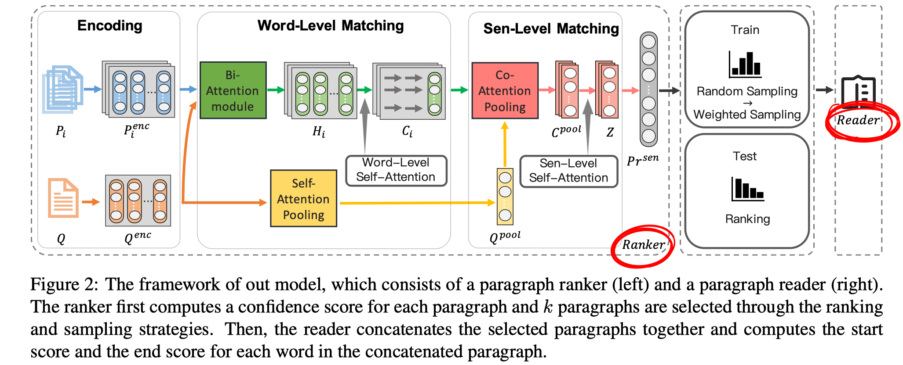

##### 问题描述

question：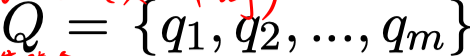

passage集合：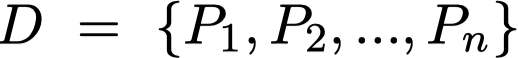 ，段落$P_i$有 $|P_i|$ 个词。

##### 整体模型

- paragraph ranker

  - Encoding layer

    编码层包括word embedding、char embedding、common word 三种特征。

    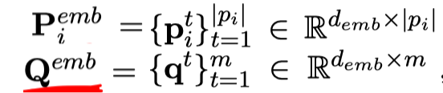

    再通过一层BiLSTM：

    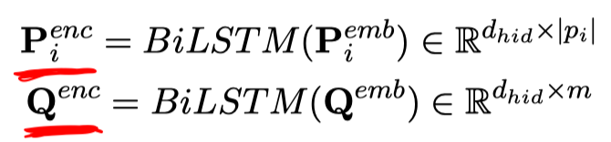

  - Word-level matching layer（捕捉问题和段落之间的匹配）

    将question和每个passage通过co-attention，再乘以question得到$H_i$，$H_i$进行self-attention得到$E_i$，$E_i$通过BiLSTM得到$C_i$.

    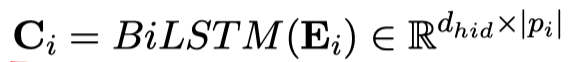

  - sentence-level matching layer（捕捉段落和段落之间的匹配）

    基于attention-pooling得到question的向量表示：

    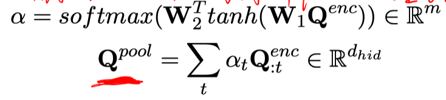

    将question和每个passage进行co-attention，得到每个段落的向量表示：

    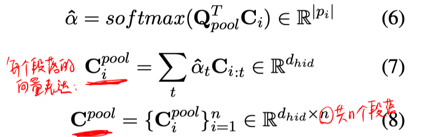

    利用段落之间的相关性，得到融合了其他段落信息的段落表达：

    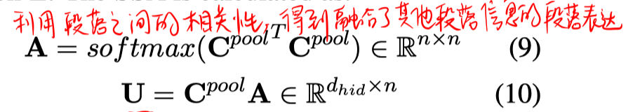

    得到最终的每个段落表达：

    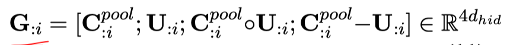

    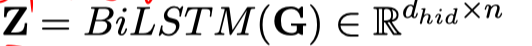

  - sentence-level decoding layer

    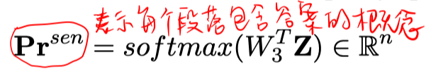

- 采样策略

  - ground truth

    只选择包含answer string的段落。

  - random sampling

    从检索到的段落中随机选择k个。（避免仅局限于正例，提高模型的泛化性和鲁棒性）

  - ranking

    根据$Pr^{sen}$，选择概率最大的k个段落。（从相关性角度看，更相关的段落。。在测试时使预测有一个好的起点）

  - weighted sampling

    根据$Pr^{sen}$，进行采样，得到k个段落。（适时加入干扰段落，但也同时缓解了噪声段落的影响）

  - RS -> WS

    使用random sampling生成初始的训练集，训练至模型收敛，再用weighted sampling接着训练。

  > 注：以上采样策略只是构造训练集时使用的，在测试时，仅使用ranking策略选择段落。

- reader

  将得到的k个段落拼接起来，通过RC模型，得到开始、结束位置的概率向量。再根据每个段落的长度，将开始、结束位置的概率向量划分成每个段落对应的自己的起止概率向量。

##### 训练

- ranker 的训练

  用远监督的方法，含有answer string的段落视为正例。

  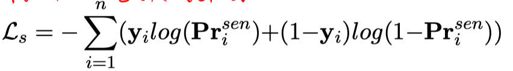

- reader 的训练

  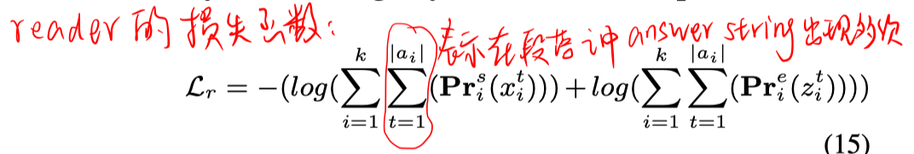

> 注：在test时可以用最大概率选择答案，也可以用重复的句子概率加和的方法来找概率最大的答案句子。

## 实验

数据集：Quasar-T、SearchQA、TriviaQA

实验结果：

1. 主实验

   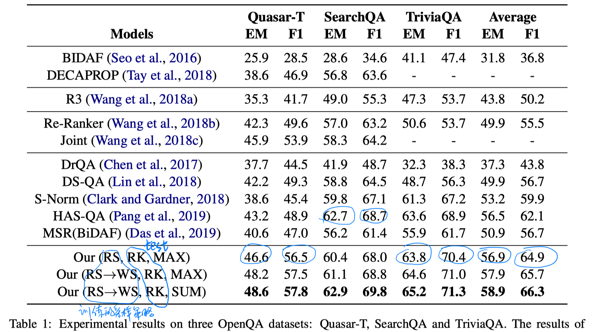

   - SearchQA的提升更不明显，是因为本文的一大优势在于ranker阶段，但SearchQA中的正例比例更高，所以ranker的效果不太明显。

2. ranker的性能

   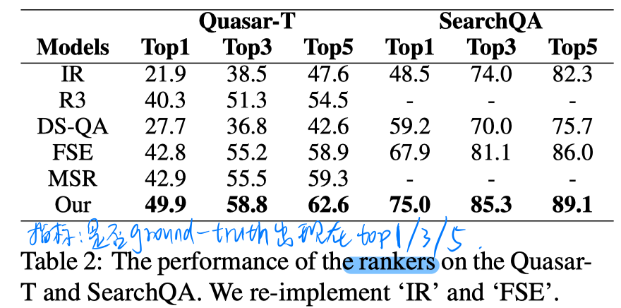

3. 训练集段落选择策略的影响

   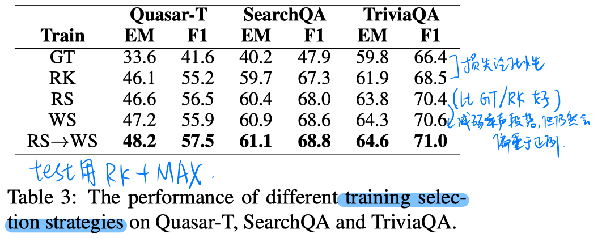

4. 测试集选择topk段落的k值影响

   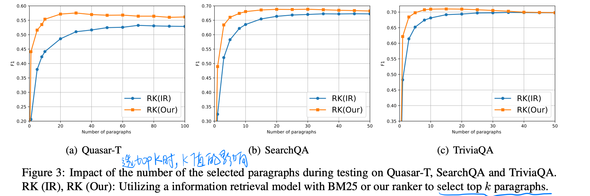

   - 本文提出的方法，k值的瓶颈值更靠后，说明本文的方法可以找到更多更有用的段落。

5. 消融实验

   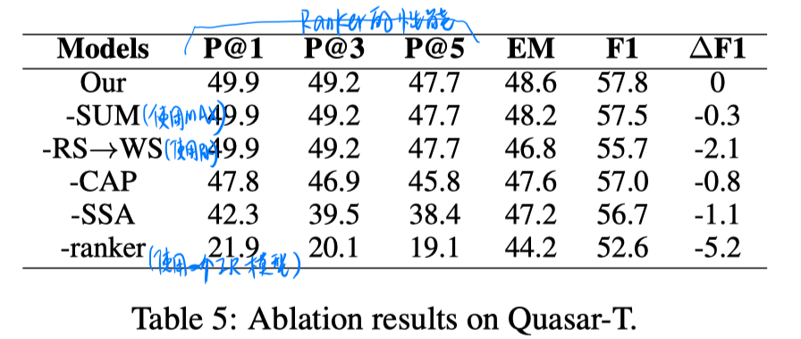

## 思考

1. 本文的ranker模块更强大，证明了除了利用question-passage之间的关系，利用passage-passage之间的关系也很有用。
2. 本文提出的RS->WS采样策略也可以进一步提高性能。