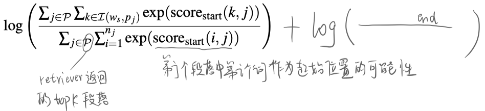
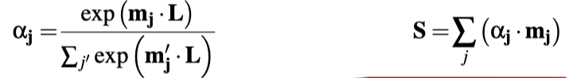
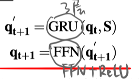
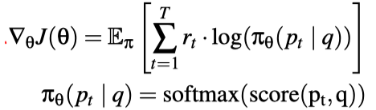
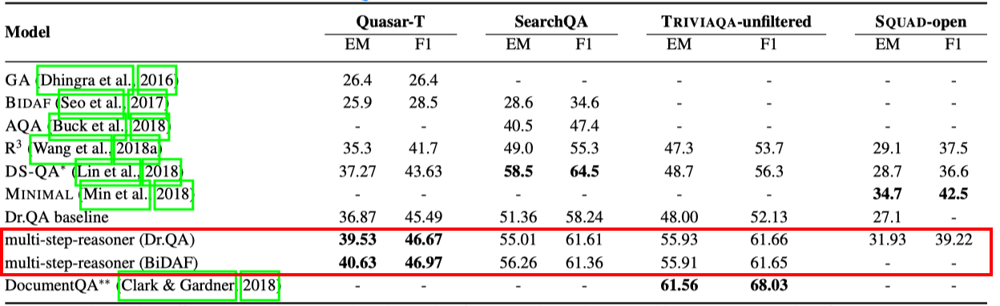
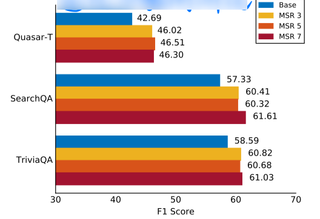

> > ICLR 2019，开放域问答，强化学习

Multi-step Retriever-Reader Interaction for Scalable Open-domain Question Answering

代码：https://github.com/rajarshd/Multi-Step-Reasoning

## 背景

本文提出了一个新的框架，用于开放域问答。本框架可以对MRC模型不可知，只要能获得 passage最终词级别的隐表达 以及 question的最终表达 即可。

主要思路是，retriever 和 reader 迭代交互：

- retriever负责选择top-k相关文档
- reader 根据相关文档选择answer span
- reasoner 有一个门控单元根据reader的状态更新query，然后retriever可以用重构后的query进行rerank，重新选择top-k相关段落。

## 模型

#### Retriever

> paragraph 的表达是独立于question的，可以提前离线计算存储。
>
> paragraph的表达向量计算：
>
> - 三层BiLSTM，取最上层的隐单元输出
> - 用self-align得到paragraph的整体表示：
>
> question的表达向量计算同paragraph，但不共享参数。
>
> 相似度计算采用内积，然后根据score选择top-k段落。
>
> 为了在大规模语料中快速选择出top-k相关文档，本文选择SGTree的方法来进行优化。

> 训练：采用远程监督的方法，即包含ground truth string的段落为正例，然后最大化 log(sigm(score(q, p+)))

#### Reader

> MRC模型采用 DrQA 和BiDAF，先设置迭代次数是1，进行预训练。之后在训练reasoner部分的参数时，reader的参数时固定的。
>
> 训练：为了适应多段落阅读理解的需求，先跨段落标准化start/end score，然后目标函数是最大化
>
> 
>
> 推断：起止位置之和最大的作为预测答案，最大长度为15。不同段落中相同span的score可以累计，为了便于处理，只考虑每个段落中top-10候选span的累加。（每个迭代步都会返回一个answer及对应的score，最后选择score最大的作为预测结果。）

#### Reasoner

> 输入：reader的当前状态（对P中每个token的最终表示 $\mathbf{m}_{\mathbf{i}} \in \mathbb{R}^{2 p}$，对q的最终表示 $\mathbf{L} \in \mathbb{R}^{2 p}$）、
>
> ​           当前question的表示 $\mathbf{q}_{\mathbf{t}} \in \mathbb{R}^{2 d}$
>
> 输出：重构后的question表示
>
> 计算过程：
>
> 
>
> 

> 训练：因为question重构不存在监督信号，所以用强化学习进行训练。
>
> reward是各迭代步中MRC预测答案的F1值之和。
>
> 
>
> 在用强化学习进行训练之前，先进行这部分参数（GRU和FFN中的参数）的预训练。
>
> 预训练：拿重构的question表示，来计算和paragraph的相似度。正例的p是含有answer的，负例的p是随机采样的。目标函数是最大化 $\log \left(\sigma\left(\mathbf{q}^{\top} \mathbf{p}^{*}-\mathbf{q}^{\top} \mathbf{p}^{\prime}\right)\right)$ ，p的表示是固定的，仅梯度更新q表示的参数。

## 实验

**数据集**：TriviaQA-unfiltered、TriviaQA-open、Quasar-T、SearchQA、SQuAD-open

**实验一**：和其他baseline的比较

**实验二**：迭代次数的对比

- 在5-7步达到较好的值，继续增加迭代次数，性能不上升。
- 随着迭代次数增加，检索得到的top-k段落质量也在增加。

**实验三：**在TriviaQA-open上的结果

- 很多baseline model不适用与这样大规模的开放域QA
- 在DrQA的基础上，使用3个迭代步，仍然可以获得性能上的提高，说明本文提出的框架对大规模开放域QA仍然适用。
- 在大规模开放域QA数据集上，各实验性能统一差于TriviaQA-unfiltered，说明对大规模的开放域QA还有待研究。

